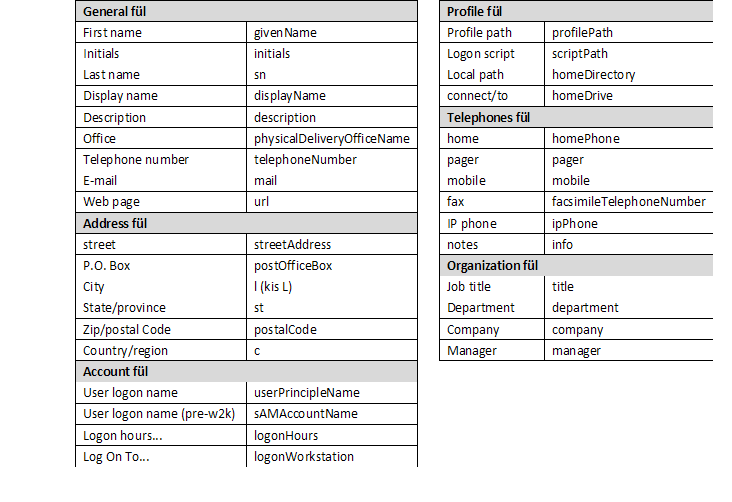

# A Windows Server 2008 R2 menedzselése [^1]

1. [A Windows Server 2008 R2 menedzselése \[^1\]](#a-windows-server-2008-r2-menedzselése-1)
   1. [1. fejezet - Elméleti háttér](#1-fejezet---elméleti-háttér)
      1. [1.1. Bevezetés](#11-bevezetés)
      2. [1.2. A Windows termékvonala](#12-a-windows-termékvonala)
         1. [1.2.1. Korai változatok](#121-korai-változatok)
         2. [1.2.2. Windows XP – Windows Server 2003](#122-windows-xp--windows-server-2003)
         3. [1.2.3. Windows Vista – Windows Server 2008](#123-windows-vista--windows-server-2008)
         4. [1.2.4. Windows 7- Windows Server 2008 R2](#124-windows-7--windows-server-2008-r2)
      3. [1.3. A Windows Server 2008 R2 és kiadásai](#13-a-windows-server-2008-r2-és-kiadásai)
      4. [1.4. Számítógépek, és logikai csoportok](#14-számítógépek-és-logikai-csoportok)
         1. [1.4.1. Munkacsoport (Workgroup)](#141-munkacsoport-workgroup)
         2. [1.4.2. Tartomány (Domain)](#142-tartomány-domain)
      5. [1.5. Az installálási előkészületek](#15-az-installálási-előkészületek)
         1. [1.5.1. A telepítés feltételei](#151-a-telepítés-feltételei)
      6. [1.6. Az installálás lépései](#16-az-installálás-lépései)
      7. [1.7. Bejelentkezés, kijelentkezés, jelszómódosítás](#17-bejelentkezés-kijelentkezés-jelszómódosítás)
         1. [1.7.1. Security Options](#171-security-options)
         2. [1.7.2. Leállítás (shutdown)](#172-leállítás-shutdown)
      8. [1.8. Felhasználók, csoportok](#18-felhasználók-csoportok)
         1. [1.8.1. Felhasználók létrehozása](#181-felhasználók-létrehozása)
         2. [1.8.2.](#182)
         3. [1.8.3. Csoportok létrehozása](#183-csoportok-létrehozása)
      9. [1.9. Tartományvezérlő létrehozása](#19-tartományvezérlő-létrehozása)
   2. [2. fejezet - Gyakorlatok](#2-fejezet---gyakorlatok)
      1. [2.1. Gyakorlat](#21-gyakorlat)
      2. [2.2. Gyakorlat](#22-gyakorlat)
      3. [2.3. Gyakorlat](#23-gyakorlat)
      4. [2.4. Gyakorlat](#24-gyakorlat)
      5. [2.5. Gyakorlat](#25-gyakorlat)
      6. [2.6. Gyakorlat](#26-gyakorlat)
      7. [2.7. Gyakorlat](#27-gyakorlat)
      8. [2.8. Gyakorlat](#28-gyakorlat)
         1. [2.9. Gyakorlat](#29-gyakorlat)
      9. [2.10.](#210)


## 1. fejezet - Elméleti háttér

### 1.1. Bevezetés

A mai világban számítógépet nagyon sokan használnak. A használatot nagymértékben befolyásolja, hogy milyen operációs rendszer üzemelteti azt. Az operációs rendszereket nagyon sok szempont szerint lehet csoportosítani, még akkor is, ha a szakmai jellemzőket figyelmen kívül hagyjuk. Szempont lehet, hogy az operációs rendszer mennyire felhasználóbarát, vagy mennyire biztonságos, esetleg cserélhető-e a grafikus felülete, stb. A felhasználók egy része folyamatosan igyekszik meggyőzni másokat az általa használt operációs rendszer előnyeiről. Ennek során azonban (talán annak megszokása miatt) nem említi hátrányait.

A PC-s világban a felhasználókat jórészt két nagy csoportba lehet sorolni: az egyik csoport a Microsoft Windows valamelyik változatát használja, míg a másik csoport valamilyen Unix-szerűt. A második csoport listája nagyon hosszú is lehet, hisz’ ide sorolják az összes Linux variánst, és a Mac OS X különböző verzióit is, főként azóta, hogy az Apple áttért az Intel processzor család használatára.

Nem szándékom egyik csoport mellett se letenni a voksomat. Tanszékünkön (Miskolci Egyetem, Általános Informatikai Tanszék) a hallgatók mindkét operációs rendszer esetében választhatnak „Rendszergazdai ismeretek” című tárgyat (Unix esetében egy Linux változatra építve). Windows esetében ez a tárgy jellemzően az épp rendelkezésre álló szerver változatra épül.

Jelenleg a legfrissebb szerver változat a Windows Server 2008 R2, amely 2009 év végétől érhető el (MSDN előfizetéssel 2009. augusztus 14.). A megjelenés óta bő 1 év telt el. Bár idegen nyelvű szakkönyvek a közel múltban jelentek már meg, de magyar nyelvű a mai napig (2011. február) nem érhető még el a szokásos kiadók gondozásában (Szak Kiadó, Panem Kiadó, Kiskapu Kiadó), és érdekes módon a Microsoft hivatalos kurzusai között is mindössze 1 olyan található, amely a Server 2008 R2-vel foglalkozik. Ez egy ún. update tanfolyam Server 2008-ról 2008 R2-re (10159A – Updating Your Windows Server 2008 Technology Skills to Windows Server 2008 R2).

Ez a jegyzet (terjedelméből adódóan) nem fedi le teljes mértékben egy rendszergazda tevékenységét (az ilyen könyvek 1400-1800 oldalasak is lehetnek). Főként a fogalmakkal, a Windows-os rendszer jellegével akar megismertetni. Az elméleti rész megáll a felhasználók és csoportok megismertetésénél, a gyakorlatok azonban tovább bővítik az ismeretanyagot.

Cél, hogy a hallgató az elméletet megértve, és a gyakorlati példákat teljesítve képes legyen önállóan egy rendszer üzemben tartására, a használt operációs rendszer főbb jellemzőinek megértésére. Ne okozzon gondot egy tetszőleges rendszer szűk keresztmetszetének megkeresése, vagy egy-egy szoftver telepítése.

Javasolt a gyakorlatokat vezető oktatónak a gyakorlatokat előre tesztelnie, mert telepítéstől függően elképzelhető, hogy egyes gyakorlatokat a helyi jellemzők függvényében módosítani kell.

A foglalkozások javasolt kivitelezése: a nagyobb hatékonyság érdekében minden téma esetében először vagy a jegyzet, vagy más forrás segítségével az elméleti ismereteket kell tisztázni, majd ezután kerüljön sor az elmélethez kapcsolódó gyakorlatra. A gyakorlatok több esetben egymásra épülnek, ezért nem javasolt egy-egy gyakorlatot kihagyni, mert a későbbiek során előfordulhat, hogy valamely gyakorlat nem, vagy csak kerülő úton lesz elvégezhető.

### 1.2. A Windows termékvonala

A Microsoft Windows operációs rendszere alapvetően két fő vonulatra osztható: mindvégig jól elkülöníthető az otthoni felhasználóknak, illetve a vállalati felhasználóknak szánt termékcsoport. Ennek szerepe még a Windows 95 operációs rendszer megjelenéséhez köthető. Az előző változat, a Windows 3.1 illetve Windows 3.11 még DOS-ból, és külön paranccsal indult.

#### 1.2.1. Korai változatok

A DOS-os programok jellemzően egyedül birtokolták a memóriát, a CPU-t, stb. (Természetesen az interrupt rendszer segítségével már valósultak meg „multitask”-os programok, de ez nem igazi multitask). Előre nem tervezett esetekben ekkor előfordulhatott az is, hogy az alkalmazás nem adta vissza a CPU-t a DOS-nak, hanem kizárólagosan használta azt (akár a programozó hibájából). A Windows 3.1 után megjelenő új Windows verziónál a Microsoft döntés elé került. Vagy készít egy olyan operációs rendszert, amely kizárja ezeket a hibákat (nem engedi futni a rosszul megírt alkalmazásokat) és egy stabil rendszer lesz, vagy hagyja a régi rendszert tovább élni.

Az első választás következményeként a felhasználók „jogosan” morogtak volna, hiszen azok a régi hibás alkalmazásaik, amik DOS alatt hibátlanul futottak, azok a Windows 95 alatt nem lettek volna működőképesek. A következmény nyilvánvaló…

A másik választás esetében pedig készül egy új operációs rendszer, ami csak felületében és szolgáltatásaiban tér el a DOS-tól.

Természetesen ez kicsit sarkított vélemény, de a lényeget jól mutatja. Belátható, hogy végül is nem volt igazi alternatíva, hiszen a felhasználók az első esetben nem vásárolják meg otthonra az új Windows-t.

A gond azonban nem oldódott meg. Vállalati környezetben a felhasználók javarészt nem korábbi játékaikkal játszanak. A vállalat pedig előbb-utóbb a stabil operációs rendszer használatának érdekében korábbi, esetleg bizonytalan alkalmazásait újraírathatja. Ezért kettéválasztották a Windows termékvonalat. Az otthoni felhasználóknak készült a Windows 95, a Windows 98, a Windows 98 SE, a Windows Milennium. A vállalati felhasználóknak pedig a Windows NT 4.0, és a Windows 2000.

#### 1.2.2. Windows XP – Windows Server 2003

A Windows XP megjelenésekor a Microsoft egyesítette a két vonalat. Az otthoni felhasználók is megkapták a stabil operációs rendszer memória-, és task kezelését, ennek következtében néhány inkorrekt módon megírt alkalmazás az XP-n már nem fut. Az otthoni felhasználók szokásainak vizsgálatával a Microsoft kiválogatta azokat a szolgáltatásokat, amikre valószínűleg nem lesz szükség. Ezeket a Windows XP egy másik változatába tette be. Így végül is az XP-ből két változat készült: a Home és a Professional változat. XP-ből azonban nem készült ún. kiszolgáló (server) változat. Ezt a Microsoft a Windows Server 2003-mal pótolta. Ezután a fejlesztés követhetőbbé vált, hiszen minden Windows változat innentől kezdve ugyanazt az irányt követte, az operációs rendszer stabilizálását. Így már csak 1 kernel-t kellett fejleszteni, és az abban levő hibákat javítani.

#### 1.2.3. Windows Vista – Windows Server 2008

Következő kliens a Windows Vista volt (2006. november 8.), aminek fejlesztésekor a Microsoft az addig érvényes trendeket követve (folyamatosan eső memória árak, növekvő memória méretek, gyorsabb processzorok, növekvő merevlemez kapacitás) elkövette azt a hibát, hogy igen erőforrás igényes lett. Elsősorban memóriából igényelt sokat, főként a grafikus felület felgyorsítása miatt. Utólag már látható, hogy a felhasználók (jellemzően a magas memória árak miatt) nem nagyon fejlesztették PC-s rendszerüket. Mivel a Windows XP is az évek múlásával egyre kedveltebb és stabilabb lett (a korábban sűrűbben előforduló úgynevezett „kék halál”-ról sok felhasználó már csak hallomásból tudott), nem volt igazán ok sem a Vistá-ra való áttérésre. Akik gyengébb PC-jükön mégis megpróbálkoztak vele, (hiszen a telepítés kevesebb memóriával rendelkező gépekre is lehetséges volt), azok rövidebb-hosszabb idő elteltével többnyire megint Windows XP-t használtak, és Vistá-val kapcsolatos panaszaiknak hangot is adtak. Azt is fontos megemlíteni, hogy a Microsoft a korábbi biztonsági hiányosságok miatt úgy döntött, hogy minél teljesebb mértékben igyekszik a következő operációs rendszerét újraírni. Emiatt újabb programozói- és biztonsági hibák is bekerülhettek a kernel-be. Az itt megjelenő, talán kicsit túl érzékeny biztonsági rendszert (a sok port kavart UAC – User Access Control) a felhasználók nehezen fogadták el, és több alkalmazás sem volt emiatt működőképes.

Közel másfél évvel később erre a kernel-re építve elkészült a szerver változat, a Windows Server 2008 (2008. február 27.). Az addig megtalált hibákat javították, és mivel egy szerver eleve több memóriával rendelkezik, ez a változat az üzemeltetők között sikeres lett.

#### 1.2.4. Windows 7- Windows Server 2008 R2

A Vista hardverigényén csökkentve (a grafikus rendszer működésének alapjait átírva), újabb felülettel, újabb szolgáltatásokkal kibővítve elkészült a Windows 7 (2009. október 22.). A korábban hozzáférhetővé tett előzetes kiadásokat a szakújságírók tesztelték, és dicsérték. Emiatt a felhasználók is nagyon várták a végleges változatot. A piaci mutatók szerint a Windows 7 mostanra kedvelt, elterjedt operációs rendszer lett, pedig nincs lényeges változtatás a Vistá-hoz képest.

Ugyanebben az időben (2009. október 22.) megjelent a frissített szerver változat is, a Windows Server 2008 R2. GUI-ja (Graphical User Interface – grafikus felhasználói felület) a Windows 7-é, szolgáltatásai jellemzően a Windows Server 2008-é.

A következő táblázatban összefoglalva láthatók a különböző (fontosabb) Windows változatok, kernel-jük verzió száma, és az úgynevezett kibocsátási alverzió (RTM – Release To Manufacturing). Itt megfigyelhető, hogy az egyes változatok valóban mennyire egymásra épülnek.

1.1. táblázat - Windows verziók

| Név, verziók |	Kernel |	RTM |
| --- | --- | --- |
| Windows NT 4.0 Workstation, Server, Enterprise  Server | NT 4.0 |	1381 |
| Windows 2000 Professional, Server, Advanced Server | NT 5.0 | 2195 |
| Windows XP Home, Professional | NT 5.1 | 2600 |
| Windows Server 2003 Web, Std, Adv., Enterp. Datacenter | NT 5.2 | 3790 |
| Windows Vista Starter, Home Basic, H-Premium, Enterprise | NT 6.0	| 6000 |
| Windows Server 2008 Web, Std, Enterprise, Datacenter | NT 6.0	| 6001 |
| Windows 7 Starter, Home Basic-Premium, Prof, Enterp, Ultim. | NT 6.1 | 7600 |
| Windows Server 2008 R2 Web, Std, Enterprise, Datacenter | NT 6.1 | 7600 |

### 1.3. A Windows Server 2008 R2 és kiadásai

A kicsit hosszúra nyúlt változatok ismertetése után nézzük a Windows Server 2008 R2-t (W2K8R2) részletesebben. Telepítés előtt (tulajdonképpen már a vásárláskor) tudnunk kell, milyen változatok állnak rendelkezésre, és az egyes változatok miben különböznek egymástól.

Windows Server 2008 R2 Foundation: ez a legegyszerűbb változat, több kötöttséggel. Legfeljebb 1 processzort képes kezelni, és maximum 8 GB-t memóriát. Bár ez még több cégnek elegendő is lenne, de 15 főben korlátozzák a felhasználók számát. Emiatt leginkább egy kis iroda működtetéséhez elegendő. Képes tartományt kezelni, illetve már létező tartományba is beléptethető bizonyos korlátozásokkal.

Windows Web Server 2008 R2: egy meglehetősen érdekes kiadás. Bár nevéből is adódóan elsősorban Web (és alkalmazás) szerver futtatására tervezték, és ennek megfelelően korlátozások vannak benne, de ugyanakkor vannak olyan jellemzői, amelyekben ugyanazt tudja, mint a nagyobb (Standard) kiadás: maximum 4 db 64 bites processzor, legfeljebb 32 GB memória, 2 Remote Desktop Admin csatlakozási lehetőség. Tudja futtatni a Microsoft SQL szervert, és képes hálózati szolgáltatásokat is nyújtani (DNS – Domain Name System, integrálva tartalmazza az IIS 7.5 – Internet Information Services 7.5, az ASP.NET-et, a Microsoft .NET Framework-öt).

Windows Server 2008 R2 Standard: ez a legáltalánosabb verzió. Főként kiszolgálók operációs rendszereként használják, például SQL szerverhez. Támogatja a komolyabb hardver kiépítést: maximum 4 db 64 bites processzor, legfeljebb 32 GB memória. További jellemzői a Hyper-V alapú virtualizáció, az IIS 7.5, és a legfeljebb 250 egyidejű hálózati kapcsolat. Képes hálózati szolgáltatások nyújtására (DNS, DHCP – Dynamic Host Configuration Protocol). Ugyanakkor nem támogatja a cluster-ezést, a DFS-R-t (cross-file replication), és az AD FS-t (Active Directory Federation Services). Javasolt felhasználási terület még a fájl szerver, a nyomtató szerver, a média szerver, és a SharePoint szerver.

Windows Server 2008 R2 Enterprise: mindent tud, amit a Standard Edition. Ahhoz képest azonban jelentős bővüléseket találhatunk: korlátlan számú hálózati kapcsolatok, maximum 2 TB memória, 8 db 64 bites processzor, 16 node-os cluster kialakítás. Ha a hardver is támogatja, bővíthető működés közben a memória. Megfelelő kliensek esetén a távoli irodák (fiók irodák - branch office) hatékonyságát növeli a hálózati forgalom csökkentésével (BranchCache).

Windows Server 2008 R2 Datacenter: gyakorlatilag nincsenek benne korlátozások. Hardvertől függően működés közben akár processzorok is adhatók hozzá, illetve cserélhetők. Korlátlan számú virtuális image használati jog, korlátlan számú hálózati- és VPN kapcsolat, 64 db 64 bites processzor (4 magos processzorok esetében ez 256 logikai processzor).

### 1.4. Számítógépek, és logikai csoportok

A Windows-t futtató gépekből telepítéskor, illetve telepítés után logikai csoportok képezhetők. Ezekkel egy otthoni felhasználó általában nem foglalkozik, nem is találkozik, használja az alapértelmezés szerinti (default) beállításokat. Kétféle logikai csoportot különböztetünk meg: a tartományokat (domain) illetve a munkacsoportokat (workgroup).

#### 1.4.1. Munkacsoport (Workgroup)

A kettő közti különbség megértése érdekében vegyünk egy példát. Ahhoz, hogy egy felhasználó dolgozni tudjon egy adott számítógépen, be kell tudnia arra jelentkezni. Munkacsoport esetén minden gépen minden olyan felhasználót létre kell hozni, akinek azon a gépen dolgoznia kell. Bár ez nagyobb létszám esetében hosszabb időt igényel, mégis dönthet emellett a rendszergazda, abból kiindulva, hogy csak egyszer kell sokat dolgoznia. Igaz, ha később újabb gépek jönnek, azokon is létre kell hozni a felhasználókat, de feltételezheti, hogy ez már viszonylag ritkábban fog előfordulni. A felhasználóktól elvárás, hogy a nagyobb biztonság érdekében összetett jelszavakat használjanak, és azokat bizonyos időközönként változtassák meg. A munkacsoport esetében a felhasználók adatai (köztük a belépéshez szükséges jelszó is) minden egyes számítógépen külön-külön tárolódnak. Ha két számítógépen azonos nevű felhasználó van (pl.: KovacsP), akkor sincs köztük kapcsolat, úgy kell tekinteni, mintha egy tankörbe véletlenül két olyan Szabó, vagy Nagy, vagy Kovács kerülne, akik között nincs semmilyen rokonsági kapcsolat.

Ha a felhasználó az egyik számítógép elé ülve módosítja a jelszavát, akkor a jelszó csak azon a számítógépen módosul, a többi gépen nem. Ha a napok múltával különböző számítógépekre jelentkezik be, és azokon módosítja a jelszavát, akkor előbb-utóbb nehéz lesz követnie, melyik számítógépen cserélte már le, és melyiken nem a jelszavát. Ilyenkor általában bevezetésre kerül egy papír fecni, amin igyekszik ezt valamilyen módon nyilvántartani. Ahogy telik az idő, előfordulhat, hogy lesz olyan számítógép, amelyiken már többször is cserélte a jelszavát, és olyan is, amelyiken még egyáltalán nem…

A számítógépek időnként elromolnak, ekkor szervizbe viszik. Ha egy adott idő alatt több számítógép kerül szervizbe, majd javítás után onnan vissza, a rendszergazda szempontjából sokszor nem lényeges, hogy az egyes gépek a laborban korábban hol voltak. A papír fecni alapú nyilvántartás ettől kezdve szétesik, mert a 3. sor 2. számítógépe visszakerülhet a 4. sor 5. helyére.

Összefoglalva: munkacsoportok esetén az adott számítógépre belépésre jogosult felhasználók adatai azon a számítógépen tárolódnak, ahol a felhasználót létrehozták, és a számítógépek között a nyilvántartás szempontjából nincs semmilyen kapcsolat.

#### 1.4.2. Tartomány (Domain)

Tartományoknál (most egy egyszerűsített esetet nézve) van egy kitüntetett számítógép, amely több más mellett a felhasználók adatait (köztük a jelszót) is tárolja. A többi számítógépen beállításra kerül, hogy a jelszót (és a többi adatot) honnan kell „lekérni” annak érdekében, hogy a bejelentkezés jogosságát ellenőrizni lehessen. (FONTOS: az ellenőrzés ugyan nem pont így történik, de így könnyebb a tartomány szerepét megérteni.) Sikeres bejelentkezés esetén, ha a felhasználó módosítja a jelszavát, akkor a jelszó ezen a központi számítógépen fog megváltozni, és letárolódni. A következő bejelentkezés történhet bármelyik számítógépen. Ha ellenőrzéskor „lekérésre” kerül a jelszó, akkor a már módosított jelszó kerül összehasonlításra. A kitüntetett számítógépet tartományvezérlőnek (DC - Domain Controller) nevezzük. A tartományvezérlőn lehetőség van más adatok letárolására is, amely adatok között a tartományba tartozó számítógépek keresni tudnak (pl.: megosztott nyomtatókat, megosztott mappákat). Ennek a központi adattárnak a neve címtár, és a Windows 2000-től kezdődően Active Directory (AD) néven hivatkozhatunk rá.

### 1.5. Az installálási előkészületek

A telepítés során alapvetően két eltérő esetet szokás megkülönböztetni, amelyeknek több alesete lehet. Az első esetben vagy teljesen üres számítógépre kell a Windows 2008 R2-t telepíteni, vagy a már fent levő operációs rendszerre nincs szükség, letörölhető. A másik esetben a számítógépen egy olyan operációs rendszer van (akár Windows Server 2008), amelyiknek beállításaiból minél többet szeretnénk megtartani.

#### 1.5.1. A telepítés feltételei

Az első esetet installálásnak nevezzük, a másikat upgrade-nek. Mindkét esetben még a kezdés előtt ellenőrizni kell, hogy az adott számítógép alkalmas-e a Windows Server 2008 R2 futtatására. Valószínűleg igen, mert a Microsoft meglehetősen alacsony értékeket szokott megadni minimális elvárásként. Azt azonban érdemes leszögezni, hogy ha egy adott számítógép rendelkezik a minimális elvárásokkal, az még nem jelenti azt, hogy használható sebességű lesz. Ennek egyik oka, hogy a minimális elvárás nem egyezik meg a javasolt, vagy optimális elvárással. Másik oka pedig, hogy egy operációs rendszert általában nem öncélúan telepítünk, hanem azért, hogy alkalmazásokat futtasson. Az alkalmazások futtatásakor pedig további hardver igény jelentkezik. Ezt még tovább fokozhatja a várható terhelés, hiszen nem mindegy például, hogy egy SQL szerver mekkora adatbázisból dolgozik, és egységnyi idő alatt hány kérést kell kiszolgálnia. A hétköznapi életben az egyes cégek másképp hivatkoznak a telepítéshez szükséges igényekre, ráadásul néha ellentmondásosan. Néhány megfogalmazás:

1. minimum requirements,

2. recommended requirements,

3. suggested requirements,

4. supported requirements, stb.

A Windows Server 2008 R2 esetében az Enterprise Edition változatú operációs rendszer használható sebességű futtatásához javasolt minimális hardver környezet:

1. 2 GHz, vagy gyorsabb 2-4 magos processzor,

1. 2 GB DDR3 memória, vagy több (lehetőleg Dual Channel módban),

1. 40 GB SATA 7200-as percenkénti fordulatú merevlemez,

1. DVD-ROM meghajtó,

1. 1280x1024 felbontású grafikus kártya és monitor,

1. billentyűzet, egér.

A fentiekben megadott rendszernél természetesen több szempont szerint lehet gyorsabbat összeállítani (SSD használata, vagy több merevlemez RAID 3-ba szervezve, esetleg több processzor, stb.).

A konfiguráció összeállítása után sajnos előfordulhat, hogy a számítógép installálás közben megáll, az installálás sikertelen lesz annak ellenére, hogy az egyes eszközök jók, működőképesek. Ennek több oka is lehet. Lehet, hogy valamely hardver komponens nem kompatibilis a Windows Server 2008 R2-vel, de az is lehet, hogy bár önmagában minden komponens megfelel, de a komponensek egymással akadnak össze (pl. alaplapi SCSI vezérlő és a grafikus kártya ugyanazt a megszakítást használja). A probléma kivédésére célszerű az egész rendszert egy szállítótól beszerezni, és már a rendelés leadásakor tisztázni, hogy az összerakott rendszer képes legyen a Windows Server 2008 R2-t futtatni. Ekkor van esély sikeres reklamációra.


1. ábra. A Microsoft HCL weblapja

A Microsoft régóta folyamatosan frissít a honlapján egy listát (HCL – Hardware Compatibility List, http://www.microsoft.com/windows/compatibility/windows-7/en-us/default.aspx), amely azokat a hardver komponenseket tartalmazza, amelyeket teszteltek az adott operációs rendszerrel. Ki lehet választani az operációs rendszert (jelenleg csak kliens operációs rendszer választható ki: Windows XP, Windows Vista, Windows 7), az hogy 32 vagy 64 bites-e, és rá lehet keresni egy adott hardverre. Ugyanakkor lehet egy adott termékcsoportot tallózni is. A megtalált komponens esetében háromféle bejegyzés lehet: Compatible, Not compatible, No information available. Sajnos a kompatibilisnek jelölt hardver komponens sem garancia a biztos működésre, mert előfordulhat olyan eset, hogy egy grafikus kártyát egy adott alaplappal sikerült ugyan működésre bírni, de ha ez alapján a felhasználó megrendeli a grafikus kártyát, és másik alaplapba teszi, akkor lehet, hogy azzal nem működik…


2. ábra. HCL kompatibilitás esetei

Hasonló célú lista érhető el a Windows Server Catalog honlapján is (http://www.windowsservercatalog.com/ ). A  legbiztosabb, ha komplett, összeállított rendszer kerül tesztelésre, és sikeres teszt után beszerzésre.

Az operációs rendszer DVD-n kerül forgalmazásra, ezért célszerű olyan rendszerben gondolkodni, amely képes optikai meghajtóról boot-olni. Más módszerrel is megoldható ugyan az operációs rendszer installálása, de ez egy egyszerű, kényelmes módszer (nem túl sok számítógép installálása esetén).

### 1.6. Az installálás lépései

Optikai meghajtóról történő telepítés során először célszerű ellenőrizni, szükség szerint módosítani a boot eszközök sorrendjét. Biztonsági okok miatt sok helyen eleve kiveszik az optikai meghajtót, illetve az egyéb külső eszközöket. A BIOS-ba való belépés számítógépenként eltérő módon történhet, de sok esetben bekapcsolás után valamelyik funkció gomb (F) nyomva tartásával a szokásos. Itt kell megkeresni a boot menüt, majd ha szükséges volt a módosítás, akkor mentéssel kilépni, betenni a DVD-t a meghajtóba, és újra indítani a számítógépet.


1. ábra. Boot eszközök sorrendjének megadása

Sikeres boot-oláskor meg kell adni, hogy milyen nyelven kívánjuk installálni az operációs rendszert, milyen régiós beállítást kérünk (dátum – idő, pénz formátum miatt), majd hogy milyen billentyűzet kiosztást kérünk.


4. ábra. Telepítési adatok kiválasztása

A Next gomb megnyomása után következő oldalon rögtön kezdődhet a telepítés folytatása (Install →), vagy két további lehetőség közül lehet választani (információk a telepítésről – What to know…, illetve már telepített operációs rendszer javítása - Repair your computer).


5. ábra. Telepítés megkezdése

Az Install gomb megnyomása után megjelenő ablakban kell kiválasztani, hogy melyik változat kerüljön telepítésre (Standard, Enterprise, Datacenter, Web Server), illetve hogy grafikus felülettel (Full Installation), vagy anélkül (Server Core Installation). A 6. ábrán megfigyelhető az is, hogy csak 64 bites változat létezik.


6. ábra. A server változat megadása

A megfelelő változat kiválasztása, és a Next megnyomása után a licensz szerződés szövege következik. Annak elfogadása, és Next után folytatódhat a további választás.


7. ábra. A licensz szerződés elfogadása

A következős ablakban egy meglévő Windows operációs rendszer frissítése (Upgrade), vagy új installálás (Clean Install – most Custom) között lehet választani. Jelen esetben a Custom megadása után ki kell választani a merevlemezt, és a particiót, ahova az installálás történik.


8. ábra. Telepítési mód (Custom) kiválasztása

Ezután lehetőség van új partíció létrehozására, meglévők törlésére, összevonására, szükség szerint formázására. Az installáló program azonban csak a legfontosabb lehetőségeket biztosítja, komoly szolgáltatásokat nem érdemes várni, hiszen a kifejezetten erre való programok ára sok esetben közelít egy kliens Windows operációs rendszer árához (pl.: 2011 márciusában a Partition Magic forgalmazótól függően kb. 20.000 Ft, míg egy Windows 7 Home Premium OEM 27.000 Ft). (Érdekességképpen, 2005 augusztusában a Partition Magic kb. 21.000 Ft volt, míg a Windows XP Professional OEM 33.000 Ft). Természetesen léteznek ingyenes változatok is, több esetben Linux alapokon.


9. ábra. Merevlemez és partíció kiválasztása

Ezután a 10. ábrának megfeleően megkezdődik a szükséges fájlok tömörített változatának felmásolása (copying) a merevlemezre a DVD-ről, majd a felmásolt fájlok kitömörítése (expanding). Ehhez akár több GB átmeneti területre is szükség lehet a merevlemezen. A következő lépések automatikusan futnak le, nincs szükség felhasználói beavatkozásra.


10. ábra. Másolás, kitömörítés

Kitömörítés után egy reboot-ot (11. ábra) követően folytatódik az installálás. Amikor ez is befejeződik, megjelenik a bejelentkezési ablak (12. ábra).


11. ábra. A számítógép újraindítása


12. ábra. Bejelentkezési képernyő

Első sikeres bejelentkezés után a felhasználónak módosítania kell a jelszavát a 13. ábrának megfelelően.


13. ábra. Jelszó módosítás

Módosítás után elkészül a felhasználó asztala (desktop), létrejönnek a szükséges fájlok, katalógusok (14. ábra).


14. ábra. Az asztal létrehozása

Ezután elindul egy alkalmazás (Initial Configuration Tasks), amely lehetőséget kezdeti beállítások elvégzésére (időzóna megadására, hálózat konfigurálására, számítógép nevének megadására, munkacsoportba, vagy tartományba történő belépésre, stb.). A 15. ábrán látható, hogy a frissen feltelepített Windows még nincs aktiválva (Not activated).


15. ábra. Kezdeti beállítások

Érdemes tisztázni az aktiválás fogalmát, szerepét. Telepítéskor ugyan meg kell adni az úgynevezett termékkulcsot, amivel igazoljuk, hogy rendelkezünk egy jogtiszta Windows-zal, de ez elkérhető ismerőstől, esetleg tőlünk kérik el a miénket. Mindkettő illegális használatra ad lehetőséget. Ezért a Windows XP-nél a Microsoft bevezette az aktiválást. Az aktiválás során egy program a számítógépben található fontosabb hardverekről (például processzor, hálózati kártya, grafikus kártya, memória, stb.) készít egy egyedi azonosító sorozatot. A program a termékkulcsot és ezt az azonosító sorozatot felküldi a Microsoft szerverébe (személyes adatok a Microsoft információi szerint nem kerülnek felküldésre). Ott először is ellenőrzésre kerül, hogy a termékkulcs benne van-e már az adatbázisban. Ha nincs, akkor letárolásra kerül a számítógépre jellemző egyedi azonosító sorozattal. Ha a termékkulcs már benne van az adatbázisban, akkor ott kell lennie mellette az azonosító sorozatnak is. A letárolt azonosítónak és a most felkerült azonosítónak meg kell egyeznie, vagy csak néhány hardver komponens esetében szabad eltérnie. Ha a kelleténél több eltérés van, akkor az arra utal, hogy másik gépre történt az installálás, és az lehet, hogy jogtalan volt. Ekkor sikertelen lesz az aktiválás. Lehetőség van korrigálni a Microsoft ügyfélszolgálatán telefonos kapcsolat keretében. Visszatérve az aktíváláshoz, válasszuk ki az első menüpontot (Activate Windows), majd a megjelenő ablakban (16. ábra) adjuk meg a termékkulcsot, és válasszuk a Next gombot.


16.- ábra. Termékkulcs (Product Key) megadása

Az előbb elmondottak alapján egyértelmű, hogy az aktiváláshoz élő Internet kapcsolattal kell rendelkezni, vagyis a hálózat konfigurálását (IP cím, alhálózati maszk, alapértelmezett átjáró, DNS szerverek elérhetőségének megadása) az aktiválás előtt meg kell tenni. Ha minden rendben történt, akkor a 17. ábrának megfelelő ablaknak kell megjelennie (Activation was successful).


17. ábra. Sikeres aktiválás

### 1.7. Bejelentkezés, kijelentkezés, jelszómódosítás

A számítógépen dolgozva használjuk annak erőforrásait, és hálózaton keresztül pedig más gépektől szolgáltatásokat elérve azok erőforrásait is. Annak érdekében, hogy ez ellenőrzötten történjen meg, a korszerű operációs rendszerek a felhasználókat valamilyen azonosítási procedurának vetik alá. Az azonosítás módja igen sok féle lehet. Viszonylag elterjedtnek számít a név-jelszó (másnéven tudás-) alapú, a smartcard alapú, és a biometriai (ujjlenyomat, arcfelismerés) alapú. Ezek közül is a tudás alapú a legelterjedtebb. Biztonsági megfontolások miatt a cégek előírják, hogy adott időközönként a felhasználóknak cserélniük kell jelszavukat. A Windows-ra jellemző, hogy ugyanazt a tevékenységet (például jelszócserét) többféleképpen is el lehet végezni. Ilyen esetekben célszerű a legkönnyebben használhatót választani. Jelen esetben (jelszó módosításhoz) a CTRL-ALT-DEL gombok egyidejű megnyomásával induló alkalmazást érdemes választani. Az előző Windows verziókban ekkor a Security Dialog Box-nak nevezett alkalmazás indult el. A Windows Server 2008 R2 esetében a Security Options (18. ábra) jelenik meg.

#### 1.7.1. Security Options


18. ábra. Security Options

Ennek negyedik választási lehetősége a Change a password… Mivel előfordulhatna, hogy egy magára hagyott gépen a bejelentkezett felhasználó jelszavát valaki a felhasználó tudta nélkül így módosítaná, ezért először a régi jelszót kell megadni. Mivel ezt is, és az új jelszót is „vakon” kell megadni, és fennáll az elgépelés lehetősége, ezért az új jelszót kétszer kell megadni (19. ábra).


19. ábra. Jelszó módosítás

Érdemes végig venni a Security Options többi szolgáltatását is. Első a Lock this computer. Előfordulhat, hogy rövidebb-hosszabb időre magára kell hagyni a számítógépet, amelyen egy korábbi bejelentkezést követően megkezdett munkák folynak (például olyan elindított alkalmazás, amelyek számol, dolgozik, és futása még nem fejeződött be). Ha a felhasználó ekkor kijelentkezik, akkor ezek a programok leállnak, futásuk megszakad, és az eddigi részeredmények elvesznek. Ha viszont a számítógépet felügyelet nélkül bejelentkezve magára hagyják, akkor egy másik felhasználó visszaélhet vele (például e-mail-eket küldhet a nevében, elolvassa dokumentumait, stb.). Ennek kiküszöbölésére vezették be a zárolási lehetőséget (Lock). Zárolás alatt az alkalmazások futnak tovább. A zárolás feloldása után a felhasználó is tovább dolgozhat a gépen. Korábbi Windows verziókban, ha a zárolást a rendszergazda oldotta fel, akkor a bejelentkezett felhasználó alkalmazásai abortálódtak, és az el nem mentett adatok elvesztek.

A második lehetőség a Switch User. Szintén előfordulhat, hogy bár épp valaki be van jelentkezve a számítógépen, de rövid időre valaki másnak is szüksége volna rá. Ugyanakkor a bejelentkezett felhasználó elindított alkalmazásai még futnak. Kijelentkezés esetén az alkalmazások futása megszakadna. Ennek megoldására vezették be felhasználóváltást. A zároláshoz hasonlóan az alkalmazások futnak tovább, és lehetőség van egy új felhasználó bejelentkezésére. Annak megtörténte után az újonnan bejelentkezett felhasználó dolgozhat, programokat indíthat. Munkája végeztével kijelentkezhet. Ezután az elsőnek bejelentkezett felhasználó (a zároláshoz hasonlóan) visszajelentkezhet.

A harmadik lehetőség (Log off) tulajdonképpen már szóba került. A felhasználó ezzel jelentkezik ki, és egy másik felhasználó pedig bejelentkezhet. Alkalmazásai bezáródnak, el nem mentett adatai elvesznek. Az operációs rendszer ugyan detektálja ezt (alkalmazástól függően), és jelzi is, de a felhasználó kikényszerítheti a kilépést (Force).

A negyedik lehetőség már tisztázásra került (jelszó módosítás).

Az ötödik (utolsó) lehetőség segítségével (Start Task Manager) egy olyan 6 füllel rendelkező alkalmazás indítható el, amellyel megnézhető:

1. milyen programokat futtat a felhasználó (Applications),

2. milyen futó folyamatok vannak (Processes),

3. a szolgáltatások közül (Services) melyek milyen állapotban vannak (Stopped, Running),

4. grafikus felületen ellenőrizhető a processzor és a memória terheltség (Performance),

5. ellenőrizhető a hálózatra használható kártyák (Bluetooth, Wired és Wireless) forgalma,

6. és végül a bejelentkezett felhasználók (Users).

Bár sokat fejlődött a Task Manager, azért jó tudni, hogy vannak olyan hasonló célt szolgáló (akár ingyenes) alkalmazások, amelyek ennél több információt szolgáltatnak. Az egyik leginkább elterjedt program a Sysinternals cég (http://www.sysinternals.com) által készített Process Explorer. (Az oldal 2006 óta a Microsoft Technet oldalán keresztül érhető el: http://technet.microsoft.com/en-us/sysinternals/bb896653).

#### 1.7.2. Leállítás (shutdown)

Bár nem itt érhető el, de meg kell említeni a Shutdown (leállítás) menüpontot. Sok felhasználó a munkaidő végén számítógépét nem állítja le, hanem egyszerűen kikapcsolja. Bár ez nem szabályszerű, mégis egyes esetekben nem okoz problémát, máskor pedig igen. Ennek oka az, hogy az operációs rendszer sok adatot, változást a memóriában őriz. Például az alkalmazások futásakor létrehozott információt is, mint egy Word esetében a dokumentumot magát. Amikor a felhasználó elmenti a dokumentumot, akkor az operációs rendszer amennyiben a késleltetett írás be van kapcsolva, akkor nem menti el az adatokat rögtön (bár azt jelzi vissza), hanem csak később, amikor a felhasználó épp nem végez munkát a számítógépen. Ha a mentést követően a felhasználó egyszerűen kikapcsolja a számítógépet, akkor azok az adatai, amelyekről azt hiszi, hogy el vannak mentve (de adott esetben még sem), elvesz(het)nek. Shutdown esetében az operációs rendszer ezeket az el nem végzett mentéseket befejezi. Annak függvényében, hogy mennyi el nem mentett adat van, a shutdown folyamat viszonylag hosszabb ideig is tarthat. Érdemes kivárni.

### 1.8. Felhasználók, csoportok

A korszerű operációs rendszerek mindegyikében igyekeznek megoldani azt a problémát, hogy egy gyakorlatlan felhasználó az operációs rendszer fájljait kitörölje, átnevezze, esetleg vírussal elfertőzze. A Windows operációs rendszerekben erre azt a megoldást választották, hogy installálás után automatikusan létrejön két speciális csoport (Group): az Administrators (Rendszergazdák) és a Guests (Vendégek), valamint két speciális felhasználó: az Administrator (Rendszergazda) és a Guest (Vendég) (20. ábra).


20. ábra. Telepítéskor automatikusan létrejövő két speciális felhasználó

Az Administrator olyan felhasználó, amely „gyárilag” különböző „privilégiumokkal” rendelkezik. Alapesetben egyedül jogosult a rendszer működését meghatározó paraméterek lekérdezésére, megváltoztatására. „Privilégiumai” egy részét át sem tudja ruházni. A Guest létrehozásának célja az volt, hogy legyen olyan korlátozott jogosultságú felhasználó, aki eleve nem képes komolyabb feladatok elvégzésére, és ebből a korlátozásból nem tud kilépni sem. A csoportok fogalma később részletesebben tisztázásra kerül. Egyelőre annyit érdemes tudni, hogy engedélyeket, jogokat csoportokhoz is hozzá lehet rendelni, és ezeket az engedélyeket, jogokat a csoport tagjai megkapják.

Érdemes két másik fogalmat is tisztázni, az engedélyt (permission) és a jogot (right). Az engedély erőforrás használathoz kötődik (van engedélyem olvasni egy fájlt, nincs engedélyem törölni egy fájlt, nincs engedélyem nyomtatni, stb.). Jog pedig rendszertevékenység elvégzéséhez kötődik (van jogom módosítani a rendszeridőt, nincs jogom archiválni, nincs jogom lokálisan bejelentkezni, nincs jogom leállítani a rendszert, stb.). A jogosultságok egy része átruházható, illetve a jogot élvezők köre bővíthető, szűkíthető. Több operációs rendszerben ezek a fogalmak összemosódnak.

#### 1.8.1. Felhasználók létrehozása

Felhasználókat kétféleképpen lehet létrehozni: vagy teljesen új felhasználó létrehozásával, vagy egy meglévő felhasználó másolásával. Workgroup esetében (illetve olyan tartománybeli gépeken, amelyek nem tartományvezérlők) felhasználók létrehozására, módosítására a Microsoft Management Console-hoz (mmc) egy hozzáadott alkalmazás (úgynevezett snap-in-ek) szolgál. A szükséges snap-in neve: Local Users and Groups. Domain esetében mindkét célra az Active Directory Users and Computers nevű alkalmazás szolgál (21. ábra).


21. ábra. Az Active Directory Users and Computers indítása

Az MMC segítségével a legtöbb rendszergazdai tevékenység elvégezhető. Tetszés szerint kialakítható MMC-k hozhatók létre, és azokat el lehet menteni. Az operációs rendszer installálásakor több előre kialakított MMC is felkerül, amiket menük segítségével lehet elindítani. Néhány fontosabb Snap-in:

1. Számítógép kezelő (Computer Management)

2. Eszköz kezelő (Device Management)

3. Diszk kezelő (Disk Management)

4. Eseményfigyelő (Event Viewer)

5. Helyi felhasználók és csoportok (Local Users and Groups)

6. Rendszer információk (System Information)

Az installálás témakörénél tisztázásra került a munkacsoport és a tartomány fogalma. Nem tartományvezérlőn csak helyi felhasználót (local user) lehet létrehozni, aki csak az adott számítógépre fog tudni belépni. Tartományvezérlőn pedig csak tartományi felhasználót (domain user) lehet létrehozni, aki a tartomány minden számítógépén be tud lépni (…ha ez nem kerül korlátozásra). Tartományvezérlőn helyi felhasználó nincs. Ezt a helyi felhasználók kezelésére szolgáló program a megfelelő menüben piros X-szel jelzi is.

Egy felhasználó létrehozásakor az operációs rendszer a felhasználóhoz hozzárendel egy azonosítót, amivel sikeres belépés után a felhasználó tevékenységét követi. A Windows-ban ez az azonosító a SID (Security Identification). A SID-et a Windows bizonyos szabályok betartásával generálja, és kiterjedten használja. (pl.: SID-je van a csoportoknak, de SID-je van az installációnak is!) Ha a felhasználó ezek után létrehoz egy fájlt, akkor a Windows nem a felhasználó nevét írja a fájl mellé, mint tulajdonost, hanem a felhasználó SID-jét. Ezért, ha a felhasználót valami ok miatt töröljük a felhasználók közül, majd később ugyanolyan néven létrehozzuk, akkor a generálás véletlenszerű része miatt a felhasználó nem a korábbi SID-jét kapja vissza. A felhasználó SID-jének megváltoztatására nincs lehetőség, korábbi fájljainak tulajdonosánál a törölt SID látszik, de mert a felhasználó törlésre került, ezért az operációs rendszer nem tudja a SID-et feloldani névvel. A felhasználó tehát nem lesz tulajdonosa korábbi fájljainak. A korrigálás igen macerás és időigényes. Elkerülésére a javaslat az, hogy a felhasználókat nem törölni kell, hanem letiltani. A letiltás később bármikor feloldható.

Kisebb vállalatok esetében a másolás viszonylag ritkán kerül használatra. A módszer eleve csak domain esetében áll rendelkezésre, és tulajdonképpen akkor kifizetődő, ha nagyobb létszámú olyan felhasználó van, vagy lesz, akik több jellemzőjükben (például csoporttagságukban) hasonlítanak egymásra.


22. ábra. Új felhasználó létrehozása

Létrehozáskor (22. ábra) tartomány esetében jellemzően meg kell adni a felhasználó nevét (Firstname, Lastname, Fullname), bejelentkezési nevét (User logon name), induló jelszavát (Password),


23. ábra. Az új felhasználó alapadatainak megadása

#### 1.8.2.

majd checkbox-ok segítségével lehet kiválasztani a következőket (23. ábra):

a felhasználónak az első sikeres bejelentkezéskor meg kell változtatnia jelszavát (User must change password at next logon);

a felhasználó nem módosíthatja jelszavát (User cannot change password). Jellemző közösen használt fiók (account) esetében;

a jelszó sohasem jár le (Password never expires);

a fiók le van tiltva (Account is disabled).

Létrehozás után már további jellemzők is megadhatók (24. ábra):


24. ábra. Létező felhasználó adatainak megtekintése, módosítása

1. telefonszámok (mobil, vezetékes, otthoni, fax, stb)

2. e-mail cím

3. web oldal címe

4. lakcím vagy munkahelyi cím adatok (város, irányítószám, megye, stb)

5. mely gépekről jelentkezhet be

6. mely napokon, és azon belül mely időpontokban

7. az account lejáratának ideje (soha, vagy egy adott nap).

Fontos tisztázni, hogy a felhasználó bejelentkezési nevének egyedinek kell lennie, hiszen két vagy több azonos nevű felhasználó esetében az azonos nevű felhasználókat már csak jelszavuk különböztetné meg egymástól. A felhasználó bejelentkezési nevének bizonyos kötöttségeket kell teljesítenie:

1. fontos, hogy érvényességi körén belül egyedinek kell lennie (munkacsoport esetében az adott gépen, tartomány esetében az egész tartományban)

2. a név bár 256 karakter hosszú is lehet, de nem javasolt, hogy hosszabb legyen, mint 64 karakter (minden bejelentkezéskor be kell gépelni…)

3. ne tartalmazza a következő karakterek egyikét sem:   <  >  ?  =  *  +  ,  \  [  ]  /  |  

4. nem hiba, de nem javasolt ékezetes karakterek használata, mert ékezet nélküli billentyűzeten problémát okozhat azok bevitele.

Ha a név megadásánál kisbetűk és nagy betűk is használatra kerültek, a Windows megjegyzi azt, de megadásnál nem különbözteti meg. Ennek megfelelően a következő nevek azonosítás szempontjából egymással egyenértékűek: kovacs, KOVACS, Kovacs, stb.

#### 1.8.3. Csoportok létrehozása

A létrehozott felhasználók segítségével szabályozni lehet, kik jelentkezhetnek be a számítógépre. Ezek a felhasználók munkájuk során erőforrásokat fognak használni (nyomtatók, diszkek). A költséges erőforrások használatát célszerű korlátozni. Ugyancsak célszerű korlátozni a diszken tárolt fájlokhoz való hozzáféréseket is, a bennük levő információ miatt. Hozzáférési engedély megadása esetén jellemzően lesznek olyan felhasználók, akik a fájlokat olvashatják, és lesznek olyanok, akik módosíthatják is azokat. Ez a korábban már bevezetett engedélyek segítségével szabályozható. Nagyobb méretű vállalat esetében (bár a felhasználók egyediek) a felhasználók igényeit áttekintve általában kialakíthatók olyan csoportok, amely csoportba tartozó felhasználók jellemzően azonos erőforrásokat fognak használni, azonos módon. Ilyen esetekben ugyan van lehetősége a rendszergazdának arra, hogy mindenkinek egyedileg adja meg az engedélyeket, de sok felhasználó esetében ez időigényes, és többször lehet hibázni is. A feladat leegyszerűsítése érdekében csoportokat lehet létrehozni, és az engedélyeket a csoportokhoz lehet hozzárendelni. Ez után meg kell adni, mely felhasználók mely csoportokba tartoznak. A csoporttagság miatt automatikusan megkapják a csoporthoz rendelt erőforrás használati engedélyeket. Ha később (bármilyen okból) módosítani kell egy erőforrás használatának jellegét (olvasásról olvasás + írásra), akkor nem kell egyesével minden felhasználót módosítani, hanem csak a csoporthoz rendelt engedélyeket kell módosítani, és már a módosított engedélyek fognak a felhasználókra vonatkozni.


25. ábra. Új csoport létrehozása az Active Directory Users and Computers-ben

Tartomány esetében a csoport létrehozásánál (25. ábra) meg kell adni a csoport nevét (hasonló kötöttségekkel, mint a felhasználói név esetében), valamint ki kell választani a csoport hatókörét (hatókör: scope) (Domain Local – Tartományi helyi, Global – Globális, illetve Universal – Univerzális). A hatókör meghatározza, hol lehet hivatkozni a csoport nevére. Ugyancsak meg kejll adni a csoport típusát (típus: type) (Security – Biztonsági illetve Distribution – Terjesztési) (26. ábra). Összefoglalva, e két utolsó adat megadásával tulajdonképpen az kerül meghatározásra, hogy hol, és milyen célokra lehet majd használni a csoportot.

Már létező csoportok esetében kétféle módon lehet megadni a csoporttagságot:

1. Az első esetben ki kell választani azt a csoportot, amelynek a tagjait módosítani kell, majd a Members (tagok) fül segítségével bővíthető, szűkíthető a tagok listája.

2. A másik esetben a felhasználók oldaláról lehet megközelíteni a csoporttagságot. Kiválasztva a felhasználót, a Member Of (Tagja ezeknek a csoportoknak) fül segítségével meg lehet adni, mely csoportoknak legyen tagja.


26. ábra. Csoport létrehozásánál megadásra kerülő adatok

Bár mindkét módszer járható, egy konkrét esetben azt érdemes választani, amelyikkel egyszerűbb a feladat megoldása. Ha a csoporthoz kell több felhasználót hozzáadni, akkor a csoport oldaláról javasolt a feladatot elvégezni, ha pedig a felhasználót kell több csoportba beletenni, akkor a felhasználó oldaláról érdemes megoldani a feladatot (27. és 28. ábra).


27. ábra. Csoporttagság módosítása a felhasználó felől


28. ábra. Csoporttagság módosítása a csoport felől

A felhasználó csoporttagságainak bővítését mutatja be a 29. ábra.


29. ábra. A felhasználó csoporttagságának kibővítése tartomány esetén

(Add. Advanced…, Find Now)

Vegyük a csoport hatókörét. Tételezzük fel, hogy egy konkrét vállalat esetében különböző osztályok vannak: Tervezési Osztály, Bér és Munkaügyi Osztály, Kiszállítási Osztály, stb. Ezeken az osztályokon van egy osztályvezető, akinek van titkárnője, és beosztottjai. Ebben az esetben célszerűnek látszik olyan csoportok létrehozása, amelyek megegyeznek az osztályok nevével. Például: TervO, BMO, KO, stb. A csoportoknak azok a felhasználók lesznek a tagjai, akik az adott osztályon dolgoznak. Ez jól áttekinthető csoporttagságot eredményez. Ugyanakkor érdemes végiggondolni, hogy az egyes osztályokon dolgozó titkárnők valószínűleg ugyanazokat az alkalmazásokat használják, és lesznek közösen használt fájljaik. Emiatt érdemes ilyen jellegű csoportokat is létrehozni (Titkarnok). Ebből adódóan lesznek olyan felhasználók, akik két, vagy még több csoportnak lesznek a tagjai. Ezzel a módszerrel könnyen kialakíthatók lesznek a csoportok, és a tagságok. Fontos tisztázni, hogy ekkor még semmilyen erőforráshoz való hozzáférés nem került meghatározásra. Az erre a célra létrehozott csoportok esetében a csoport hatókörének a Globális csoportot kell megadni.

Az engedélyek hozzárendelése akkor egyszerűsödne, ha a csoportok egymásba ágyazhatók lennének. Az egyik csoportba a felhasználók kerülnek, a másik csoporthoz pedig hozzárendelésre kerülnek az erőforrás használati engedélyek. Az egymásba ágyazás lehetséges, de nem tetszőleges módon. Globális csoportba tartományi helyi csoportot nem lehet beletenni, viszont tartományi helyi csoportba globális csoport (is) beletehető. Nézzük ennek figyelembevételével a tartományi helyi csoportokat.

Sor kerül tehát sor az erőforrásokhoz való hozzáférési engedélyek megadására. Az erőforrások (tartomány esetében) jellemzően valamelyik tartománybeli számítógépen keresztül állnak rendelkezésre. Az erőforráshoz való hozzáféréshez emiatt a felhasználónak olyan felhasználónak kell lennie, aki az adott számítógépen rendelkezik (helyi) felhasználói fiókkal. Korábban ugyanakkor tisztázásra került, hogy tartomány esetében nem célszerű helyi felhasználókkal dolgozni. Helyettük erre a célra a tartományi felhasználók vannak. Az ellentmondás feloldására alakították ki a tartományi helyi csoportokat. A globális csoportok a vállalat felépítésének megfelelően kerülnek kialakításra. A tartományi helyi csoportok pedig az erőforrásoknak megfelelően. Így létezhet például egy Nyomtathatnak nevű csoport. A csoport tagjainak megadjuk egy adott nyomtatóra való nyomtatás engedélyét. Mivel jelenleg még üres a csoport (hiszen most jött létre), ezért (az engedély megadásának ellenére) senki nem fog tudni nyomtatni. A következő lépés az, hogy fel kell tölteni ezt a csoportot.

Bármilyen hatókörű csoportról is beszélünk, csoportba egy felhasználó mindig beletehető. Viszont a globális csoportokban a felhasználók már benne vannak. Annak érdekében, hogy ezt fel lehessen használni, a tartományi helyi csoportokba bele lehet tenni globális csoportokat is. Előtte azonban meg kell vizsgálni a csoportok másik jellemzőjét, a típusát.

A biztonsági csoport rendelkezik a korábban már bevezetett SID-del, ami egyedi azonosításra ad lehetőséget, és így alkalmas hozzáférési engedélyek kezelésére. A terjesztési csoportnak nincs SID-je, ezért terjesztési csoporthoz nem lehet hozzáférési engedélyt rendelni. Az univerzális csoportokat egyelőre elhagyva a lehetséges csoporttok a következők lehetnek:

1. Tartományi helyi, biztonsági (Domain Local Security - DLS)

2. Tartományi helyi, terjesztési (Domain Local, Distribution – DLD)

3. Globális, biztonsági (Global Security – GLS)

4. Globális, terjesztési (Global Distribution – GLD).

Az előbb bevezetett rövidítések segítségével áttekinthető formában megadható, hogy mely csoportok ágyazhatók egymásba:

1. DLS-be: DLD, DLS, GLD,

2. DLD-be: DLD, DLS, GLD, GLS,

3. GLS-be: GLD, GLS,

4. GLD-be: GLD, GLS.

A felsorolás segítségével ellenőrizhető, hogy globális csoportba valóban csak globális csoport tehető bele. Ugyancsak a fenti rövidítések segítségével megadható az is, hogy ha hozzáférési engedélyt kell adni egy erőforráshoz, akkor ott csak DLS, illetve GLS fog megjelenni.

Első alkalommal gondot okozhat annak megértése, hogy mi történik olyan esetekben, ha egy felhasználó több csoportnak a tagja, és különböző csoporttagságai révén különböző hozzáférési engedélyekhez jut. Ennek megoldása tulajdonképpen egyszerű: egy adott erőforrás esetén tetszőleges sorrendben venni kell az egyes csoporttagságokkal járó hozzáférési engedélyeket, és azokat összegezni (kumulálni) kell. Példán keresztül: ha egy felhasználó Users csoporttagsága miatt kap egy olvasási engedélyt egy adott fájl esetében, egy másik csoporttagsága miatt pedig kap egy írási engedélyt, akkor ezek eredője az olvasási + írási engedély lesz. Ha a sorrend lenne a meghatározó, akkor az írási (mint másodszor megvizsgált engedély) felülírná az olvasási engedélyt, és az a fura helyzet állna elő, hogy olvasni ugyan nem tudja a felhasználó a fájlt, de írni igen.

A tiltás (egy engedély megvonása) mindent felülír függetlenül attól, hogy milyen sorrendben vizsgáljuk a csoporttagságokat.

### 1.9. Tartományvezérlő létrehozása

Az eddig ismertetésre került elméleti részek mindenhol tartományi logikai modellre épültek. A következőkben ábrák segítségével bemutatásra kerül egy tartományvezérlő létrehozása. Első lépésként el kell indítani a Szerver menedzsert (Server Manager) (30. ábra).


30. ábra. A Server Manager indítása, és a Server Roles kiválasztása

A megjelenő ablakban ki kell választani a Server Roles (szerver szerepkör) menüt, majd megjelölni az Active Directory Domain Services-t. A szerepkör betöltéséhez szükség van a .NET Framework telepítésére is. Ezt a Server Manager automatikusan felismeri, és jelzi, csak el kell fogadni az Add Required Features segítségével (31. ábra).


31. ábra. A .NET Framework-re szükség van

A következő ablakban az installáló program összefoglalja, milyen komponensek kerülnek telepítésre. Folytatás az Install gomb-bal történik (32. ábra).


32. ábra. Ezek a komponensek kerülnek telepítésre

A számítógép és a diszk sebességétől függően viszonylag hosszabb idő után megtörténik a komponensek hozzáadása (33. ábra).


33. ábra. Sikeresen megtörtént a komponensek hozzáadása

Ekkor azonban még nincs tartományvezérlő, ehhez szükség van a dcpromo program futtatására is (34. ábra).


34. ábra. A dcpromo-t még futtatni kell

Parancssorból elindítva a dcpromo-t, elindul egy (a Windows világra jellemző) „varázsló”  (wizard) (35. ábra).


35. ábra. A dcpromo futtatásakor induló varázsló (wizard)

Első lépésként meg kell adni, létezik-e már az a tartomány, amelynek ez a számítógép a tartományvezérlője lesz (ha igen: Existing forest, ha nem: Create a new domain in a new forest) (36. ábra). Jelen esetben nem létezik.


36. ábra. Új tartomány létrehozása

Később ütközések elkerülése érdekében ellenőrzésre kerül, tényleg nem létezik-e a tartomány (37. ábra).


37. ábra. A tartomány meglétének ellenőrzési folyamata

Amennyiben valóban nem létezik még a tartomány, akkor a következő lépésben meg kell adni, milyen szolgáltatásokkal rendelkezzen a tartományvezérlő. Amennyiben korábbi verziójú operációs rendszerre is számítani kell a tartomány működése során, akkor nem olyan működési szintet kell választani, amit az képes kezelni. Jelen esetben a legmagasabbat lehet választani, a Windows Server 2008 R2-őt (38. ábra).


38. ábra. A tartomány működési szintjének megadása

A Windows 2000-től kezdődően jelent meg az Active Directory, melynek működése a DNS-re épül. Ezért a tartományban, valamelyik tartományvezérlőn lennie kell egy DNS szervernek. Ennek meglétét a telepítő ellenőrzi (39. ábra).


39. ábra. DNS szerver meglétének ellenőrzése

Ha nincs, akkor automatikusan megtörténik a DNS szerver létrehozása (40. ábra).


40. ábra. A DNS szerver telepítése

A DNS szerver telepítése után folyatódik a tartományvezérlő létrehozásához szükséges adatok megadása. Az Active Directory valójában egy adatbázis. Következőként meg kell adni, hogy melyik mappában legyen, hol tárolódjanak a log fájlok, és melyik legyen a SYSVOL mappa. A telepítő erre felkínál egy alapértelmezés szerinti mappát, érdemes azt választani (41. ábra).


41. ábra. Az Active Directory tároló mappáinak megadása

Minden szükséges adat megadásra került. A következő ablakban ezek kerülnek összefoglalásra. Ha minden rendben, kezdődhet a tartományvezérlő létrehozása a Next megnyomásával (42. ábra).


42. ábra. Az eddig megadott adatok összefoglalása

Ezután megkezdődik a tartomány létrehozása, a tartományvezérlő kialakítása, és a szükséges vezérlőprogramok hozzáadása (43. ábra).


43. ábra. Megkezdődött a tartomány létrehozása, a tartományvezérlő kialakítása

Célszerű a végén a számítógépet újraindítani. Ezután lehet ellenőrizni, felkerültek-e a szükséges vezérlő program (például Active Directory Domains and Trust, Active Directory Sites and Services, Active Directory Users and Computers, stb.) (44. ábra).


44. ábra. A menürendszer kiegészült új programokkal

## 2. fejezet - Gyakorlatok

### 2.1. Gyakorlat

Témakör Telepítés: Windows Server 2008 R2 Enterprise, Core, Windows 7

Feladatok:

1. Új virtuális gép és Windows Server 2008 R2 Enterprise alap lemez létrehozása

2. A differenciális lemezek és a két új virtuális gép létrehozása a szerverekhez

3. A két szerver alap konfigurálása (név, tűzfal, hálózat)

4. Új virtuális gép létrehozása és Windows Server 2008 R2 Core telepítése

5. Új virtuális gép és Windows 7 Ultimate alap lemez létrehozása

6. A differenciális lemezek és a két új virtuális gép létrehozása a kliensekhez

7. A két kliens alap konfigurálása (név, tűzfal, hálózat)

Megoldások

1. Új virtuális gép és Windows Server 2008 R2 Enterprise alap lemez létrehozása

```
  1.1.1.	Start -> Administrative Tools -> Hyper-V manager
  1.1.2.	Action menű -> New ->  Virtual Machine...
  1.1.3.	Specify Name and Location:
     Name: W2k8_ent_base
     Store the virtual machine in a different location
     Location: [meghajtó]\VPC\
     Next >
  1.1.4.	Assign Memory: 512MB, Next >
  1.1.5.	Configure Networking: Internal vagy Belso_halozat, Next >
  1.1.6.	Connect Virtual Hard Disk: Create a virtual hard disk: 
     Name: w2k8_ent_base_disk
     Location:[meghajtó]\VPC\
     Size: 50GB
     Next >
  1.1.7.	Installation Options: Install an operating system from a boot CD/DVD-ROM
        Image file (.iso): [meghajtó]\install\en_windows_server_2008_r2_standard_enterprise_datacenter_and_web_x64_dvd_x15-59754.iso
        Next >
   1.1.8.	Completing the New Virtual Machine Wizard: Finish
                        
   1.1.9.	Válasszuk ki a Hyper-V Manager-ben az imént létrehozott virtuális gépet -> jobb gomb -> Start
   1.1.10.	Válasszuk ki a Hyper-V Manager-ben az imént létrehozott virtuális gépet -> jobb gomb -> Connect
   1.1.11.	Install Windows:
      Language: English
      Time and currency format: Hungarian (Hungary)
      Keyboard or input method: Hungarian
      Next
   1.1.12.	Install now
   1.1.13.	Select the operating system you want to install
      Windows Server 2008 R2 Enterprise (Full Installation)
      Next
   1.1.14.	I accept the license terms, Next
   1.1.15.	Which type of installation do you want?
       Custom (advanced)
    1.1.16.	Where do you want to install Windows?
        Disk 0 Unallocated Space 50.0GB
       Next
    1.1.17.	A telepítés során a virtuális gép kétszer újra fog indulni.
    1.1.18.	Ha végzett a telepítő, akkor a jelszó modosító üzenet fogad minket.
    1.1.19.	The user’s Password must be changed before loging on the first time. 
       OK
     1.1.20.	New password: Password1
       Confirm password: Password1
       Enter
    1.1.21.	Your password has been changed. 
       OK
    1.1.22.	Initial Configuration Tasks
       Do not show this window at logon
       Close
   1.1.23.	Server Manager
       Do not show me his console at logon
       És zárjuk be ezt az ablakot
    1.1.24.	Start -> Shut down -> Comment: kész
    1.1.25.	A Hyper-V Manager-ben válasszuk ki a virtuális gépet majd jobb gomb -> Delete -> Delete
```
               
2. A differenciális lemezek és a két új virtuális gép létrehozása a szerverekhez

```
               1.2.1.	Hyper-V Manager -> Action -> New -> Hard Disk...
1.2.2.	Choose Disk Type: Differencing
Next >
1.2.3.	Specify Name and Location:
Name: DC01
Location: [meghajtó]\VPC\DC01\
Next >
1.2.4.	Configure Disk: Location: [meghajtó]\VPC\W2k8_ENT_base.vhd
Next >
1.2.5.	Completing the New Virtual Hard Disk Wizard: Finish


1.2.6.	Hyper-V Manager -> Action -> New -> Hard Disk...
1.2.7.	Choose Disk Type: Differencing
Next >
1.2.8.	Specify Name and Location:
Name: SRV01
Location: [meghajtó]\VPC\SRV01\
Next >
1.2.9.	Configure Disk: Location: [meghajtó]\VPC\W2k8_ENT_base.vhd
Next >
1.2.10.	Completing the New Virtual Hard Disk Wizard: Finish

1.2.11.	Action menű -> New ->  Virtual Machine...
1.2.12.	Specify Name and Location:
Name: DC01
Store the virtual machine in a different location
Location: [meghajtó]\VPC\DC01
Next >
1.2.13.	Assign Memory: 512MB, Next >
1.2.14.	Configure Networking: Internal vagy Belso_halozat, Next >
1.2.15.	Connect Virtual Hard Disk: Use an existing hard disk: 
Name: dc01.vhd
Location: [meghajtó]\VPC\dc01\dc01.vhd
Next >
1.2.16.	Completing the New Virtual Machine Wizard: Finish

1.2.17.	Action menű -> New ->  Virtual Machine...
1.2.18.	Specify Name and Location:
Name: SRV01
Store the virtual machine in a different location
Location: [meghajtó]\VPC\SRV01
Next >
1.2.19.	Assign Memory: 512MB, Next >
1.2.20.	Configure Networking: Internal vagy Belso_halozat, Next >
1.2.21.	Connect Virtual Hard Disk: Use an existing hard disk: 
Name: srv01.vhd
Location: [meghajtó]\VPC\srv01\srv01.vhd
Next >
1.2.22.	Completing the New Virtual Machine Wizard: Finish
```
            
3. A két szerver alap konfigurálása (név, tűzfal, hálózat)

```
1.3.1.	Indítsuk el a DC01-et:
1.3.2.	Válasszuk ki a Hyper-V Manager-ben a DC01-et -> jobb gomb -> Start
1.3.3.	Válasszuk ki a Hyper-V Manager-ben a DC01-et -> jobb gomb -> Connect
1.3.4.	Indítsuk el a SRV01-et:
1.3.5.	Válasszuk ki a Hyper-V Manager-ben a SRV01-et -> jobb gomb -> Start
1.3.6.	Válasszuk ki a Hyper-V Manager-ben a SRV01-et -> jobb gomb -> Connect

1.3.7.	Jelentkezzünk be a DC01 gépre
Felhasználó: Adminsitrator
Jelszó: Password1
1.3.8.	Start -> Control Panel -> View by: Small icons -> Network and Sharing Center -> Change adapter settings
1.3.9.	Local Area Connection 2 -> jobb gomb: Properties ->vegyük ki a pipát az IPv6 
1.3.10.	Válasszuk ki az Internet Protocol Version 4-et: Properties: Use the following IP address
IP address: 10.10.1.1
Subnet mask: 255.0.0.0
Preferred DNS server: 10.10.1.1
OK ->Close

1.3.11.	Start -> Control Panel -> View by: Small icons -> Windows Firewall -> Turn Windows firewall on or off
1.3.12.	Home or work (private) network location settings: Turn off Windows firewall (not recommended)
1.3.13.	Public network location settings: Turn off Windows firewall (not recommended)

1.3.14.	Start -> Control Panel -> View by: Small icons -> System -> Change settings
1.3.15.	System Properties: Change...
1.3.16.	Computer Name/Domain Changes: Computer name: DC01 -> OK
1.3.17.	Restart: OK
1.3.18.	System Properties: Close
1.3.19.	Restart now

1.3.20.	Jelentkezzünk be az SRV01 gépre
Felhasználó: Adminsitrator
Jelszó: Password1
1.3.21.	Start -> Control Panel -> View by: Small icons -> Network and Sharing Center -> Change adapter settings
1.3.22.	Local Area Connection 2 -> jobb gomb: Properties -> vegyük ki a pipát az IPv6 
1.3.23.	Válasszuk ki az Internet Protocol Version 4-et: Properties: Use the following IP address
IP address: 10.10.1.2
Subnet mask: 255.0.0.0
Preferred DNS server: 10.10.1.1
OK ->Close
1.3.24.	Start -> Control Panel -> View by: Small icons -> Windows Firewall -> Turn Windows firewall on or off
1.3.25.	Home or work (private) network location settings: Turn off Windows firewall (not recommended)
1.3.26.	Public network location settings: Turn off Windows firewall (not recommended)

1.3.27.	Start -> Control Panel -> View by: Small icons -> System -> Change settings
1.3.28.	System Properties: Change...
1.3.29.	Computer Name/Domain Changes: Computer name: SRV01 -> OK
1.3.30.	Megjegyzés: A tartományt csak azután tudjuk megadni miután a DC01-en a tartományvezérlő szerepkört hozzáadtuk. Lásd 2. Gyakorlat
1.3.31.	Restart: OK
1.3.32.	System Properties: Close
1.3.33.	Restart now

1.3.34.	Ha mind a két gép újra indult, mentsük el őket
Válasszuk ki a Hyper-V Manager-ben a DC01-et -> jobb gomb -> Save
Válasszuk ki a Hyper-V Manager-ben a SRV01-et -> jobb gomb -> Save
```
            
4. Új virtuális gép létrehozása és Windows Server 2008 R2 Core telepítése

```
1.4.1.	Start -> Administrative Tools -> Hyper-V manager
1.4.2.	Action menű -> New ->  Virtual Machine...
1.4.3.	Specify Name and Location:
Name: Core01
Store the virtual machine in a different location
Location: [meghajtó]\VPC\core01
Next >
1.4.4.	Assign Memory: 512MB, Next >
1.4.5.	Configure Networking: Internal vagy Belso_halozat, Next >
1.4.6.	Connect Virtual Hard Disk: Create a virtual hard disk: 
Name: Core01.vhd
Location: [meghajtó]\VPC\
Size: 30GB
Next >
1.4.7.	Installation Options: Install an operating system from a boot CD/DVD-ROM
Image file (.iso): [meghajtó]\install\en_windows_server_2008_r2_standard_enterprise_datacenter_and_web_x64_dvd_x15-59754.iso
Next >
1.4.8.	Completing the New Virtual Machine Wizard: Finish
 
1.4.9.	Válasszuk ki a Hyper-V Manager-ben a Core01-et -> jobb gomb -> Start
1.4.10.	Válasszuk ki a Hyper-V Manager-ben a Core01-et -> jobb gomb -> Connect
1.4.11.	Install Windows:Language: English
Time and currency format: Hungarian (Hungary)
Keyboard or input method: Hungarian
Next
1.4.12.	Install now
1.4.13.	Select the operating system you want to install
Windows Server 2008 R2 Enterprise (Server Core Installation)
Next
1.4.14.	I accept the license terms, Next
1.4.15.	Which type of installation do you want?
Custom (advanced)
1.4.16.	Where do you want to install Windows?
Disk 0 Unallocated Space 30.0GB
Next
1.4.17.	A telepítés során a virtuális gép kétszer újra fog indulni.
1.4.18.	Ha végzett a telepítő, akkor a jelszó modosító üzenet fogad minket.
1.4.19.	The user’s Password must be changed before loging on the first time. 
OK
1.4.20.	New password: Password1
Confirm password: Password1
Enter
1.4.21.	Your password has been changed. 
OK
1.4.22.	Ha a parancssor megjelent, ezt a gépet is mentsük el:
Válasszuk ki a Hyper-V Manager-ben a Core01-et -> jobb gomb -> Save 
```
            
5. Új virtuális gép és Windows 7 Ultimate alap lemez létrehozása

```
1.5.1.	Start -> Administrative Tools -> Hyper-V manager
1.5.2.	Action menű -> New ->  Virtual Machine...
1.5.3.	Specify Name and Location:
Name: W7_base
Store the virtual machine in a different location
Location: meghajtó>\VPC\w7
Next >
1.5.4.	Assign Memory: 512MB, Next >
1.5.5.	Configure Networking: Internal vagy Belso_halozat, Next >
1.5.6.	Connect Virtual Hard Disk: Create a virtual hard disk: 
Name: w7_base_disk
Location: meghajtó>\VPC\w7
Size: 50GB
Next >
1.5.7.	Installation Options: Install an operating system from a boot CD/DVD-ROM
Image file (.iso): meghajtó>\install\en_windows_7_ultimate_x86_dvd_x15-65921.iso
Next >
1.5.8.	Completing the New Virtual Machine Wizard: Finish

1.5.9.	Válasszuk ki a Hyper-V Manager-ben az imént létrehozott virtuális gépet -> jobb gomb -> Start
1.5.10.	Válasszuk ki a Hyper-V Manager-ben az imént létrehozott virtuális gépet -> jobb gomb -> Connect
1.5.11.	Install Windows:
Language: English
Time and currency format: Hungarian (Hungary)
Keyboard or input method: Hungarian
Next
1.5.12.	Install now
1.5.13.	I accept the license terms, Next
1.5.14.	Which type of installation do you want?
Custom (advanced)
1.5.15.	Where do you want to install Windows?
Disk 0 Unallocated Space 50.0GB
Next
1.5.16.	A telepítés során a virtuális gép kétszer újra fog indulni.
1.5.17.	Ha végzett a telepítő, akkor a felhasználónevet és gépnevet kell megadnunk, ez tetszőleges lehet, később .
1.5.18.	Type a user name: valaki
Type a computer name: valaki-PC
Next
1.5.19.	Type a Password: Password1
Retype your password: Password1
Type a password hint: valami
Next
1.5.20.	Type your Windows product key
Itt nem adunk meg kulcsot, hagyjuk üresen 
Next
1.5.21.	Help protect your computer and improve Windows automatically:
Use recommended settings
1.5.22.	Review your time and date settings: UTC +01:00
Next
1.5.23.	Select your computer’s current location: Home network
1.5.24.	Start -> Shut down
1.5.25.	A Hyper-V Manager-ben válasszuk ki a virtuális gépet majd jobb gomb -> Delete -> Delete
```
            
6. A differenciális lemezek és a két új virtuális gép létrehozása a kliensekhez

```
1.6.1.	Hyper-V Manager -> Action -> New -> Hard Disk...
1.6.2.	Choose Disk Type: Differencing
Next >
1.6.3.	Specify Name and Location:
Name: Client01
Location: meghajtó>\VPC\Client01\
Next >
1.6.4.	Configure Disk: Location: meghajtó>\VPC\W7_base_disk.vhd
Next >
1.6.5.	Completing the New Virtual Hard Disk Wizard: Finish

1.6.6.	Hyper-V Manager -> Action -> New -> Hard Disk...
1.6.7.	Choose Disk Type: Differencing
Next >
1.6.8.	Specify Name and Location:
Name: Client02
Location: meghajtó>\VPC\Client02\
Next >
1.6.9.	Configure Disk: Location: meghajtó>\VPC\W7_base_disk.vhd
Next >
1.6.10.	Completing the New Virtual Hard Disk Wizard: Finish

1.6.11.	Action menű -> New ->  Virtual Machine...
1.6.12.	Specify Name and Location:
Name: Client01
Store the virtual machine in a different location
Location: meghajtó>\VPC\Client01
Next >
1.6.13.	Assign Memory: 512MB, Next >
1.6.14.	Configure Networking: Internal vagy Belso_halozat, Next >
1.6.15.	Connect Virtual Hard Disk: Use an existing hard disk: 
Name: Client01.vhd
Location: meghajtó>\VPC\dc01\client01.vhd
Next >
1.6.16.	Completing the New Virtual Machine Wizard: Finish

1.6.17.	Action menű -> New ->  Virtual Machine...
1.6.18.	Specify Name and Location:
Name: Client02
Store the virtual machine in a different location
Location: meghajtó>\VPC\Client02
Next >
1.6.19.	Assign Memory: 512MB, Next >
1.6.20.	Configure Networking: Internal vagy Belso_halozat, Next >
1.6.21.	Connect Virtual Hard Disk: Use an existing hard disk: 
Name: client02.vhd
Location: meghajtó>\VPC\client02.vhd
Next >
1.6.22.	Completing the New Virtual Machine Wizard: Finish
```
                          
7. A két kliens alap konfigurálása (név, tűzfal, hálózat)

```
1.7.1.	Indítsuk el a Client01-et:
1.7.2.	Válasszuk ki a Hyper-V Manager-ben a Client01-et -> jobb gomb -> Start
1.7.3.	Válasszuk ki a Hyper-V Manager-ben a Client01-et -> jobb gomb -> Connect
1.7.4.	Jelentkezzünk be a Client01gépre
Felhasználó: Adminsitrator
Jelszó: Password1

1.7.5.	Start -> Control Panel -> View by: Small icons -> Network and Sharing Center -> Change adapter settings
1.7.6.	Local Area Connection 2 -> jobb gomb: Properties -> vegyük ki a pipát az IPv6 
1.7.7.	Válasszuk ki az Internet Protocol Version 4-et: Properties: Use the following IP address
IP address: 10.10.1.4
Subnet mask: 255.0.0.0
Preferred DNS server: 10.10.1.1
OK ->Close

1.7.8.	Start -> Control Panel -> View by: Small icons -> Windows Firewall -> Turn Windows firewall on or off
1.7.9.	Home or work (private) network location settings: Turn off Windows firewall (not recommended)
1.7.10.	Public network location settings: Turn off Windows firewall (not recommended)

1.7.11.	Start -> Control Panel -> View by: Small icons -> System -> Change settings
1.7.12.	System Properties: Change...
1.7.13.	Computer Name/Domain Changes: Computer name: Client01-> OK
1.7.14.	Restart: OK
1.7.15.	System Properties: Close
1.7.16.	Restart now
 
1.7.17.	Indítsuk el a Client02-et:
1.7.18.	Válasszuk ki a Hyper-V Manager-ben a Client02-et -> jobb gomb -> Start
1.7.19.	Válasszuk ki a Hyper-V Manager-ben a Client02-et -> jobb gomb -> Connect
1.7.20.	Jelentkezzünk be a Client02gépre
Felhasználó: Adminsitrator
Jelszó: Password1

1.7.21.	Ezen a kliensen letiltjuk a hálózatot a következő gyakorlathoz:
1.7.22.	Start -> Control Panel -> View by: Small icons -> Network and Sharing Center -> Change adapter settings
1.7.23.	Local Area Connection 2 -> jobb gomb: Disable

1.7.24.	Start -> Control Panel -> View by: Small icons -> Windows Firewall -> Turn Windows firewall on or off
1.7.25.	Home or work (private) network location settings: Turn off Windows firewall (not recommended)
1.7.26.	Public network location settings: Turn off Windows firewall (not recommended)

1.7.27.	Start -> Control Panel -> View by: Small icons -> System -> Change settings
1.7.28.	System Properties: Change...
1.7.29.	Computer Name/Domain Changes: Computer name: Client02-> OK
1.7.30.	Restart: OK
1.7.31.	System Properties: Close
1.7.32.	Restart now
```
            
2.1. táblázat - gépcímek

| gépneve | IP címe | maszk | DNS |
--- | --- | --- | --- |
| DC01 | 10.10.1.1 | 255.0.0.0 | 10.10.1.1 |
| SRV01 | 10.10.1.2 | 255.0.0.0 | 10.10.1.1 |
| Core01 | 10.10.1.3 | 255.0.0.0 | 10.10.1.1 |
| Client01 | 10.10.1.4 | 255.0.0.0 | 10.10.1.1 |

### 2.2. Gyakorlat

Témakör Tartományvezérlő, DNS, tartományba léptetés, ODJ, Core változat konfigurálása, RODC

Feladatok:

1. Tartományvezérlő és DNS szerver szerepkör hozzáadása a DC01-hez

2. Az SRV01 és a Client01 tartományba léptetése

3. A Client02 tartománybaléptetése Offline Domain Join technikával

4. A Core szerver konfigurálása parancssori eszközökkel

5. A ’Read-Only Domain Controller’ szerepkör telepítése a Core szerverre

Megoldások:

1. Tartományvezérlő és DNS szerver szerepkör hozzáadása a DC01-hez

```
               2.1.1	Ha még nem fut a DC01, akkor indítsuk el és jelentkezzünk be rá:
Válasszuk ki a Hyper-V Manager-ben aDC01 virtuális gépet -> jobb gomb -> Start
Válasszuk ki a Hyper-V Manager-ben aDC01 virtuális gépet -> jobb gomb -> Connect
user: administrator
password: Password1
2.1.2	Start -> Administrative Tools -> Server Manager -> Roles -> Add Roles
2.1.3	Before you begin: Next >
2.1.4	Válasszuk ki az ’Active Directory Domain Services’-t
Add Roles Wizard: Add Required Features
Next >
2.1.5	Active Directory Domain Services: Next >
Install
2.1.6	Installation Results: Close
2.1.7	A Server Manager-ben nyissuk ki a Roles-t és kattintsunk az ’Active Directory Domain Services’-ra
2.1.8	A Summary felirat alatt kattintsunk erre:
Run the active Directory Domain Services Installation Wizard (dcpromo.exe).
2.1.9	A felugró ablakban: Next >
2.1.10	Operating System Compatibility: Next >
2.1.11	Choose a Deployment Configuration: Create a new domain in a new forest
Next >
2.1.12	Name the Forest Root Domain: FQDN of the forest root domain: miskolc.hu
Next >
2.1.13	Set Forest Functional Level: Forest function level: Windows Server 2008 R2
2.1.14	Additional Domain Controller Options: DNS Server
Next >
2.1.15	A felugró figyelmeztető ablakban kattintsunk a Yes-re
2.1.16	Location for Database, Log Files, and SYSVOL: Next >
2.1.17	Directory Service Restore Mode Administrator Password:
Password: Password1
Confirm password: Password1
2.1.18	Summary: Next >
2.1.19	A felugró kis ablakban pipáljuk be a ’Reboot on completition’ opciót.
```
            
2. Az SRV01 és a Client01 tartományba léptetése

```
2.2.1	Ha még nem fut azSRV01, akkor indítsuk el és jelentkezzünk be rá:
Válasszuk ki a Hyper-V Manager-ben az SRV01 virtuális gépet -> jobb gomb -> Start
Válasszuk ki a Hyper-V Manager-ben az SRV01 virtuális gépet -> jobb gomb -> Connect
user: administrator
password: Password1
2.2.2	Start -> Control Panel -> System -> Change settings -> Change -> Domain: miskolc.hu -> OK
User name: administrator
Password: Password1
OK
2.2.3	Welcome to the miskolc.hu domain. -> OK
2.2.4	You must restart your computer to apply these changes -> OK -> Close -> Restart Now

2.2.5	Ha még nem fut a Client01, akkor indítsuk el és jelentkezzünk be rá:
Válasszuk ki a Hyper-V Manager-ben a Client01 virtuális gépet -> jobb gomb -> Start
Válasszuk ki a Hyper-V Manager-ben a Client01 virtuális gépet -> jobb gomb -> Connect
user: administrator
password: Password1
2.2.6	Start -> Control Panel -> System -> Change settings -> Change -> Domain: miskolc.hu -> OK
User name: administrator
Password: Password1
OK
2.2.7	Welcome to the miskolc.hu domain. -> OK
2.2.8	You must restart your computer to apply these changes -> OK -> Close -> Restart Now
```
            
3. A Client02 tartománybaléptetése Offline Domain Join technikával

```
2.3.1	Start -> Hyper-V Manager -> Action -> New -> Floppy Disk…
2.3.2	Name: kis_lemez
Location: meghajtó>\VPC\
Create
2.3.3	Válasszuk ki a DC01 virtuális gépet -> jobb gomb -> Settings…
2.3.4	Diskette Drive -> Virtual floppy disk (.vfd) file: 
Browse
meghajtó>\VPC\kis_lemez.vfd
Open -> OK

2.3.5	Ha még nem fut a DC01, akkor indítsuk el és jelentkezzünk be rá:
Válasszuk ki a Hyper-V Manager-ben a DC01 virtuális gépet -> jobb gomb -> Start
Válasszuk ki a Hyper-V Manager-ben a DC01 virtuális gépet -> jobb gomb -> Connect
2.3.6	User: administrator
Jelszó: Password1
2.3.7	Start -> Computer -> válasszuk ki a ’Floppy Disk Drive (A:)’-ot –> jobb gomb -> Format… -> Start
OK -> OK -> Close
2.3.8	Start -> Command Prompt
2.3.9	Adjuk ki a következő parancsot:
djoin /provision /domain miskolc.hu /machine client02 /savefile a:\odj.txt

2.3.10	Start -> Hyper-V Manager -> Válasszuk ki a DC01 virtuális gépet -> jobb gomb -> Settings…
2.3.11	Diskette Drive -> None -> OK

2.3.12	Hyper-V Manager -> Válasszuk ki a Client02 virtuális gépet -> jobb gomb -> Settings…
2.3.13	Diskette Drive -> Virtual floppy disk (.vfd) file: 
Browse
meghajtó>\VPC\kis_lemez.vfd
Open -> OK

2.3.14	Ha még nem fut a Client02, akkor indítsuk el és jelentkezzünk be rá:
Válasszuk ki a Hyper-V Manager-ben a Client02virtuális gépet -> jobb gomb -> Start
Válasszuk ki a Hyper-V Manager-ben a Client02virtuális gépet -> jobb gomb -> Connect
2.3.15	User: administrator
Jelszó: Password1
2.3.16	Start -> Cmd -> jobb gomb a parancssor kis ikonján -> Run as administrator ->Yes
2.3.17	Adjuk ki a következő parancsot:
djoin/requestodj /loadfile a:\odj.txt /windowspath %systemroot% /localos
2.3.18	Indítsuk újra a gépet, majd jelentkezzünk be helyi administratorként és ellenőrizzük le a tartományi beállítást a gépen.
2.3.19	Start -> Control Panel -> System –nél ezt kell látnunk: Domain: miskolc.hu
```
            
4. A Core szerver konfigurálása parancssori eszközökkel

```
2.4.1	Ha még nem fut a Core01, akkor indítsuk el és jelentkezzünk be rá:
Válasszuk ki a Hyper-V Manager-ben a Core01virtuális gépet -> jobb gomb -> Start
Válasszuk ki a Hyper-V Manager-ben a Core01virtuális gépet -> jobb gomb -> Connect
2.4.2	User: administrator
Jelszó: Password1
2.4.3	Kérdezzük le a jelenlegi gép nevet:
hostname
2.4.4	Nevezzük át a gépet az alábbi paranccsal Core-rodc01 –re
Netdom renamecomputer %computername% /newname:core-rodc01
A kérdésre válaszoljunk igennel: Y
2.4.5	Ezután indítsuk újra:
shutdown /r /t 0
2.4.6	Ha újra indult jelentkezzünk be ismét és állítsuk be az időt és a dátumot:
control timedate.cpl
2.4.7	Hálózati interface-ek lekérdezése:
netsh int show interface
2.4.8	Az egyszerűbb hivatkozásért nevezzük át, majd győződjünk meg róla, hogy valóban megtörtént az átnevezés:
netsh interface set interface name=”Local Area Connection” newname=WAN
netsh int show interface
2.4.9	Fix IPv4 cím beállítása:
Netsh int ipv4 set address “WAN” static address=10.10.1.3 mask=255.0.0.0
2.4.10	DNS szerver beállítása:
Netsh int ipv4 set dnsserver “WAN” static 10.10.1.1 primary
2.4.11	Léptessük be a tartományba:
netdom join %computername% /Domain:miskolc.hu /UserD:administrator /PasswordD:Password1
2.4.12	Ismét indítsuk újra:
shutdown /r /t 0
2.4.13	Jelentkezzünk be ismét és engedélyezzük a ping választ a tűzfalon:
netsh firewall set ICMPsetting 8
2.4.14	Engedélyezzük a távoli asztal kapcsolatot:
cscript %SystemRoot%\system32\scregedit.wsf /AR 0
2.4.15	Engedélyezzük a távoli asztal kapcsolatot a tűzfalon:
netshadvfirewall firewall set rule group="Remote Desktop" new enable=yes
2.4.16	Engedélyezzük a távmenedzsmentet a tűzfalon:
netshadvfirewall firewall set rule group="Remote Administration" new enable=yes
2.4.17	Engedélyezzük a tűzfal távmenedzsmentelését a tűzfalon:
2.4.18	netshadvfirewall firewall set rule group="Windows Firewall Remote Management" new enable=yes
2.4.19	Engedélyezzük a tűzfalon a fájl- és nyomtatómegosztást:
netshadvfirewall firewall set rule group="File and Printer Sharing" new enable=yes
2.4.20	Egyéb előre definiált windows tűzfal szabály csoportok:
Windows Firewall Rule Group:Remote Event Log Management
Windows Firewall Rule Group:Remote Scheduled Tasks Management
Windows Firewall Rule Group:Performance Logs and Alerts
Windows Firewall Rule Group:Remote Volume Management
2.4.21	Nézzük meg a tűzfal szabályokat:
Netsh advfirewall firewall show rule name=all | more
2.4.22	Kapcsoljuk be az automatikus Windows Update-et és indítsuk újra a Windows Update szervízt:
cd c:\windows\system32
cscript scregedit.wsf /AU 4
net stop wuauserv
net start wuauserv
```
            
5. A ’Read-Only Domain Controller’ szerepkör telepítése a Core szerverre

```
2.5.1	Indítsuk el a notpad.exe-t: 
notepad
2.5.2	Az alábbi tartalmat gépeljük be és mentsük el c:\corepromo.txt néven:
[DCInstall]
AutoConfigDNS=Yes
CriticalReplicationOnly=No
DisableCancelForDnsInstall=No
UserDomain=miskolc
UserName=administrator
Password=Password1
SafeModeAdminPassword=Password1
RebootOnCompletion=No
SiteName=Default-First-Site-Name
ReplicaDomainDNSName=miskolc.hu
ReplicaOrNewDomain=ReadOnlyReplica
ReplicationSourceDC=dc01.miskolc.hu
2.5.3	Adjuk ki a következő parancsot:
dcpromo /unattend:”c:\corepromo.txt”
2.5.4	Ha elkészült a telepítés nézzük át mi történt a telepítés során, majd indítsuk újra a gépet:
shutdown /r /t 0

2.5.5	Ha még nem fut a DC01, akkor indítsuk el és jelentkezzünk be rá:
Válasszuk ki a Hyper-V Manager-ben aDC01 virtuális gépet -> jobb gomb -> Start
Válasszuk ki a Hyper-V Manager-ben aDC01 virtuális gépet -> jobb gomb -> Connect
user: administrator
password: Password1
2.5.6	Start -> Administrative Tools -> Active Directory Users and Computers
2.5.7	Nyissuk ki a miskolc.hu csomópontot és kattintsunk a ’Domain Controllers’ tárolóra
2.5.8	Itt látnunk kell a CORE-RODC01 gépet, ha nincs ott frissítsük a nézetet (Action -> Refresh)
2.5.9	Válasszuk ki a CORE-RODC01 gépet -> jobb gomb Properties, figyeljük meg, hogy a General fülön a DC Type mezőben ’Read-only Domain Controller’ szerepel
```            

### 2.3. Gyakorlat

Témakör Bevezetés a vbs script-be és a powershell-be, AD recycle bin

Feladatok:

1. Szervezetiegységeklétrehozásaaz AD-ban

2. Kötegelt user létrehozásvb script segítségével

3. Ismerkedés a powershell-lel

4. A remote powershell használata

5. Az Active Directory modul használata powershell-ben

6. Az AD kukaengedélyezéseéshasználata

Megoldások:

1. Szervezetiegységeklétrehozásaaz AD-ban

```
3.1.1.	Ha még nem fut a DC01, akkor indítsuk el és jelentkezzünk be rá:
Válasszuk ki a Hyper-V Manager-ben aDC01 virtuális gépet -> jobb gomb -> Start
Válasszuk ki a Hyper-V Manager-ben aDC01 virtuális gépet -> jobb gomb -> Connect
user: administrator
password: Password1
3.1.2.	Start -> Administrative Tools ->Active Directory Users and Computers (ADUC)
3.1.3.	Jelöljük ki a miskolc.hu -t -> jobb gomb -> New -> Organization unit
Name: Felhasznalok -> ok
3.1.4.	Jelöljük ki a Felhasznalok -> jobb gomb -> New -> Organization unit
Name: IT -> ok
3.1.5.	Jelöljük ki a Felhasznalok -> jobb gomb -> New -> Organization unit
Name: Sales -> ok
3.1.6.	Jelöljük ki a Felhasznalok -> jobb gomb -> New -> Organization unit
Name: HR -> ok
3.1.7.	Jelöljük ki a Felhasznalok -> jobb gomb -> New -> Organization unit
Name: Managers -> ok
3.1.8.	Jelöljük ki a Felhasznalok -> jobb gomb -> New -> Organization unit
Name: SpecialAccounts -> ok
3.1.9.	Jelöljük ki a Felhasznalok -> jobb gomb -> New -> Organization unit
Name: TestAccounts -> ok
```

2. Kötegelt user létrehozásvb script segítségével

```
3.2.1.	Start ->Control Panel -> Folder Options ->View fül->vegyük ki a pipát az alábbi opció elől:
Hide extension for known file types
Ok

3.2.2.	Az asztalon jobb gomb -> New -> Text document ->create.vbs -> Yes
3.2.3.	jelöljük ki az imént létrehozott fájlt -> jobb gomb -> edit
3.2.4.	Gépeljük be az alábbi tartalmat és mentsük el:
Set objContainer = GetObject(”LDAP://OU=IT,OU=Felhasznalok,DC=miskolc,DC=hu”)
for i=1 to 1000
Set objUser = objContainer.Create(”User”,”cn=IT_user” & i)
objUser.put ”sAMAccountName”, ”IT_user” & i
objUser.put ”description”, ”IT worker”
objUser.put ”l”, ”Miskolc”
objUser.setInfo
Next
Wscript.echo ”Az 1000db IT user sikeresen létrehozva!”
3.2.5.	Start -> Command Prompt
3.2.6.	Navigáljunk el a scriptünkhöz: cd desktop
3.2.7.	Futtassuk a scriptet az alábbi paranccsal:
cscript create.vbs
3.2.8.	Ellenőrizzük le, hogy valóban létrejött-e az 1000db új felhasználó:
Start -> Administrative Tools -> Active Directory Users and Computers
Nyissuk ki a Felhasznalok\IT szervezeti egységet és ellenőrizzük a felhasználókat.
3.2.9.	A scriptben vastagon kiemelt részek módosításával készítsűnk újabb manager, sales, stb. felhasználókat.
3.2.10.	Néhány fontosabb AD tulajdonság nevét vb scriptben az alábbi táblázat tartalmazza
```



3. Ismerkedés a powershell-lel

```
3.3.1.	A tálcáról indítsuk el a powershell alkalmazást:
 
3.3.2.	Adjuk ki az alábbi parancsokat:
Set-ExecutionPolicy –ExecutionPolicy unrestricted
Válaszoljunk igennel: Y
cd \
cls
3.3.3.	Adjuk ki az alábbi parancsot és nézzük át az elérhető parancsok listáját és funkviójukat:
Get-Command
3.3.4.	Hasznos funkció a powershellben a parancsok rövidíthetősége, hogy melyik parancsot hgoyan rövidíthetjük, adjuk ki a következő parancsot:
Get-Alias
3.3.5.	A következő parancs segítségével átnézünk néhány fontosabb funkciót, ez a parancs az aktuálisan futó process-ekről nyújt információkat:
Get-Process
3.3.6.	A kapott listát rendezzük sorba az ID alapján:
Get-Process | Sort-Object –Property id
3.3.7.	Az oszlopok közzül válasszunk kihármat és csak azokat irassuk ki, a rendezést tartsuk meg:
Get-Process | Select-Object -Property id,Handles,ProcessName | Sort-Object –Property id | Format-Table -auto
3.3.8.	A sorba rendezett listából csak az első 10 sort írassuk ki:
Get-Process | Sort-Object –Property id | Select-Object –First 10
3.3.9.	A process-ek listáját tároljuk el egy változóban, majd írassuk ki:
$processes = Get-Process | Sort-Object –Property id
$processes
```
            
4. A remote powershell használata

```
3.4.1.	Ha még nem fut az SRV01, akkor indítsuk el:
Válasszuk ki a Hyper-V Manager-ben az SRV01virtuális gépet -> jobb gomb -> Start
3.4.2.	Hogy lássuk alapból a remoteing nem működik, adjuk ki a következő parancsot még a DC01-en:
Invoke-Command –ComputerName SRV01 {Get-Process}
3.4.3.	Jelentkezzünk be az SRV01 szerverreésottpowershell-ben adjukkiazalábbiparancsot:
Enable-PSRemoting -Force
3.4.4.	Térjünkvissza a DC01-reésadjukkiazelőzőparancsotismét:
Invoke-Command –ComputerName SRV01 {Get-Process}
3.4.5.	Kérjük le a process-ekadatait ID alapjánsorbarendezveéscsakazelső 10-et:
Invoke-Command –ComputerName SRV01 {Get-Process | Sort-Object –Property id | Select-Object –First 10}
```
            
5. Az Active Directory modul használata powershell-ben

```
3.5.1.	Indítsuk el a Server Manager-t: Start -> Administrative Tools -> Server Manager vagy a tálcán kattintsunk erre az ikonra:
 
3.5.2.	Bal oldlaon jelöljük ki a Features csomópontot, majd jobb oldalon kattintsunk az ’Add Features’ -re
3.5.3.	A felugrólistábanpipáljuk be a ‘Windows PowerShell Integrated Scripting Environment (ISE)’-t
Next > ->Install ->Close
3.5.4.	A Start menű Search programs and files dobozbaírjuk be, hogypowerésa listábólkattintsunk a ‘Windows PowerShell ISE’ –re
3.5.5.	Importáljuk be az Active Directory modult:
Import-Module ActiveDirectory
3.5.6.	Kérjünkinformációt a tartományról:
Get-ADDomainmiskolc.hu
és a tartományvezérlőről is:
Get-ADDomainController
3.5.7.	Számoljuk meg hánydarab user találhatóaz AD-ban:
Get-AdObject –Filter {ObjectClass –eq “User”} –SearchBase ‘DC=Miskolc,DC=hu’ | Measue-Object
3.5.8.	Hozzunklétreegyújusert:
New-ADUsermanagerboss –path “OU=Managers,OU=Felhasznalok,DC=Miskolc,DC=hu” –AccountPassword (ConvertTo-SecureString –AsPlainText “Password1” -force) –enabled $true
3.5.9.	Állítsunk be néhánytulajdonságotaziméntlétrehozottusernek:
Set-ADUsermanagerboss –GivenName “Bela” –Surename “Nagy” –homepage “http://www.miskolc.hu” –description “Fonok”

3.5.10.	Néhány fontosabb AD tulajdonság nevét powershell-ben az alábbi táblázat tartalmazza:
(Feladat: a hiányzókat kikeresni)
```


6. Az AD kukaengedélyezéseéshasználata

```
3.6.1.	Ha még nem fut a DC01, akkor indítsuk el és jelentkezzünk be rá:
Válasszuk ki a Hyper-V Manager-ben aDC01 virtuális gépet -> jobb gomb -> Start
Válasszuk ki a Hyper-V Manager-ben aDC01 virtuális gépet -> jobb gomb -> Connect
user: administrator
password: Password1
3.6.2.	Indítsuk el az Active Directory Domain and Trusts-t:
Start -> Administrative Tools -> Active Directory Domain and Trusts
3.6.3.	Jobbgomb a Miskolc.hu-n -> Raise domain functional level
3.6.4.	Ellenőrizzük, hogy a Current domain functional level az
Windows Server 2008 R2
Close
3.6.5.	Indítsuk el az Active Directory Module for Windows PowerShell -t:
Start -> Administrative Tools -> Active Directory Module for Windows PowerShell
3.6.6.	A következő paranccsal ellenőrizzük az AD kuka feature állapotát:
Get-ADOptionalFeature –Filter *
3.6.7.	AzEnabledScopestulajdonságüres, amiaztjelzi, hogyaz AD kukamégnemengedélyezett.
3.6.8.	Adjukkiazalábbiparancsot, hogyengedélyezzükaz AD kukát:
Enable-ADOptionalFeature “Recycle Bin Feature” –Scope ForestOrConfigurationSet –Target Miskolc.hu
3.6.9.	A feltettkérésreválaszoljunkigennel: Y
3.6.10.	Ismét ellenőrizzük az AD kuka állapotát:
Get-ADOptionalFeature –Filter *
3.6.11.	Töröljünk 3 felhasználót, ehheznyissuk meg az Active Directory Administrative Center-t:
Start -> Administrative Tools -> Active Directory Administrative Center
3.6.12.	Baloldalonkattintsunk a miskolc (local) –ra, a középsőablakban a Felhasznalok –ra, majdazIT-re
3.6.13.	Töröljük ezeket a felhasználókat: IT_user1, IT_user2, IT_user3. Jelöljük ki őket -> jobb gomb -> Delete -> Yes
3.6.14.	Most ellenőrizzük az AD kuka tartalmát, ehhez térjünk vissza az Active Directory Module for Windows PowerShell –hezésadjukkiazalábbiparancsot:
Get-ADObject –SearchBase ”CN=Deleted Objects,DC=miskolc,DC=hu” –ldapfilter ”(objectClass=*)”–includeDeletedObjects
3.6.15.	A listában az objectGUID tulajdonságok a fontosak, az alapján lehet visszaállítani a felhasználó accountját.
3.6.16.	Most állítsuk vissza az egyik törölt felhasználót, az alábbi parancs segítségével:
Restore-ADObject –identity  az  IT_user1 objectGUID tulajdonságának értéke
Például:
Restore-ADObject –identity df55ac48-1045-47ce-b107-952e59b871a1
3.6.17.	Ellenőrizzük, hogy valóban újra látható-e az IT_user1 az ADUC-ban:
Start -> Administrative Tools -> Active Directory Users and Computers
3.6.18.	Navigáljunk el a miskolc.hu\Felhasznalok\IT\ szervezeti egységbe és keressük ki az IT_user1-et.
```

### 2.4. Gyakorlat

Témakör Csoportházirend beállítások

Feladatok:

1. A Default Domain Policy jelszóra vonatkozó beállításai

2. Parancsikon, mappa és hálózati meghajtó megjelenítése csoport házirend segítségével

3. Alkalmazások tiltás/engedélyezése csoportházirend segítségével

Megoldások:

1. A Default Domain Policy jelszóra vonatkozó beállításai

```
               4.1.1.	Ha még nem fut a DC01, akkor indítsuk el és jelentkezzünk be rá:
Válasszuk ki a Hyper-V Manager-ben aDC01 virtuális gépet -> jobb gomb -> Start
Válasszuk ki a Hyper-V Manager-ben aDC01 virtuális gépet -> jobb gomb -> Connect
user: administrator
password: Password1
4.1.2.	Nyissuk meg a Group Policy Management consol-t:
Start -> Administrative Tools -> Group Policy Management
4.1.3.	A bal oldali listában nyissuk ki a Forest: miskol.hu csomópontot
4.1.4.	Nyissuk ki a Domains csomópontot
4.1.5.	Nyissuk ki a miskolc.hu csomópontot
4.1.6.	Kattintsunk a Default Domain Policy –ra
4.1.7.	A felugró ablakban kattintsuk be a ’Do not show this message again’ előtti check boksz-ot és kattintsunk az OK-ra
4.1.8.	A jobb oldali ablakban kattintsunk a Settings fülre
4.1.9.	A felugró ablakban kattintsunk az Add… gombra majd Add és Close
4.1.10.	A jobb felső sarokban kattintsunk a show all feliratra
4.1.11.	Az egyik fontos beállítási csoport a jelszóházirendet szabályozza:
Computer Configuration\Policies\Windows Settings\Security Settings\Account Policies/Password Policy
4.1.12.	Ahhoz, hogy ezeket a beállításokat módosíthassuk kattintsunk a baloldali listában a Default Domain Policy –ra jobb gombbal -> Edit…
4.1.13.	A felugró ablakban navigáljunk el a 4.1.10-es pontban leírt csomóponthoz.
4.1.14.	A jobb oldali ablakban állítsuk be az alábbi értékeket:
Enforce password history: 10 passwords remembered
Maximum password age: 30 days
Minimum password age: 3 days
Minimum password length: 8 characters
4.1.15.	A policy módosítása az egyes értékek módosításával megtörténik és mentésre kerül, ezért külön menteni nem szükséges. A File -> Exit menü segítségével lépjünk ki a policy editor-ból.
4.1.16.	A Group Policy Management jobb oldali ablakában jelöljük ki a Default Domain Policy–t és kattintsunk a frissítés ikonra vagy nyomjuk meg az F5 billentyűt.
4.1.17.	A jobb felső sarokban kattintsunk ismét a show all feliratra.
4.1.18.	Figyeljük meg, hogy itt is látszanak mostmár a módosítások.
```
            
2. Parancsikon, mappa és hálózati meghajtó megjelenítése csoport házirend segítségével

```
4.2.1.	Indítsuk el az Active Directory Users and Computers-t:
Start -> Administrative Tools -> Active Directory Users and Computers
4.2.2.	Jelöljük ki a miskolc.hu -t -> jobb gomb -> New -> Organization unit
Name: Desktop Computers -> ok
4.2.3.	Bal oldalon kattintsunk a Computers tárolóra
4.2.4.	A CLIENT01ésCLIENT02gépeketjelöljükki ->jobbgomb -> Move…
4.2.5.	A felugróablakbanjelöljükki a Desktop Computers –t -> OK

4.2.6.	Hozzunk létre minden felhasználónak, akik a megadott gépre bejelentkeznek egy parancsikont az asztalra
4.2.7.	Ha mégnemfutindítsuk el a Group Policy Management consol-t:
Start -> Administrative Tools -> Group Policy Management
Ha még fut akkor csak kattintsunk a frissítés ikonra vagy nyomjuk meg az F5 billentyűt.
4.2.8.	A bal oldali listában jelöljük ki a Desktop Computers –t -> jobb gomb -> Create a GPO in this domain, and Link it here…
4.2.9.	Name: Desktop Configuration -> OK
4.2.10.	Nyissukkibaloldalon a Desktop Computers tárolót ->jelöljükki a Desktop Configuration policy-t ->jobbgomb -> Edit…
4.2.11.	A felugró Group Policy Management Editor –ban a bal oldali ablakban navigáljunk el erre a csomópontra:
Computer Configuration\Preferences\Windows Settings
4.2.12.	Jelöljük ki a Shortcuts –ot -> jobb gomb -> New -> Shortcut
4.2.13.	A felugró ablakban az Action –nél válasszuk ki a Create –et
4.2.14.	Állítsuk be az alábbiakat:
Name: Notepad
Location:All Users Desktop
Target Path: c:\windows\system32\notepad.exe
4.2.15.	A Common fülön jelöljük be az ’Item-level targeting’ –et -> Kattintsunk a Targeting… gombra
4.2.16.	A felugró ablakban kattintsunk a New Item –re ->Computer Name -> Írjuk be a CLIENT01 –et
4.2.17.	Ismételjük meg, New Item ->Computer Name -> Írjuk be a CLIENT02 –t -> OK
4.2.18.	OK

4.2.19.	Hozzunk létre minden felhasználónak, akik a megadott operációs rendszerű gépre bejelentkeznek egy mappát a C: meghajtóra:
4.2.20.	A Group Policy Management Editor –ban a bal oldali ablakban navigáljunk el erre a csomópontra:
Computer Configuration\Preferences\Windows Settings
4.2.21.	Jelöljük ki a Folders –ot -> jobb gomb -> New ->Folder
4.2.22.	A felugró ablakban az Action –nél válasszuk ki a Create –et
4.2.23.	A Path –hoz írjuk be: c:\test_folder
4.2.24.	A Common fülön jelöljük be az ’Item-level targeting’ –et -> Kattintsunk a Targeting… gombra
4.2.25.	A felugró ablakban kattintsunk a New Item –re ->Operating System -> győződjünk meg arról, hogy a Product-nál Windows 7 van kiválasztva ->OK -> OK
4.2.26.	Hozzunk létre egy megosztott mappát: Start -> Computer -> Local Disk (C:)
4.2.27.	Jobb gomb –> New -> Folder -> nevezzük el: Share–nek
4.2.28.	Jobb gomb az imént létrehozott mappán -> Share with -> Specific people… 
4.2.29.	A felugró ablakban a legördülő menűből válasszuk ki az Everyone –t -> Add -> Share -> Done 
4.2.30.	Csatoljunk egy hálózati meghajtót minden felhasználónak bejelentkezés után:
4.2.31.	A Group Policy Management Editor –ban a bal oldali ablakban navigáljunk el erre a csomópontra:
User Configuration\Preferences\Windows Settings
4.2.32.	Jelöljük ki a Drive Maps –et -> jobb gomb -> New ->Mapped Drive
4.2.33.	A felugró ablakban az Action –nél válasszuk ki a Create –et
4.2.34.	Állítsuk be az alábbiakat:
Location: \\dc01\share
Pipáljuk be a Reconnect -et
Label as: DATA
Drive Letter: P
4.2.35.	OK
4.2.36.	A Group Policy Management Editor –ban File -> Exit

4.2.37.	Ellenőrizzük le az imént elvégzett beállítások működését:
4.2.38.	Ha még nem fut a Client01, akkor indítsuk el és jelentkezzünk be rá:
Válasszuk ki a Hyper-V Manager-ben aClient01virtuális gépet -> jobb gomb -> Start
Válasszuk ki a Hyper-V Manager-ben aClient01virtuális gépet -> jobb gomb -> Connect
user: miskolc\administrator
password: Password1
4.2.39.	Ha nincs a notepad parancsikonja az asztalon, akkor adjuk ki az alábbi parancsot a DC01-en és a Client01-en is:
Gpupdate /force
```
            
3. Alkalmazások tiltás/engedélyezése csoportházirend segítségével

```
4.3.1.	Ha még nem fut a DC01, akkor indítsuk el és jelentkezzünk be rá:
Válasszuk ki a Hyper-V Manager-ben a DC01 virtuális gépet -> jobb gomb -> Start
Válasszuk ki a Hyper-V Manager-ben a DC01 virtuális gépet -> jobb gomb -> Connect
user: administrator
password: Password1
4.3.2.	Start -> Administrative Tools -> Active Directory Users and Computers (ADUC)
4.3.3.	Keressük meg az IT_user10 nevű felhasználót: jelöljük ki a miskolc.hu –t -> jobb gomb -> Find…
4.3.4.	A felugró ablakba írjuk be a felhasználó nevét:
Name: IT_user10
4.3.5.	Jelöljük ki az IT_user10-et -> jobb gomb -> Properties -> Account fül
4.3.6.	Vegyük ki a pipát az ’Account is disabled’ opció elől -> OK
 
4.3.7.	Jelöljük ki az IT_user10-et -> jobb gomb -> Reset Password…
New password: Password1
Confirm password: Password1
OK -> OK
4.3.8.	Ha még nem fut azSRV01, akkor indítsuk el és jelentkezzünk be rá:
Válasszuk ki a Hyper-V Manager-ben azSRV01 virtuális gépet -> jobb gomb -> Start
Válasszuk ki a Hyper-V Manager-ben azSRV01 virtuális gépet -> jobb gomb -> Connect
user: IT_user10
password: Password1
4.3.9.	Győződjünk meg róla, hogy a notepad alkalmazást el tudjuk-e indítani
Start -> Search programs and files: notepad -> a listában kattintsunk a Notepad -re
4.3.10.	Ha elindult az alkalmazás gépeljünk be valami és mentsük el, vagy csak zárjuk be.
4.3.11.	Térjünkvissza a DC01-re éshozzunklétreegybiztonságicsoportot:
Start -> Administrative Tools -> Active Directory Users and Computers (ADUC)
4.3.12.	Jelöljükki a Miskolc.hu/Felhasználóktárolót ->jobbgomb -> New -> Group
Group name: Restricted Users
Group scope: Global
Group type: Security
4.3.13.	AdjukhozzáazIT_user10felhasználótehhez a csoporthoz:
Jelöljükki a Restricted Userscsoportot -> Properties -> Members fül -> Add…
Enter the object names to select (examples): IT_user10 -> Check names -> OK -> OK -> OK

4.3.14.	Indítsuk el a Group Policy Management konzolt: Start -> Administrative Tools ->Group Policy Management
4.3.15.	Jelöljükki a Desktop Configurationházirendet a Forest: Miskolc.hu\miskolc.hu\Desktop Computers alatt ->jobbgomb -> Edit
4.3.16.	Jelöljükki a Computer Configuration\Policies\Windows Settings\Security Settings\System Servicescsomópontot
4.3.17.	A jobboldaliablakbanjelöljükkiaz ‘Application Identity’ szervízt ->jobbgomb -> Properties
4.3.18.	A felugróablakbanjelöljük be a ‘Define this policy setting’opciótésválasszukaz ‘Automatic’indításimódot -> OK

4.3.19.	BaloldalonjelöljükkiazApplication Control Policies\AppLocker\Executable Rules–t ->jobbgomb
->Create Default Rules
4.3.20.	IsmétjobbgombazExecutable Rules –on ->Create New Rule
4.3.21.	Before You Begin -> Next >
4.3.22.	Permissions: Deny -> Select… -> Enter the object name to select (examples): Restricted Users -> Check Names -> OK -> Next >
4.3.23.	Conditions: Path-> Next >
4.3.24.	Path: %windir%\system32\notepad.exe-> Next >
4.3.25.	Exceptions: Next >
4.3.26.	Name and Description: Description: Notepad->Create
4.3.27.	Jelöljükkiaz Application Control Policies\AppLocker -t
4.3.28.	Jobboldalon Configure Rule Enforcement: Configure rule enforcement
Executable rules: Configured
Enforce rules
OK

4.3.29.	Ellenőrizzük a módosítottházirendhatását:
Adjukki a gpupdate /forceparancsot a DC01-en ésazSRV01-en is
4.3.30.	AzSRV01-es gépenindítsuk el a notepad alkalmazást:
Start -> Search programs and files: notepad -> a listában kattintsunk a Notepad -re
4.3.31.	Hibaüzenetetkapunk, hogyazalkalmazás a házirendkorlátozásamiattnemindítható.
4.3.32.	Zárjuk be a hibaüzenetet: OK
```

### 2.5. Gyakorlat

Témakör Nyomtatás

Feladatok:

1. A nyomtatószerverszerepkörtelepítése a DC01-es szerverre

2. Nyomtatóillesztőprogramtelepítése

3. Új nyomtató hozzáadása a DC01-es szerverhez

4. Az új nyomtató hozzárendelése az IT osztály felhasználóihoz csoportházirend segítségével

5. A nyomtató tesztelése

6. Riportkészítésepowershell-ben a nyomtatásokról

Megoldások:

1. A nyomtatószerverszerepkörtelepítése a DC01-es szerverre

```
5.1.1.	Ha még nem fut a DC01, akkor indítsuk el és jelentkezzünk be rá:
Válasszuk ki a Hyper-V Manager-ben aDC01 virtuális gépet -> jobb gomb -> Start
Válasszuk ki a Hyper-V Manager-ben aDC01 virtuális gépet -> jobb gomb -> Connect
user: administrator
password: Password1
5.1.2.	Start -> Administrative Tools -> Server Manager -> Roles -> Add Roles
5.1.3.	Add Roles Wizard:select ’Print and Document Services’ -> Next >
5.1.4.	Print and Document Services: Next >
5.1.5.	Select Role Services: Next >
5.1.6.	Confirm Installation Selections ->Install -> Close 
```
            
2. Nyomtatóillesztőprogramtelepítése

```
5.2.1.	Start -> Administrative Tools -> Print Management -> Print Servers -> DC01 -> Drivers –> jobb gomb -> Add Driver… -> Next >
5.2.2.	Processor and Operating System Selection: Next >
5.2.3.	Printer Driver Selection: HP -> HP Color LaserJet 9500 PCL 6 -> Next > Finish  
```
            
3. Új nyomtató hozzáadása a DC01-es szerverhez

```
   5.3.1.	Start -> Administrative Tools -> Print Management -> Print Servers -> DC01 -> Printers -> jobb gomb -> Add 
5.3.2.	Printer Installation: Next >
5.3.3.	Printer Address:
Type of Device: TCP/IP Device
Host name or IP address: 10.10.1.252
Vegyük ki a pipát innen: ’Auto detect the printer driver to use’
Next >
5.3.4.	Additional Port information required: 
Standard: Hewlett Packard Jet Direct
Next >
5.3.5.	Printer Driver:
Use an existing printer driver on the computer: HP Color LaserJet 9500 PCL 6
Next >
5.3.6.	Printer Name and Shareing Settings: Next >
5.3.7.	Printer Found: Next >
5.3.8.	Completeing the Network Printer Installation Wizard: Finish

5.3.9.	Start -> Administrative Tools -> Print Management -> Print Servers -> DC01 -> Printers -> HP Color LaserJet 9500 PCL6 -> jobb gomb ->Manage Shareing
Piáljuk be ezt: List in the directory
5.3.10.	Az Advanced fülön pipáljuk be ezt: Keep printed documents
OK
```

4. Az új nyomtató hozzárendelése az IT osztály felhasználóihoz csoportházirend segítségével

```
5.4.1.	Start -> Administrative Tools -> Group Policy Management -> Forest: miskolc.hu -> Domains -> miskolc.hu -> Felhasznalok -> IT -> jobb gomb -> Create a GPO in this domain, and link it here…
5.4.2.	New GPO:
Name: IT nyomtato
OK
5.4.3.	Group Policy Management -> Forest: miskolc.hu -> Domains -> miskolc.hu -> Felhasznalok -> IT ->  IT nyomtato -> jobb gomb -> Edit
5.4.4.	Group Policy Management Editor -> User Configuration -> Preferences -> Control Panel Settings -> Printers ->jobbgomb -> New -> Shared Printer
5.4.5.	New Shared Printer Properties:
Shared printer: Share Path: kattintsunk a ‘…’ gombra
5.4.6.	Find Custom Search: jelöljükki a ‘DC01-HP Color LaserJet 9500 PCL6’ –ot -> OK
5.4.7.	New Shared Printer Properties:
Jelöljükezt be: ‘Set this printer as the default printer…’
OK
5.4.8.	Zárjuk be a Group Policy Management Editor ablakot
5.4.9.	Zárjuk be a Group Policy Management ablakot
```
            
5. A nyomtató tesztelése

```
5.5.1.	Ha még nem fut azSRV01, akkor indítsuk el és jelentkezzünk be rá:
Válasszuk ki a Hyper-V Manager-ben azSRV01 virtuális gépet -> jobb gomb -> Start
Válasszuk ki a Hyper-V Manager-ben azSRV01 virtuális gépet -> jobb gomb -> Connect
user: miskolc\it_user10
password: Password1
5.5.2.	Ellenőrizzük le, hogymegkaptuk-e a házirenddel a HP Color LaserJet 9500 PCL 6 nyomtatót:
Start -> Devices and Printers
5.5.3.	Ahhoz, hogy a következőpontbanelkészíthessük a riportotnyomtassunkkinéhánydolgot.
5.5.4.	Nyissuk meg a WordPadalkalmazást:
Start -> All Programs ->Accessories -> WordPad
5.5.5.	Írjunkbelepár sort, majdmentsük el szoveg.rtfnévenésnyomtassukki 1 példányban. Zárjuk be a WordPad alkalmazást.
5.5.6.	Nyissuk meg a Paint alkalmazást:
Start -> All Programs -> Accessories -> Paint
5.5.7.	Rajzoljunkvalamit, majdmentsük el kep.bmpnévenésnyomtassukki 1 példányban. Zárjuk be a Paint alkalmazást.
```
            
6. Riportkészítésepowershell-ben a nyomtatásokról

```
5.6.1.	Ha még nem fut a DC01, akkor indítsuk el és jelentkezzünk be rá:
Válasszuk ki a Hyper-V Manager-ben aDC01 virtuális gépet -> jobb gomb -> Start
Válasszuk ki a Hyper-V Manager-ben aDC01 virtuális gépet -> jobb gomb -> Connect
user: administrator
password: Password1
5.6.2.	A tálcáról indítsuk el a powershell alkalmazást:
 
5.6.3.	Adjukki a következőparancsot:
get-wmiobject -class win32_printjob -computername "nyomtatoszerver_neve" | select document,drivername,totalpages,pagesprinted,owner | ft–auto

5.6.4.	Mentsük el a megnyitottvirtuálisgépeinket:
Válasszuk ki a Hyper-V Manager-ben aDC01 virtuális gépet -> jobb gomb ->Save
Válasszuk ki a Hyper-V Manager-ben az SRV01 virtuális gépet -> jobb gomb ->Save
```

### 2.6. Gyakorlat

Témakör Alkalmazásszerverszerepkör: SharePoint Foundation 2010 (SPF2010)

Feladatok:

1. A szükséges programok letöltése és új merevlemez csatolása az SRV01-es szerverhez

2. Az SPF2010 szoftver előfeltételek telepítése az SRV01-es szerverre

3. Az SPF2010 telepítése

4. A team.miskolc.hu A record bejegyzése a DNS-be

5. A team site elérésénektesztelése, újmegbeszélésindítása, dokumentumfeltöltése

Megoldások:

1. A szükségesprogramokletöltéseésújmerevlemezcsatolásaaz SRV01-es szerverhez

```
6.1.1.	Töltsük le a az alábbi linkről a szükséges programokat tartalmazó virtuális merevlemez fájlt:
http://www.uni-miskolc.hu/~qgiimisi/w2k8/programs.vhd
6.1.2.	Ha még nem fut a DC01és az SRV01, akkor indítsuk el őket:
Válasszuk ki a Hyper-V Manager-ben aDC01 virtuális gépet -> jobb gomb -> Start
Válasszuk ki a Hyper-V Manager-ben aDC01 virtuális gépet -> jobb gomb -> Connect
Válasszuk ki a Hyper-V Manager-ben azSRV01 virtuális gépet -> jobb gomb -> Start
Válasszuk ki a Hyper-V Manager-ben az SRV01 virtuális gépet -> jobb gomb -> Connect
6.1.3.	Csatoljuka letöltött merevlemezt az SRV01 szerverhez:
Válasszuk ki a Hyper-V Manager-ben az SRV01 virtuális gépet -> jobb gomb -> Settings
6.1.4.	Hardware -> SCSI Controller -> Hard Drive -> Add -> Browse… -> keressük ki a letöltött virtuális merevlemez fájlt -> Open -> Ok
6.1.5.	Jelentkezzünk be az SRV01–es szerverre:
user: miskolc\administrator
password: Password1
6.1.6.	Start -> Administrative Tools -> Server Manager -> Storage -> Disk Management
6.1.7.	Kattintsunk a ’Disk 1’ –re (ahol az Offline feliratot látjuk) -> jobb gomb -> Online
```
            
2. Az SPF2010 szoftverelőfeltételektelepítéseaz SRV01-es szerverre

```
Start -> Command Prompt -> navigáljunk el a telepítő fájlokhoz:
e:
cd e:\SPF2010
6.2.1.	Hogy offline módban tudjuk telepíteni a számtalan szoftver előfeltételét a SharePoint Foundation 2010-nek szükségünk lesz a PrerequisiteInstaller.exe alkalmazásra, ehhez bontsuk ki a SharepointFoundation2010.exe –t az Install mappába a következő parancs segítségével:
SharepointFoundation2010.exe /extract:e:\spf2010\install
6.2.2.	Start -> Control Panel -> Folder Options -> View fül -> vegyük ki a pipát a ’Hide extensions for known file types’
6.2.3.	Ellenőrizzük az E:\SPF2010\PrerequisiteInstaller.Arguments.txt fájl tartalmát:
/SQLNCli:"\\srv01\e$\SPF2010\sqlncli.msi" /ChartControl:"\\srv01\e$\SPF2010\MSChart.exe" /NETFX35SP1:"\\srv01\e$\SPF2010\dotnetfx35setup.exe" /IDFX:"\\srv01\e$\SPF2010\Windows6.0-KB974405-x64.msu" /Sync:"\\srv01\e$\SPF2010\Synchronization.msi" /FilterPack:"\\srv01\e$\SPF2010\FilterPackx64.exe" /ADOMD:"\\srv01\e$\SPF2010\SQLSERVER2008_ASADOMD10.msi" /Speech:"\\srv01\e$\SPF2010\SpeechPlatformRuntime.msi" /SpeechLPK:"\\srv01\e$\SPF2010\MSSpeech_SR_en-US_TELE.msi" /KB976462:"\\srv01\e$\SPF2010\Windows6.1-KB976462-v2-x64.msu" 
6.2.4.	A fájl egyetlen sorból áll, a kapcsoló és az elérési út között nincs szóköz, csak az újabb kapcsolók előtt kell szóköznek lennie: /kapcsoló1:”elérési_útvonal1”˽ /kapcsoló2:”elérési_útvonal2”
6.2.5.	Másoljuk ennek a fájlnak a tartalmát a vágólapra és a parancssorba másoljuk majd be a 
jobb gomb -> Paste segítségével a következő lépésben.
6.2.6.	A parancssorból futtassuk a telepítő alkalmazást:
cd e:\SPF2010\install
PrerequisiteInstaller.exe/SQLNCli:"\\srv01\e$\SPF2010\sqlncli.msi" /ChartControl:"\\srv01\e$\SPF2010\MSChart.exe" /NETFX35SP1:"\\srv01\e$\SPF2010\dotnetfx35setup.exe" /IDFXR2:"\\srv01\e$\SPF2010\Windows6.0-KB974405-x64.msu" /Sync:"\\srv01\e$\SPF2010\Synchronization.msi" /FilterPack:"\\srv01\e$\SPF2010\FilterPackx64.exe" /ADOMD:"\\srv01\e$\SPF2010\SQLSERVER2008_ASADOMD10.msi" /Speech:"\\srv01\e$\SPF2010\SpeechPlatformRuntime.msi" /SpeechLPK:"\\srv01\e$\SPF2010\MSSpeech_SR_en-US_TELE.msi" /KB976462:"\\srv01\e$\SPF2010\Windows6.1-KB976462-v2-x64.msu"
6.2.7.	Welcome to the Microsoft Sharepoint 2010 Products Preparation Tool: Next >
6.2.8.	License Terms for software products: I accept the terms of the License Agreement(s) -> Next >
6.2.9.	A telepítés végén a szerver újraindul, ha ez megtörtént jelentkezzünk be rá ismét:
user: miskolc\administrator
password: Password1
```
            
3. Az SPF2010 telepítése

```
6.3.1.	Indítsuk el setup.exe –t: E:\SPF2010\install\setup.exe
6.3.2.	Read the Microsoft Software License Terms: I accept the terms of this agreement -> Continue
6.3.3.	Choose the installation you want: Standalone
6.3.4.	Várjuk meg, amíg elkészül a telepítés.
6.3.5.	Run Configuration Wizard: Close
6.3.6.	Welcome to SharePoint Products: Next >
6.3.7.	A felugró figyelmeztető ablakban válasszuk a Yes-t
6.3.8.	Várjuk meg, amíg elkészül a konfigurálás mind a 10 lépése.
6.3.9.	Configuration Successful: Finish
6.3.10.	Ezután automatikusan megnyílik a kezdő oldal, azonosítsuk magunkat a felugró ablakban:
user: miskolc\administrator
password: Password1
Remember my credentials
6.3.11.	Welcome to Internet Explorer 8: Ask me later
```
            
4. A team.miskolc.hu A record bejegyzése a DNS-be

```
6.4.1.	Jelentkezzünk be a DC01–es szerverre:
user: miskolc\administrator
password: Password1
6.4.2.	Start -> Administrative Tools -> DNS
6.4.3.	DNS -> DC01 -> Forward Lookup Zones -> miskolc.hu -> jobb gomb -> New Host (A or AAAA)…
6.4.4.	Name (uses parent domain name if blank):team
IP address:10.10.1.2
6.4.5.	Add host -> Ok -> Done
```
            
5. A team site elérésének tesztelése, új megbeszélés indítása, dokumentum feltöltése

```
   6.5.1.	Ha még nem fut a Client01, akkor indítsuk el őket:
Válasszuk ki a Hyper-V Manager-ben aClient01virtuális gépet -> jobb gomb -> Start
Válasszuk ki a Hyper-V Manager-ben aClient01virtuális gépet -> jobb gomb -> Connect
user: miskolc\administrator
password: Password1
6.5.2.	Start -> All Programs -> Internet Explorer
Welcome to Internet Explorer 8: Ask me later
team.miskolc.hu
6.5.3.	Azonosítsuk magunkat a felugró ablakban:
user: miskolc\administrator
password: Password1
Remember my credentials
6.5.4.	Discussion -> TeamDiscussion -> Add new discussion
6.5.5.	Subject: Nem tudok nyomtatni a 3. Emeleti színes nyomtatóra
Body: „valaki segítsen már nekem hogyan lehet a színes nyomtatóra nyomtatni???”
6.5.6.	Libraries -> Shared Documents -> Add document -> Browse…
Libraries ->Pictures -> Sample Pictures -> Koala -> Open -> OK
```

### 2.7. Gyakorlat

Témakör RAID tömbökkonfigurálása, Backup és restore

Feladatok:

1. 4 új virtuális merevlemez létrehozása és csatlakoztatása a DC01-es szerverhez

2. Különböző kötettípusok létrehozása

3. A Windows Backup Feature telepítése, manuális backup indítása

4. Restore indítása, sikerességénekellenőrzése

Megoldások:

1. 4 újvirtuálismerevlemezlétrehozásaéscsatlakoztatása a DC01-es szerverhez

```
7.1.1.	Start -> Administrative Tools -> Hyper-V manager -> New -> Hard Disk… 
7.1.2.	Choose Disk Type: Dynamically expanding
Next >
7.1.3.	Specify Name and Location:
Name: Disk1.vhd
Location: meghajtó>\VPC\
Next >
7.1.4.	Configure Disk: Create a new blank virtual hard disk
Size: 30GB
Next >
7.1.5.	Completing the New Virtual Hard Disk Wizard: Finish
7.1.6.	Ismételjük meg a 7.1.1 – 7.1.5 lépéseket még háromszor és hozzuk létre az alábbi virtuális merevlemezeket is:
Disk2.vhd – 30GB
Disk3.vhd – 30GB
Disk4.vhd – 30GB
7.1.7.	Ha még nem fut a DC01szerver, akkor indítsuk el őket:
Válasszuk ki a Hyper-V Manager-ben aDC01 virtuális gépet -> jobb gomb -> Start
7.1.8.	Csatoljuk a négy új merevlemezt a DC01 szerverhez:
Válasszuk ki a Hyper-V Manager-ben aDC01 virtuális gépet -> jobb gomb -> Settings…
7.1.9.	Hardware -> SCSI Controller -> Hard Drive -> Add -> Browse… -> keressük ki Disk1.vhd virtuális merevlemez fájlt -> Open -> Apply
7.1.10.	Ismételjük meg a 7.1.9 lépést még háromszor és csatlakoztassuk az alábbi virtuális merevlemezeket is:Disk2.vhd, Disk3.vhd, Disk4.vhd
7.1.11.	Ha a negyediket is csatlakoztattuk: OK
7.1.12.	Válasszuk ki a Hyper-V Manager-ben aDC01 virtuális gépet -> jobb gomb ->Connect
7.1.13.	Start -> Administrative Tools -> Server Manager -> Storage -> Disk Management
7.1.14.	Hozzuk Online módba a csatlakoztatott merevlemezeket:
A disk nevén jobb gomb ->Online
7.1.15.	Ismételjük meg a 7.1.14 –es lépést még háromszor és hozzuk Online módba a másik három merevlemezt is.
7.1.16.	Most inicializáljuk a négy merevlemezt:Jobb gomb a Disk 1 nevén ->Initialize Disk
7.1.17.	A felugró ablakban győződjünk meg róla, hogy mind a 4 merevlemez ki van választva és kattintsunk az OK-ra.
```
            
2. Különböző kötettípusok létrehozása

```
7.2.1.	Spanned („átnyúló”) kötet létrehozása:
Jobb gomb az „Unallocated” területen (Disk 1) -> New Spanned Volume…
Welcome to the New Spanned Volume Wizard
Next >
7.2.2.	Select Disks: Jelöljük ki bal oldalon mind a 3 lemezt (a SHIFT gomb nyomva tartása mellett)
Add >Next >
7.2.3.	Assign Drive Letter or Path: E
Next >
7.2.4.	Format Volume: Volume Label: Spanned
Next >
7.2.5.	Completing the New Spanned Volume Wizard: Finish
7.2.6.	A felugró ablakban figyelmeztetést kapunk arról, hogy a lemezeket a varázsló dinamikusra állítja át, kattintsunk a Yes -re
7.2.7.	Spanned kötet -> 4db 30GB-os lemez -> a maximális elérhető partíció méret: 120GB, hibatűrés nincs, teljesítmény növekedés nincs
7.2.8.	Töröljük az imént létrehozott spanned partíciót: jobb gomb -> Delete Volume… -> Yes

7.2.9.	Mirrored („tükrözött”) kötet létrehozása:
Jobb gomb az „Unallocated” területen (Disk 1) -> New Mirrored Volume…
Welcome to the New Mirrored Volume Wizard
Next >
7.2.10.	Select Disks: Jelöljük ki bal oldalon mind a 3 lemezt (a SHIFT gomb nyomva tartása mellett)
Add >Next >
7.2.11.	Assign Drive Letter or Path: E
Next >
7.2.12.	Format Volume: Volume Label: Mirrored
Next >
7.2.13.	Completing the New Mirrored Volume Wizard: Finish
7.2.14.	A felugró ablakban figyelmeztetést kapunk arról, hogy a lemezeket a varázsló dinamikusra állítja át, kattintsunk a Yes -re
7.2.15.	Mirrored kötet -> 4db 30GB-os lemez -> a maximális elérhető partíció méret: 30GB, hibatűrés van, teljesítmény növekedés nincs
7.2.16.	Töröljük az imént létrehozott mirrored partíciót: jobb gomb -> Delete Volume… -> Yes

7.2.17.	RAID-5 kötet létrehozása:
Jobb gomb az „Unallocated” területen (Disk 1) -> New RAID-5 Volume…
Welcome to the New RAID-5 Volume Wizard
Next >
7.2.18.	Select Disks: Jelöljük ki bal oldalon mind a 3 lemezt (a SHIFT gomb nyomva tartása mellett)
Add >Next >
7.2.19.	Assign Drive Letter or Path: E
Next >
7.2.20.	Format Volume: Volume Label: RAID-5
Next >
7.2.21.	Completing the New RAID-5 Volume Wizard: Finish
7.2.22.	A felugró ablakban figyelmeztetést kapunk arról, hogy a lemezeket a varázsló dinamikusra állítja át, kattintsunk a Yes -re
7.2.23.	RAID-5 kötet -> 4db 30GB-os lemez -> a maximális elérhető partíció méret: 90GB, hibatűrés van, teljesítmény növekedés van
7.2.24.	Várjuk meg amíg a szinkronizálás véget ér majd töröljük az imént létrehozott RAID-5 partíciót: jobb gomb -> Delete Volume… -> Yes 

7.2.25.	Striped („csíkozott”) kötet létrehozása:
Jobb gomb az „Unallocated” területen (Disk 1) -> New Striped Volume…
Welcome to the New Striped Volume Wizard
Next >
7.2.26.	Select Disks: Jelöljük ki bal oldalon mind a 3 lemezt (a SHIFT gomb nyomva tartása mellett)
Add >Next >
7.2.27.	Assign Drive Letter or Path: E
Next >
7.2.28.	Format Volume: Volume Label: Backup
Next >
7.2.29.	Completing the New Striped Volume Wizard: Finish
7.2.30.	A felugró ablakban figyelmeztetést kapunk arról, hogy a lemezeket a varázsló dinamikusra állítja át, kattintsunk a Yes -re
7.2.31.	Striped kötet -> 4db 30GB-os lemez -> a maximális elérhető partíció méret: 120GB, hibatűrés nincs, teljesítmény növekedés van
```

3. A Windows Backup Feature telepítése, manuális backup indítása

```
7.3.1.	Hozzunk létre egy ’Fontos_iratok’ nevű mappát:
Start -> Computer -> Local Disk (C:) -> jobb gomb -> New -> Folder -> „Fontos_iratok”
7.3.2.	Start -> Search programs and files: notepad Enter
7.3.3.	Gépeljünk be tetszőleges szöveget, majd mentsük el:
File -> Save -> Computer -> Local Disk (C:) ->’Fontos_iratok’-> File name: fontos.txt -> Save

7.3.4.	Start -> Administrative Tools -> Server Manager -> Features -> Add Features
7.3.5.	Select Features: jelöljük ki a listából a ’Windows Server BackupFeatures’ –t 
Next >
7.3.6.	Confirm Installation Selection: Install
Close
7.3.7.	Indítsuk el a Windows Server Backup eszközt:
Start -> Administrative Tools -> Windows Server Backup
7.3.8.	Action -> Backup Once…
7.3.9.	Backup Options: Different options
Next >
7.3.10.	Select Backup Configuration: Custom
Next >
7.3.11.	Select Items for Backup: Add Items -> Local Disk (C:) -> jelöljük be a ’Fontos_iratok’ mappát
OK
Next >
7.3.12.	Specify Destination Type: Local drives
Next >
7.3.13.	Select Backup Destination: Backup (E:)
Next >
7.3.14.	Confirmation: Backup
7.3.15.	Várjuk meg, amíg elkészül a backup, majd kattintsunk a Close gombra.

7.3.16.	Töröljük le a C: meghajtóról a ’Fontos_iratok’ mappát:
Start -> Computer -> Local Disk (C:) -> jobb gomb a ’Fontos_iratok’ mappán -> Delete -> Yes
7.3.17.	Ürítsük ki a lomtárat is: jobb gomb az asztalon lévő ’Recycle Bin’ ikonon -> Empty Recycle Bin -> Yes
```

4. Restore indítása, sikerességének ellenőrzése

```
   7.4.1.	Indítsuk el a Windows Server Backup eszközt, ha még nem fut:
Start -> Administrative Tools -> Windows Server Backup
7.4.2.	Action -> Recover…
7.4.3.	Getting Started: This server (DC01)
Next >
7.4.4.	Select Backup Date: Next >
7.4.5.	Select Recovery Type: Files and folders
Next >
7.4.6.	Select Items to Recover: 
Available items: DC01\Local disk (C:)\Fontos_iratok
Items to recover: fontos.txt
Next >
7.4.7.	Specify Recovery Options: Another location: C:\
Next >
7.4.8.	Confirmation: Recover
7.4.9.	Várjuk meg, amíg elkészül a restore, majd kattintsunk a Close gombra.
7.4.10.	Ellenőrizzük a megadott helyen a fontos.txt –t és tartalmát.
```

### 2.8. Gyakorlat

Témakör Windows Deployment Services, DHCP

Feladatok:

1. A WDS és a DHCP szerepkör telepítése

2. A DHCP és a WDS szerepkör konfigurálása

3. Az install és boot image-ek hozzáadása

4. W7 telepítése hálózaton keresztül

Megoldások:

1. A WDS és a DHCP szerepkör telepítése

```
   8.1.1.	Ha még nem fut a DC01, akkor indítsuk el és jelentkezzünk be:
Válasszuk ki a Hyper-V Manager-ben aDC01 virtuális gépet -> jobb gomb -> Start
Válasszuk ki a Hyper-V Manager-ben aDC01 virtuális gépet -> jobb gomb -> Connect
user: miskolc\administrator
jelszó: Password1

8.1.2.	Start -> Administrative Tools -> Server Manager -> Roles ->Add Roles
8.1.3.	Select Server Roles: Windows Deployment Services
Next >
8.1.4.	Overview of Windows Deployment Services
Next >
8.1.5.	Select Role Services: Next >
8.1.6.	Confirm Installation Selections: Install
8.1.7.	Installation Results: Close

8.1.8.	Server Manager -> Roles -> Add Roles
8.1.9.	Select Server Roles: DHCP Server
Next >
8.1.10.	DHCP Server: Next >
8.1.11.	Select Network Connection Bindings: Next >
8.1.12.	Specify IPv4 DNS Server Settings: Next >
8.1.13.	Specify IPv4 WINS Server Settings: Next >
8.1.14.	Add or Edit DHCP Scopes: Add…
Scope name: Desktop Clients
Starting IP address: 10.10.1.100
Starting IP address: 10.10.1.200
OK
8.1.15.	Configure DHCPv6 Stateless Mode: Next >
8.1.16.	Specify IPv6 DNS Server Settings: Next >
8.1.17.	Authorize DHCP Server: Next >
8.1.18.	Confirm Instalation Selections: Install
8.1.19.	Confirm Installation Selections: Install
8.1.20.	Installation Results: Close
```

2. A DHCP és a WDS szerepkör konfigurálása

```
8.2.1.	Start -> Administrative Tools -> DHCP
8.2.2.	DHCP -> dc01.miskolc.hu -> IPv4 -> Server Options -> Actions -> Configure Options…
066 Boot Server Host Name: dc01
067 Bootfile Name: boot\x86\wdsnbp.com
Apply -> OK

8.2.3.	Start -> Administrative Tools -> Windows Deployment Services -> Servers ->dc01.miskolc.hu -> jobb gomb -> Configure Server
8.2.4.	Before You Begin: Next >
8.2.5.	Remote Installation Folder Location: C:\RemoteInstall->Next >
System Volume Warning: Yes
8.2.6.	DHCP Option 60: válasszuk ki mind a két opciót:
Do not lsiten on port 67
Configure DHCP option 60 to ’PXEClient’
Next >
8.2.7.	PXE Server Initial Settings: Respond to all client computers (known and unknown)
Next >
8.2.8.	Operation Complete: vegyük ki a pipát az ’Add images to the server now’ opció elől
Finish
```

3. Az install és boot image-ek hozzáadása

```
8.3.1.	DC01 on localhost – Virtual Machine Connection ablak -> Media -> DVD Drive -> Insert Disk…
Keressük ki a Windows Server 2008 R2 telepítő iso fájlt:
meghajtó>\install\en_windows_server_2008_r2_standard_enterprise_datacenter_and_web_x64_dvd_x15-59754.iso
Open
8.3.2.	Windows Deployment Services -> Servers ->dc01.miskolc.hu -> Boot Images -> jobb gomb -> Add Boot Image…
8.3.3.	Image File: File Location: Browse…
Computer -> DVD Drive (D:) -> sources -> boot.wim -> Open
Next >
8.3.4.	Image Metadata:
Image name: WinServer 2008 R2 (x64)
Image description:WinServer 2008 R2 (x64)
Next >
8.3.5.	Summary: Next >
8.3.6.	Task Progress: Finish
8.3.7.	Windows Deployment Services -> Servers ->dc01.miskolc.hu -> Install Images -> jobb gomb -> Add Image Group…
Enter a name for the image group: WinServer 2008 R2 (x64)
OK
8.3.8.	Windows Deployment Services -> Servers ->dc01.miskolc.hu -> Install Images -> jobb gomb -> Add Image Group…
Enter a name for the image group: Win7 (x86)
OK

8.3.9.	Windows Deployment Services -> Servers ->dc01.miskolc.hu -> Install Images ->WinServer 2008 R2 (x64) ->jobb gomb -> Add Install Image …
8.3.10.	Image File: File Location: Browse…
Computer -> DVD Drive (D:) -> sources ->install.wim -> Open
Next >
8.3.11.	Available Images: Next >
8.3.12.	Summary: Next >
8.3.13.	Task Progress: Finish

8.3.14.	DC01 on localhost – Virtual Machine Connection ablak -> Media -> DVD Drive -> Insert Disk…
Keressük ki a Windows Server 2008 R2 telepítő iso fájlt:
meghajtó>\install\meghajtó>\install\en_windows_7_ultimate_x86_dvd_x15-65921.iso
Open

8.3.15.	Windows Deployment Services -> Servers ->dc01.miskolc.hu -> Boot Images -> jobb gomb -> Add Boot Image…
8.3.16.	Image File: File Location: Browse…
Computer -> DVD Drive (D:) -> sources -> boot.wim -> Open
Next >
8.3.17.	Image Metadata:
Image name: W7 (x86)
Image description:W7 (x86)
Next >
8.3.18.	Summary: Next >
8.3.19.	Task Progress: Finish
8.3.20.	Windows Deployment Services -> Servers ->dc01.miskolc.hu -> Install Images ->Win7 (x86) ->jobb gomb -> Add Install Image …
8.3.21.	Image File: File Location: Browse…
Computer -> DVD Drive (D:) -> sources -> install.wim -> Open
Next >
8.3.22.	Available Images: Next >
8.3.23.	Summary: Next >
8.3.24.	Task Progress: Finish
```
            
4. W7 telepítésehálózatonkeresztül

```
8.4.1.	Start -> Administrative Tools -> Hyper-V manager
8.4.2.	Action menű -> New ->  Virtual Machine...
8.4.3.	Specify Name and Location:
Name: W7_wds
Store the virtual machine in a different location
Location: meghajtó>\VPC\w7_wds
Next >
8.4.4.	Assign Memory: 512MB, Next >
8.4.5.	Configure Networking: Internal vagy Belso_halozat, Next >
8.4.6.	Connect Virtual Hard Disk: Create a virtual hard disk: 
Name: w7_wds
Location: meghajtó>\VPC\w7_wds
Size: 50GB
Next >
8.4.7.	Installation Options: Install an operating system later->Next >
8.4.8.	Completing the New Virtual Machine Wizard: Finish

8.4.9.	Cseréljük ki a virtuális gép hálózati csatolóját:
Válasszuk ki a Hyper-V Manager-ben az imént létrehozott virtuális gépet -> jobb gomb -> Settings
8.4.10.	Hardware -> Network Adapter -> Remove
8.4.11.	Hardware -> Add Hardware -> Legacy Network Adapter -> Add
8.4.12.	Hardware -> Legacy Network Adapter -> Network: Internal vagy Belso_halozat ->Apply
8.4.13.	A virtuális gép BIOS-ában állítsuk be a BOOT sorrendet:
BIOS ->Startup order: Legacy Network adapter és mozgassuk a lista elejére a baloldali nyíl segítségével->Apply -> OK

8.4.14.	Válasszuk ki a Hyper-V Manager-ben az imént létrehozott virtuális gépet -> jobb gomb -> Start
8.4.15.	Válasszuk ki a Hyper-V Manager-ben az imént létrehozott virtuális gépet -> jobb gomb -> Connect
8.4.16.	Nyomjuk meg az F12-es billentyűt (gyorsan!) amikor a gép ezt kéri, hogy a hálózatról boot-oljon.
8.4.17.	Choose an operating system to start: W7 (x86)->Enter
8.4.18.	Windows Deployment Services: 
Locale: Hungarian (Hungary)
Keyboard or input method: Hungarian
Next
8.4.19.	Connect to dc01.miskolc.hu:
User name: miskolc\administrator
Password: Password1
OK
8.4.20.	Select the operating system you want to install: Windows 7 Ultimate -> Next
8.4.21.	Where do you want to install Windows: Disk 0 Unallocated Space -> Next
8.4.22.	Installing Windows… -> megvárhatjuk, amíg elkészül a telepítés, de akár be is zárhatjuk.
```

#### 2.9. Gyakorlat

Témakör Network Load Balancing (NLB)

Feladatok:

1. AzNLB01 ésaz NLB02 szerverek létrehozása

2. Az NLB01 szerver konfigurálása

3. Az NLB02 szerver konfigurálása

4. Tesztweboldal létrehozása

5. Az NLB cluster létrehozása

6. A webshop.miskolc.hu A record bejegyzése a DNS-be

7. Az NLB tesztelése

Megoldások:

1. AzNLB01 ésaz NLB02 szerverek létrehozása

```
9.1.1.	Hyper-V Manager -> Action -> New -> Hard Disk...
9.1.2.	Choose Disk Type: Differencing
Next >
9.1.3.	Specify Name and Location:
Name: NLB01
Location: meghajtó>\VPC\NLB01\
Next >
9.1.4.	Configure Disk: Location: meghajtó>\VPC\W2k8_ENT_base.vhd
Next >
9.1.5.	Completing the New Virtual Hard Disk Wizard: Finish

9.1.6.	Action menű -> New ->  Virtual Machine...
9.1.7.	Specify Name and Location:
Name: NLB01
Store the virtual machine in a different location
Location: meghajtó>\VPC\NLB01
Next >
9.1.8.	Assign Memory: 512MB, Next >
9.1.9.	Configure Networking: Internal vagy Belso_halozat 
Next >
9.1.10.	Connect Virtual Hard Disk: Use an existing hard disk: 
Name: nlb01.vhd
Location: meghajtó>\VPC\nlb01\nlb01.vhd
Next >
9.1.11.	Completing the New Virtual Machine Wizard: Finish
9.1.12.	Válasszuk ki a Hyper-V Manager-ben az NLB01-et -> jobb gomb -> Settings
9.1.13.	Hardware -> Network Adapter -> MAC Address -> jelöljük be az ’Enable spoofing of MAC addresses’ opciót
9.1.14.	Apply -> OK
9.1.15.	Hyper-V Manager -> Action -> New -> Hard Disk...
9.1.16.	Choose Disk Type: Differencing
Next >
9.1.17.	Specify Name and Location:
Name: NLB02
Location: meghajtó>\VPC\NLB02\
Next >
9.1.18.	Configure Disk: Location: meghajtó>\VPC\W2k8_ENT_base.vhd
Next >
9.1.19.	Completing the New Virtual Hard Disk Wizard: Finish

9.1.20.	Action menű -> New ->  Virtual Machine...
9.1.21.	Specify Name and Location:
Name: NLB02
Store the virtual machine in a different location
Location: meghajtó>\VPC\NLB02
Next >
9.1.22.	Assign Memory: 512MB, Next >
9.1.23.	Configure Networking: Internal vagy Belso_halozat, Next >
9.1.24.	Connect Virtual Hard Disk: Use an existing hard disk: 
Name: nlb02.vhd
Location: meghajtó>\VPC\nlb02\nlb02.vhd
Next >
9.1.25.	Completing the New Virtual Machine Wizard: Finish
9.1.26.	Válasszuk ki a Hyper-V Manager-ben az NLB02-t -> jobb gomb -> Settings
9.1.27.	Hardware -> Network Adapter -> MAC Address -> jelöljük be az ’Enable spoofing of MAC addresses’ opciót
9.1.28.	Apply -> OK
9.1.29.	Indítsuk el az NLB02-t:
9.1.30.	Válasszuk ki a Hyper-V Manager-ben az NLB02-t -> jobb gomb -> Start
9.1.31.	Válasszuk ki a Hyper-V Manager-ben az NLB02-t -> jobb gomb -> Connect

9.1.32.	Mielőtt tovább lépnénk, indítsuk el a DC01-es szervert
9.1.33.	Válasszuk ki a Hyper-V Manager-ben a DC01-et -> jobb gomb -> Start
9.1.34.	Válasszuk ki a Hyper-V Manager-ben a DC01-et-> jobb gomb -> Connect
```
            
2. Az NLB01 szerver konfigurálása

```
9.2.1.	Indítsuk el az NLB01-et(NLB02-t):
9.2.2.	Válasszuk ki a Hyper-V Manager-ben az NLB01-et (NLB02-t)-> jobb gomb -> Start
9.2.3.	Válasszuk ki a Hyper-V Manager-ben az NLB01-et (NLB02-t)-> jobb gomb -> Connect
9.2.4.	Set Up Windows: Next
9.2.5.	Jelöljük be az ’I accept the license terms’ opciót ->Start
9.2.6.	The user’s password must be changed before logging on the first time: OK
New password: Password1
Confirm password: Password1
Enter -> OK

9.2.7.	A hálózat beállítása
9.2.8.	Start -> Control Panel -> View by: Small icons -> Network and Sharing Center -> Change adapter settings
9.2.9.	Local Area Connection -> jobb gomb: Properties -> vegyük ki a pipát az IPv6 
9.2.10.	Válasszuk ki az Internet Protocol Version 4-et: Properties: Use the following IP address
IP address: 10.10.1.151(10.10.1.152)
Subnet mask: 255.0.0.0
Preferred DNS server: 10.10.1.1
OK ->OK

9.2.11.	A szerver átnevezése és tartományba léptetése
9.2.12.	Start -> Control Panel -> View by: Small icons -> System -> Change settings
9.2.13.	System Properties: Change...
9.2.14.	Computer Name/Domain Changes: 
Computer name: NLB01(NLB02)
Domain: miskolc
OK
9.2.15.	Computer Name/Domain Changes:
User name: administrator
Password: Password1
OK
9.2.16.	Computer Name/Domain Changes: Welcome to the miskolc domain. ->OK
9.2.17.	Computer Name/Domain Changes: You must restart your computer to apply these changes ->OK
9.2.18.	System Properties: Close
9.2.19.	Restart now

9.2.20.	A tűzfal letiltása
9.2.21.	Jelentkezzünk be azNLB01-es(NLB02-es)szerverre: Switch User -> Other User
User name:miskolc\Adminsitrator
Jelszó: Password1
Enter -> OK
9.2.22.	Start -> Control Panel -> View by: Small icons -> Windows Firewall -> Turn Windows firewall on or off
9.2.23.	Domain network location settings: Turn off Windows firewall (not recommended)
9.2.24.	Home or work (private) network location settings: Turn off Windows firewall (not recommended)
9.2.25.	Public network location settings: Turn off Windows firewall (not recommended)
9.2.26.	A web szerver szerepkör telepítése
9.2.27.	Start -> Administrative Tools -> Server Manager -> Roles -> Add Roles
9.2.28.	Before You Begin: Next >
9.2.29.	Select Server Roles: Web Server (IIS) -> Next >
9.2.30.	Web Server (IIS): Next >
9.2.31.	Select Role Services: válasszuk ki a következő szervízeket is:
ISAPI Filters
ISAPI Extensions
ASP
Next >
9.2.32.	Confirm Installation Selections: Install
9.2.33.	Installation Results: Close

9.2.34.	Az NLB feature telepítése
9.2.35.	Start -> Server Manager -> Features -> Add Features
9.2.36.	Select Features -> Network Load Balancing -> Next >
9.2.37.	Confirm Installation Selections: Install
9.2.38.	Installation Results: Close
```
            
3. Az NLB02 szerver konfigurálása

```
9.3.1.	Ismételjükmeg a 9.2. –eslépéseket a zárójelesadatokkal
```
            
4. Tesztweboldal létrehozása

```
9.4.1.	Az NLB01-es szerveren hozzunk létre egy html fájlt
9.4.2.	Start -> Control Panel -> Folder Options -> View -> Vegyük ki a pipát a ’Hide extensions for known file types’ elől -> OK
9.4.3.	Start -> Computer -> Local Disk (C:) -> inetpub -> wwwroot -> jobb gomb -> New -> Text Document
9.4.4.	Gépeljük be az alábbi tartalmat a fájlba és mentsük el:

<html>
<head><title>Köszöntjük cégünk WebShopjában!”</title></head>
<body><H1>Hamarosan megnyitunk! – hosted by NLB01</H1></body>
</html>

9.4.5.	Nevezzük át az index.txt fájlt: index.html –re, a felugró figyelmeztető ablakban kattintsunk a Yes -re

9.4.6.	Készítsünk egy másolatot erről a fájlról és másoljuk át az NLB02-re
9.4.7.	Jelöljük ki az index.html –t -> CTRL+C -> CTRL+V
9.4.8.	Editáljuk az index –Copy.html fájlt: jobb gomb -> Open with… ->Browse… -> Computer -> Local Disk (C:) -> Windows -> System32 -> notepad.exe -> Open -> Vegyük ki a pipát az ’Always use the selected program to open this kind of file’ opció elől -> OK
9.4.9.	Cseréljük ki a ’hosted by NLB01’ szöveget erre: ’hosted by NLB02’ ->File -> Save

Megjegyzés: a valóságban a cluster összes csomópontján azonos web tartalomnak kell lennie, itt a példában csak azért különbözőek az index.html –ek, hogy tesztelésnél könnyen azonosíthassuk éppen melyik szerver szolgálta ki a kérésünket.

9.4.10.	Start -> Computer -> a címsorba írjuk be: \\nlb02\c$\inetpub\wwwroot\
9.4.11.	Mozgassuk át ide az index – copy.html fájlt és nevezzük át az új helyén index.html -re
9.4.12.	Ellenőrizzük le az NLB01-en és az NLB02-n a weblap elérhetőségét:
Start -> Internet Explorer -> Ask me later -> nyisuk meg ezt az oldalt: http://localhost/
```
            
5. Az NLB cluster létrehozása

```
9.5.1.	Az NLB01-es szerveren: Start -> Administrative Tools ->Network Load Balancing Manager
9.5.2.	Jobb gomb a ’Network Load Balancing Clusters’ –en -> New Cluster
9.5.3.	New Cluster: Connect: Host: NLB01-> Connect
9.5.4.	Válasszuk ki a ’Local Area Connection’ –t -> Next >
9.5.5.	New Cluster: Host Parameters: Next >
9.5.6.	New Cluster: Cluster IP Addresses: Add… ->
9.5.7.	Add IP Address
IPv4 address: 10.10.1.150
Subnet mask: 255.0.0.0
OK-> Next >
9.5.8.	New Cluster: Cluster Parameters
Full Internet name: webshop.miskolc.hu
Next >
9.5.9.	New Cluster: Port Rules: Finish
9.5.10.	Várjuk meg amíg véget ér a konfiguráció. Sikeres konfigurálás után a Network Load Balancing Clusters alatt megjelenik a webshop.miskolc.hu (10.10.1.150) ez alatt pedig az NLB01(Local Area Connection) zöld színnel.
9.5.11.	Jelöljük ki a ’webshop.miskolc.hu’ –t -> jobb gomb -> Add Host To Cluster
9.5.12.	Add Host to Cluster: Connect: NLB02 -> Connect
9.5.13.	Válasszuk ki a ’Local Area Connection’ –t -> Next >
9.5.14.	New Cluster: Host Parameters: Next >
9.5.15.	New Cluster: Port Rules: Finish
9.5.16.	Várjuk meg amíg az NLB02 is megjelnik zölden.
```
            
6. A webshop.miskolc.hu A record bejegyzése a DNS-be

```
9.6.1.	Jelentkezzünk be a DC01-re:
User name: Administrator
Password: Password1
9.6.2.	Start -> Administrative Tools -> DNS
9.6.3.	DNS -> DC01 -> Forward Lookup Zones -> miskolc.hu -> jobb gomb -> New Host (A or AAAA)…
Name: webshop
IP address: 10.10.1.150
Add Host
9.6.4.	A felugró ablakban kattintsunk az OK gombra.
9.6.5.	New Host: Done
```
            
7. Az NLB tesztelése

```
9.7.1.	A DC01-en indítsunk el egy böngészőt: Start -> All Programs -> Internet Explorer
9.7.2.	Nyissuk meg a következő weblapot: webshop.miskolc.hu
9.7.3.	Most az NLB cluster egyik tagját mentsük el:
Válasszuk ki a Hyper-V Manager-ben az NLB01-et -> jobb gomb -> Save
9.7.4.	A DC01-en frissítsük a weblapot a böngészőben.
9.7.5.	Indítsuk el az NLB01-et és állítsuk le az NLB02-t:
Válasszuk ki a Hyper-V Manager-ben az NLB01-et -> jobb gomb -> Start
Válasszuk ki a Hyper-V Manager-ben az NLB02-et -> jobb gomb -> Save
9.7.6.	A DC01-en frissítsük a weblapot a böngészőben.
9.7.7.	Megfigyelhettük a teszt alatt, hogy amint az egyik szerver kiesett a másik automatiksan átvette a kérések kiszolgálását.
```

### 2.10.

Témakör Alkalmazások publikálása Remote Desktop Szervízen keresztül

Feladatok:

1. Jogosultságok és csoportok létrehozása

2. Az RDS szerver szerepkör telepítése a DC01-es szerverre

3. Az RDS01-es szerver létrehozása

4. Az RDS szerverszerepkörtelepítéseaz RDS01-es szerverre

5. Csoporttagság konfigurálása a szervereken

6. A Remote Desktop Connection Broker

7. A Remote Desktop Web Access konfigurálása

8. A RemoteApp-ok tesztelése

Megoldások:

1. Jogosultságok és csoportok létrehozása

```
10.1.1.	Ha még nem fut, indítsuk el a DC01-es szervert és jelentkezzünk be rá:
Válasszuk ki a Hyper-V Manager-ben a DC01-et -> jobb gomb -> Start
Válasszuk ki a Hyper-V Manager-ben a DC01-et-> jobb gomb -> Connect
10.1.2.	Start -> Adminstrative Tools -> Active Directory Users and Computers -> miskolc.hu -> jobb gomb -> New -> Organizational Unit
10.1.3.	Name: Remote Access
OK

10.1.4.	miskolc.hu -> Remote Access -> jobb gomb - > New -> User
10.1.5.	First name: Remote
Last name: User
User login name: Ruser
Next >
10.1.6.	Password: Password1
Confirm password: Password1
Vegyük ki a pipát a ’User must change password at next logon’ opció elől
Pipáljuk ki a következő opciókat:
User cannot change password
Password never expires
Next >
Finish

10.1.7.	miskolc.hu -> Remote Access -> jobb gomb - > New -> Group
10.1.8.	Group name: RD Users
Group scope: Global
Group type: Security
OK
10.1.9.	miskolc.hu -> Remote Access -> RD Users -> jobb gomb - > Properties -> Members fül
10.1.10.	Add -> Enter the names to select (examples): ruser
Check Names
OK -> OK
10.1.11.	miskolc.hu -> Remote Access -> jobb gomb - > New -> Group
10.1.12.	Group name: RD Web Computers
Group scope: Global
Group type: Security
OK
10.1.13.	miskolc.hu -> Remote Access -> RD Web Computers -> jobb gomb - > Properties -> Members fül
10.1.14.	Object Types... -> Pipáljuk be a ’Computers’ opciót -> OK
10.1.15.	Add -> Enter the names to select (examples): dc01
Check Names
OK
10.1.16.	Add -> Enter the names to select (examples): rds01
Check Names
OK
10.1.17.	OK
```
            
2. Az RDS szerver szerepkör telepítése a DC01-es szerverre

```
   10.2.1.	Start -> Adminstrative Tools -> Server Manager
10.2.2.	Server manager (DC01) -> Roles -> Add Roles
10.2.3.	Select Server Roels: Remote Desktop Services
Next >
10.2.4.	Remote Desktop Services: Next >
10.2.5.	Select Role Services:
Remote Desktop Session Host-> a felugró ablakban kattintsunk az ’Install Remote Desktop Session Host anyway (not recommended)’ opcióra
Remote Desktop Connection Broker
Remote Desktop Gateway -> Add Roles Wiard: Add Required Roles Services
Remote Desktop Web Acces -> Add Roles Wiard: Add Required Roles Services
Next >
10.2.6.	Uninstall and Reinstall Application for Compatibility: Next >
10.2.7.	Specify Authentication Method for Remote Desktop Session Host: Do not require Network Level Authentication
Next >y
10.2.8.	Specify Licensing Mode: Configure later
Next >
10.2.9.	Select Users Groups Allowed Access To This RD Session Host Server: Next >
10.2.10.	Configure Client Experience: Next >
10.2.11.	Choose a Server Authentication Certificate for SSL Encryption: Create a self-signed certificate for SSL encryption
Next >
10.2.12.	Create Authorization Policies for RD Gateway: Now
Next >
10.2.13.	Select Users Groups That Can Connect Through RD Gateway: Add
Enter the names to select (examples): RD Users
OK
Next >
10.2.14.	Create an RD CAP for RD Gateway: Next >
10.2.15.	Create an RD RAP for RD Gateway: Browse...
Enter the names to select (examples): RD Web Computers
OK
Next >
10.2.16.	Network Policy and Access Services: Next >
10.2.17.	Select Role Services: jelöljük be a ’Routing and Remote Access Services’ opciót
Next >
10.2.18.	Web Server (IIS): Next >
10.2.19.	Select Role Services: Next >
10.2.20.	Confirm Installation Selections: Install
10.2.21.	Installation Results: Close
10.2.22.	Add Roles Wizard: Yes
10.2.23.	Az újraindítás után ismét jelentkezzünk be a DC01-es szerverre:
User name: miskolc\administrator
Password: Password1
10.2.24.	Automatikusan elindul a Resume Configuration Wizard
10.2.25.	Resume Configuration Wizard: Close
10.2.26.	Zárjuk be a Server Manager -t

10.2.27.	Adjuk hozzá a számológépet és a paint-et a RemoteApp Programokhoz
10.2.28.	Start -> Admnistrative Tools -> Remote Desktop Services ->RemoteApp Manager
10.2.29.	Action -> Add RemoteApp Programs
10.2.30.	Welcome to the RemoteApp Wizard: Next >
10.2.31.	Choose programs to add to the RemoteApp Programs list: válasszuk ki az alábbiakat:
Calculator
Paint
Next >
10.2.32.	Review Settings: Finish
10.2.33.	Zárjuk be a RemoteApp Manager–t
```

3. Az RDS01-es szerver létrehozása

```
10.3.1.	Hyper-V Manager -> Action -> New -> Hard Disk...
10.3.2.	Choose Disk Type: Differencing
Next >
10.3.3.	Specify Name and Location:
Name: RDS01
Location: meghajtó>\VPC\RDS01\
Next >
10.3.4.	Configure Disk: Location: meghajtó>\VPC\W2k8_ENT_base.vhd
Next >
10.3.5.	Completing the New Virtual Hard Disk Wizard: Finish

10.3.6.	Hyper-V Manager -> Action -> New -> Hard Disk...
10.3.7.	Choose Disk Type: Differencing
Next >
10.3.8.	Specify Name and Location:
Name: RDS01
Location: meghajtó>\VPC\RDS01\
Next >
10.3.9.	Configure Disk: Location: meghajtó>\VPC\W2k8_ENT_base.vhd
Next >
10.3.10.	Completing the New Virtual Hard Disk Wizard: Finish
```
            
4. Az RDS szerver szerepkör telepítése az RDS01-es szerverre

```
10.4.1.	Start -> Adminstrative Tools -> Server Manager
10.4.2.	Server manager (RDS01) -> Roles -> Add Roles
10.4.3.	Select Server Roels: Remote Desktop Services
Next >
10.4.4.	Remote Desktop Services: Next >
10.4.5.	Select Role Services:
Remote Desktop Session Host
Remote Desktop Connection Broker
Remote Desktop Gateway -> Add Roles Wiard: Add Required Roles Services
Remote Desktop Web Acces
Next >
10.4.6.	Uninstall and Reinstall Application for Compatibility: Next >
10.4.7.	Specify Authentication Method for Remote Desktop Session Host: Do not require Network Level Authentication
Next >
10.4.8.	Specify Licensing Mode: Configure later
Next >
10.4.9.	Select Users Groups Allowed Access To This RD Session Host Server: Next >
10.4.10.	Configure Client Experience: Next >
10.4.11.	Choose a Server Authentication Certificate for SSL Encryption: Create a self-signed certificate for SSL encryption
Next >
10.4.12.	Create Authorization Policies for RD Gateway: Now
Next >
10.4.13.	Select Users Groups That Can Connect Through RD Gateway: Add
Enter the names to select (examples): RD Users
OK
Next >
10.4.14.	Create an RD CAP for RD Gateway: Next >
10.4.15.	Create an RD RAP for RD Gateway: Browse...
Enter the names to select (examples): RD Web Computers
OK
Next >
10.4.16.	Network Policy and Access Services: Next >
10.4.17.	Select Role Services: jelöljük be a ’Routing and Remote Access Services’ opciót
Next >
10.4.18.	Web Server (IIS): Next >
10.4.19.	Select Role Services: Next >
10.4.20.	Confirm Installation Selections: Install
10.4.21.	Installation Results: Close
10.4.22.	Add Roles Wizard: Yes
10.4.23.	Az újraindítás után ismét jelentkezzünk be a RDS01-es szerverre:
User name: miskolc\administrator
Password: Password1

10.4.24.	Ha automatikusan elindul még a Resume Configuration Wizard, akkor várjuk meg a végét
10.4.25.	Resume Configuration Wizard: Close
10.4.26.	Zárjuk be a Server Manager -t

10.4.27.	Adjuk hozzá a notepad.exe-t és a WordPad-et a RemoteApp Programokhoz
10.4.28.	Start -> Admnistrative Tools -> Remote Desktop Services ->RemoteApp Manager
10.4.29.	Action -> Add RemoteApp Programs
10.4.30.	Welcome to the RemoteApp Wizard: Next >
10.4.31.	Choose programs to add to the RemoteApp Programs list: válasszuk ki az alábbiakat:
WordPad
Browse… ->c:\windows\system32\notepad.exe -> Open
Next >
10.4.32.	Review Settings: Finish
10.4.33.	Zárjuk be a RemoteApp Manager-t
```
            
5. Csoporttagság konfigurálása a szervereken

```
10.5.1.	A DC01-es szerveren: Start -> Administrative Tools -> Active Directory Users and Computers
10.5.2.	Miskolc.hu -> Users -> TS Web Access Computers -> jobb gomb -> Properties -> Members fül
10.5.3.	Add… -> Enter the names to select (examples): RD Web Computers
Check Names
OK
OK
10.5.4.	Miskolc.hu -> Builtin -> Remote Desktop users -> jobb gomb -> Properties -> Members fül
10.5.5.	Add… -> Enter the names to select (examples): RD Users
Check Names
OK

10.5.6.	Az RDS01-es szerveren: Start -> Administrative Tools -> Server Manager
10.5.7.	Server Managers (RDS01) -> Configuration -> Local Users and Groups -> Groups
10.5.8.	TS Web Access Computers -> jobb gomb -> Properties
10.5.9.	Add… -> Enter the names to select (examples): RD Web Computers
Check Names
user name: administrator
Password: Password1
OK
OK
10.5.10.	Remote Desktop Users -> jobb gomb -> Properties
10.5.11.	Add… -> Enter the names to select (examples): RD Users
Check Names
user name: administrator
Password: Password1
OK
OK
```
            
7. A Remote Desktop Connection Broker

```
10.6.1.	Az RDS01-es szerveren: Start -> Administrative Tools -> Remote Desktop Services ->Remote Desktop Connection Manager
10.6.2.	RemoteApp Sources -> Add remoteApp Sources…
10.6.3.	RemoteApp source name: dc01.miskolc.hu
Add
10.6.4.	RemoteApp Sources -> Add remoteApp Sources…
10.6.5.	RemoteApp source name: rds01.miskolc.hu
Add
10.6.6.	Zárjuk be a Remote Desktop Connection Manager -t
```
            
7. A Remote Desktop Web Access konfigurálása

```
   10.7.1.	Az RDS01-es szerveren: Start ->Administrative Tools -> Remote Desktop Services -> Remote Desktop Web Access Configuration
10.7.2.	A felugró ablakban: Add… -> Add -> Close
10.7.3.	Az Internet Explorerben: Continue to this website (not recommended)
10.7.4.	A felugró ablakban jelöljük be az ’In the future, do not show this warning’ opciót -> OK
10.7.5.	Az Internet Explorer ablakában a címsor mögött kattintsunk a ’Certificate Error’ szövegre
10.7.6.	Majd a felugró kis ablakban a ’View Certificate’–re -> Install Certificate…
10.7.7.	Welcome to the Certiication Import Wizard: Next >
10.7.8.	Certificate Store: Place all certificate in the following store: Browse…
10.7.9.	Select Certificate Store: Trusted Root Certification Authorities -> OK
Next >
10.7.10.	Completing the Certification Import Wizard: Finish
10.7.11.	A felugró biztonsági figyelmeztetés ablakában: Yes
10.7.12.	Certificate Import Wizard: OK
10.7.13.	Most jelentkezzünk be az Internet Explorerben megnyitott Remote Desktop Services Deafault Connection oldalon:
Domain\user name: miskolc\administrator
Password: Password1
Sign in
10.7.14.	Válasszuk az ’An RD Conenction Broker server’ opciót
Source name: rds01.miskolc.hu
OK
```

8. A RemoteApp-ok tesztelése

```
10.8.1.	Ha még nem fut, indítsuk el a Client01-es szervert és jelentkezzünk be rá:
Válasszuk ki a Hyper-V Manager-ben a Client01-et -> jobb gomb -> Start
Válasszuk ki a Hyper-V Manager-ben aClient01-et-> jobb gomb -> Connect
User name: miskolc\ruser
Password: Password1
10.8.2.	Start -> Internet Explorer
10.8.3.	Nyissuk meg ezt az oldalt: https://rds01.miskolc.hu/rdweb
10.8.4.	Continue to this website (not recommended)
10.8.5.	Az Internet Explorer figyelmeztető sávjában jobb gomb az Active X control –on -> Run Add-on
10.8.6.	A felugró ablakban: Run
10.8.7.	Jelentkezzünk be az Enterprise Remote Access oldalon:
Domain\user name: miskolc\ruser
Password: Password1
Sign in
10.8.8.	Győződjünk meg hogy mind a 4 publikált alkalmazás látható.
10.8.9.	Ha mégsem lennének ott, akkor indítsuk újra a DC01-et, az RDS01-et és a Client01-et is és ellenőrizzük újra.
```

---

[^1]: Wágner György [Windows Server 2008 üzemeltetése](https://gyires.inf.unideb.hu/KMITT/c09/ch01.html) 