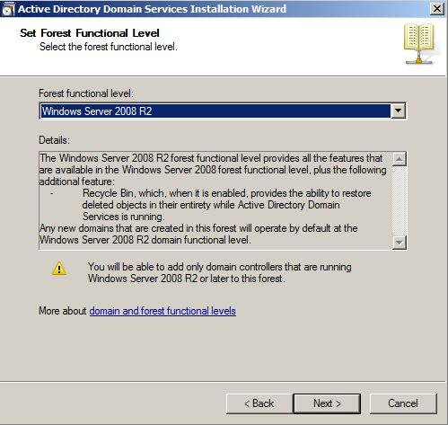

# A Windows Server 2008 R2 menedzselése [^1]

1. [A Windows Server 2008 R2 menedzselése \[^1\]](#a-windows-server-2008-r2-menedzselése-1)
   1. [1. fejezet - Elméleti háttér](#1-fejezet---elméleti-háttér)
      1. [1.1. Bevezetés](#11-bevezetés)
      2. [1.2. A Windows termékvonala](#12-a-windows-termékvonala)
         1. [1.2.1. Korai változatok](#121-korai-változatok)
         2. [1.2.2. Windows XP – Windows Server 2003](#122-windows-xp--windows-server-2003)
         3. [1.2.3. Windows Vista – Windows Server 2008](#123-windows-vista--windows-server-2008)
         4. [1.2.4. Windows 7- Windows Server 2008 R2](#124-windows-7--windows-server-2008-r2)
      3. [1.3. A Windows Server 2008 R2 és kiadásai](#13-a-windows-server-2008-r2-és-kiadásai)
      4. [1.4. Számítógépek, és logikai csoportok](#14-számítógépek-és-logikai-csoportok)
         1. [1.4.1. Munkacsoport (Workgroup)](#141-munkacsoport-workgroup)
         2. [1.4.2. Tartomány (Domain)](#142-tartomány-domain)
      5. [1.5. Az installálási előkészületek](#15-az-installálási-előkészületek)
         1. [1.5.1. A telepítés feltételei](#151-a-telepítés-feltételei)
      6. [1.6. Az installálás lépései](#16-az-installálás-lépései)
      7. [1.7. Bejelentkezés, kijelentkezés, jelszómódosítás](#17-bejelentkezés-kijelentkezés-jelszómódosítás)
         1. [1.7.1. Security Options](#171-security-options)
         2. [1.7.2. Leállítás (shutdown)](#172-leállítás-shutdown)
      8. [1.8. Felhasználók, csoportok](#18-felhasználók-csoportok)
         1. [1.8.1. Felhasználók létrehozása](#181-felhasználók-létrehozása)
         2. [1.8.2.](#182)
         3. [1.8.3. Csoportok létrehozása](#183-csoportok-létrehozása)
      9. [1.9. Tartományvezérlő létrehozása](#19-tartományvezérlő-létrehozása)
   2. [2. fejezet - Gyakorlatok](#2-fejezet---gyakorlatok)
      1. [2.1. 1. Gyakorlat](#21-1-gyakorlat)


## 1. fejezet - Elméleti háttér

### 1.1. Bevezetés

A mai világban számítógépet nagyon sokan használnak. A használatot nagymértékben befolyásolja, hogy milyen operációs rendszer üzemelteti azt. Az operációs rendszereket nagyon sok szempont szerint lehet csoportosítani, még akkor is, ha a szakmai jellemzőket figyelmen kívül hagyjuk. Szempont lehet, hogy az operációs rendszer mennyire felhasználóbarát, vagy mennyire biztonságos, esetleg cserélhető-e a grafikus felülete, stb. A felhasználók egy része folyamatosan igyekszik meggyőzni másokat az általa használt operációs rendszer előnyeiről. Ennek során azonban (talán annak megszokása miatt) nem említi hátrányait.

A PC-s világban a felhasználókat jórészt két nagy csoportba lehet sorolni: az egyik csoport a Microsoft Windows valamelyik változatát használja, míg a másik csoport valamilyen Unix-szerűt. A második csoport listája nagyon hosszú is lehet, hisz’ ide sorolják az összes Linux variánst, és a Mac OS X különböző verzióit is, főként azóta, hogy az Apple áttért az Intel processzor család használatára.

Nem szándékom egyik csoport mellett se letenni a voksomat. Tanszékünkön (Miskolci Egyetem, Általános Informatikai Tanszék) a hallgatók mindkét operációs rendszer esetében választhatnak „Rendszergazdai ismeretek” című tárgyat (Unix esetében egy Linux változatra építve). Windows esetében ez a tárgy jellemzően az épp rendelkezésre álló szerver változatra épül.

Jelenleg a legfrissebb szerver változat a Windows Server 2008 R2, amely 2009 év végétől érhető el (MSDN előfizetéssel 2009. augusztus 14.). A megjelenés óta bő 1 év telt el. Bár idegen nyelvű szakkönyvek a közel múltban jelentek már meg, de magyar nyelvű a mai napig (2011. február) nem érhető még el a szokásos kiadók gondozásában (Szak Kiadó, Panem Kiadó, Kiskapu Kiadó), és érdekes módon a Microsoft hivatalos kurzusai között is mindössze 1 olyan található, amely a Server 2008 R2-vel foglalkozik. Ez egy ún. update tanfolyam Server 2008-ról 2008 R2-re (10159A – Updating Your Windows Server 2008 Technology Skills to Windows Server 2008 R2).

Ez a jegyzet (terjedelméből adódóan) nem fedi le teljes mértékben egy rendszergazda tevékenységét (az ilyen könyvek 1400-1800 oldalasak is lehetnek). Főként a fogalmakkal, a Windows-os rendszer jellegével akar megismertetni. Az elméleti rész megáll a felhasználók és csoportok megismertetésénél, a gyakorlatok azonban tovább bővítik az ismeretanyagot.

Cél, hogy a hallgató az elméletet megértve, és a gyakorlati példákat teljesítve képes legyen önállóan egy rendszer üzemben tartására, a használt operációs rendszer főbb jellemzőinek megértésére. Ne okozzon gondot egy tetszőleges rendszer szűk keresztmetszetének megkeresése, vagy egy-egy szoftver telepítése.

Javasolt a gyakorlatokat vezető oktatónak a gyakorlatokat előre tesztelnie, mert telepítéstől függően elképzelhető, hogy egyes gyakorlatokat a helyi jellemzők függvényében módosítani kell.

A foglalkozások javasolt kivitelezése: a nagyobb hatékonyság érdekében minden téma esetében először vagy a jegyzet, vagy más forrás segítségével az elméleti ismereteket kell tisztázni, majd ezután kerüljön sor az elmélethez kapcsolódó gyakorlatra. A gyakorlatok több esetben egymásra épülnek, ezért nem javasolt egy-egy gyakorlatot kihagyni, mert a későbbiek során előfordulhat, hogy valamely gyakorlat nem, vagy csak kerülő úton lesz elvégezhető.

### 1.2. A Windows termékvonala

A Microsoft Windows operációs rendszere alapvetően két fő vonulatra osztható: mindvégig jól elkülöníthető az otthoni felhasználóknak, illetve a vállalati felhasználóknak szánt termékcsoport. Ennek szerepe még a Windows 95 operációs rendszer megjelenéséhez köthető. Az előző változat, a Windows 3.1 illetve Windows 3.11 még DOS-ból, és külön paranccsal indult.

#### 1.2.1. Korai változatok

A DOS-os programok jellemzően egyedül birtokolták a memóriát, a CPU-t, stb. (Természetesen az interrupt rendszer segítségével már valósultak meg „multitask”-os programok, de ez nem igazi multitask). Előre nem tervezett esetekben ekkor előfordulhatott az is, hogy az alkalmazás nem adta vissza a CPU-t a DOS-nak, hanem kizárólagosan használta azt (akár a programozó hibájából). A Windows 3.1 után megjelenő új Windows verziónál a Microsoft döntés elé került. Vagy készít egy olyan operációs rendszert, amely kizárja ezeket a hibákat (nem engedi futni a rosszul megírt alkalmazásokat) és egy stabil rendszer lesz, vagy hagyja a régi rendszert tovább élni.

Az első választás következményeként a felhasználók „jogosan” morogtak volna, hiszen azok a régi hibás alkalmazásaik, amik DOS alatt hibátlanul futottak, azok a Windows 95 alatt nem lettek volna működőképesek. A következmény nyilvánvaló…

A másik választás esetében pedig készül egy új operációs rendszer, ami csak felületében és szolgáltatásaiban tér el a DOS-tól.

Természetesen ez kicsit sarkított vélemény, de a lényeget jól mutatja. Belátható, hogy végül is nem volt igazi alternatíva, hiszen a felhasználók az első esetben nem vásárolják meg otthonra az új Windows-t.

A gond azonban nem oldódott meg. Vállalati környezetben a felhasználók javarészt nem korábbi játékaikkal játszanak. A vállalat pedig előbb-utóbb a stabil operációs rendszer használatának érdekében korábbi, esetleg bizonytalan alkalmazásait újraírathatja. Ezért kettéválasztották a Windows termékvonalat. Az otthoni felhasználóknak készült a Windows 95, a Windows 98, a Windows 98 SE, a Windows Milennium. A vállalati felhasználóknak pedig a Windows NT 4.0, és a Windows 2000.

#### 1.2.2. Windows XP – Windows Server 2003

A Windows XP megjelenésekor a Microsoft egyesítette a két vonalat. Az otthoni felhasználók is megkapták a stabil operációs rendszer memória-, és task kezelését, ennek következtében néhány inkorrekt módon megírt alkalmazás az XP-n már nem fut. Az otthoni felhasználók szokásainak vizsgálatával a Microsoft kiválogatta azokat a szolgáltatásokat, amikre valószínűleg nem lesz szükség. Ezeket a Windows XP egy másik változatába tette be. Így végül is az XP-ből két változat készült: a Home és a Professional változat. XP-ből azonban nem készült ún. kiszolgáló (server) változat. Ezt a Microsoft a Windows Server 2003-mal pótolta. Ezután a fejlesztés követhetőbbé vált, hiszen minden Windows változat innentől kezdve ugyanazt az irányt követte, az operációs rendszer stabilizálását. Így már csak 1 kernel-t kellett fejleszteni, és az abban levő hibákat javítani.

#### 1.2.3. Windows Vista – Windows Server 2008

Következő kliens a Windows Vista volt (2006. november 8.), aminek fejlesztésekor a Microsoft az addig érvényes trendeket követve (folyamatosan eső memória árak, növekvő memória méretek, gyorsabb processzorok, növekvő merevlemez kapacitás) elkövette azt a hibát, hogy igen erőforrás igényes lett. Elsősorban memóriából igényelt sokat, főként a grafikus felület felgyorsítása miatt. Utólag már látható, hogy a felhasználók (jellemzően a magas memória árak miatt) nem nagyon fejlesztették PC-s rendszerüket. Mivel a Windows XP is az évek múlásával egyre kedveltebb és stabilabb lett (a korábban sűrűbben előforduló úgynevezett „kék halál”-ról sok felhasználó már csak hallomásból tudott), nem volt igazán ok sem a Vistá-ra való áttérésre. Akik gyengébb PC-jükön mégis megpróbálkoztak vele, (hiszen a telepítés kevesebb memóriával rendelkező gépekre is lehetséges volt), azok rövidebb-hosszabb idő elteltével többnyire megint Windows XP-t használtak, és Vistá-val kapcsolatos panaszaiknak hangot is adtak. Azt is fontos megemlíteni, hogy a Microsoft a korábbi biztonsági hiányosságok miatt úgy döntött, hogy minél teljesebb mértékben igyekszik a következő operációs rendszerét újraírni. Emiatt újabb programozói- és biztonsági hibák is bekerülhettek a kernel-be. Az itt megjelenő, talán kicsit túl érzékeny biztonsági rendszert (a sok port kavart UAC – User Access Control) a felhasználók nehezen fogadták el, és több alkalmazás sem volt emiatt működőképes.

Közel másfél évvel később erre a kernel-re építve elkészült a szerver változat, a Windows Server 2008 (2008. február 27.). Az addig megtalált hibákat javították, és mivel egy szerver eleve több memóriával rendelkezik, ez a változat az üzemeltetők között sikeres lett.

#### 1.2.4. Windows 7- Windows Server 2008 R2

A Vista hardverigényén csökkentve (a grafikus rendszer működésének alapjait átírva), újabb felülettel, újabb szolgáltatásokkal kibővítve elkészült a Windows 7 (2009. október 22.). A korábban hozzáférhetővé tett előzetes kiadásokat a szakújságírók tesztelték, és dicsérték. Emiatt a felhasználók is nagyon várták a végleges változatot. A piaci mutatók szerint a Windows 7 mostanra kedvelt, elterjedt operációs rendszer lett, pedig nincs lényeges változtatás a Vistá-hoz képest.

Ugyanebben az időben (2009. október 22.) megjelent a frissített szerver változat is, a Windows Server 2008 R2. GUI-ja (Graphical User Interface – grafikus felhasználói felület) a Windows 7-é, szolgáltatásai jellemzően a Windows Server 2008-é.

A következő táblázatban összefoglalva láthatók a különböző (fontosabb) Windows változatok, kernel-jük verzió száma, és az úgynevezett kibocsátási alverzió (RTM – Release To Manufacturing). Itt megfigyelhető, hogy az egyes változatok valóban mennyire egymásra épülnek.

1.1. táblázat - Windows verziók

| Név, verziók |	Kernel |	RTM |
| Windows NT 4.0 Workstation, Server, Enterprise  Server | NT 4.0 |	1381 |
| Windows 2000 Professional, Server, Advanced Server | NT 5.0 | 2195 |
| Windows XP Home, Professional | NT 5.1 | 2600 |
| Windows Server 2003 Web, Std, Adv., Enterp. Datacenter | NT 5.2 | 3790 |
| Windows Vista Starter, Home Basic, H-Premium, Enterprise | NT 6.0	| 6000 |
| Windows Server 2008 Web, Std, Enterprise, Datacenter | NT 6.0	| 6001 |
| Windows 7 Starter, Home Basic-Premium, Prof, Enterp, Ultim. | NT 6.1 | 7600 |
| Windows Server 2008 R2 Web, Std, Enterprise, Datacenter | NT 6.1 | 7600 |

### 1.3. A Windows Server 2008 R2 és kiadásai

A kicsit hosszúra nyúlt változatok ismertetése után nézzük a Windows Server 2008 R2-t (W2K8R2) részletesebben. Telepítés előtt (tulajdonképpen már a vásárláskor) tudnunk kell, milyen változatok állnak rendelkezésre, és az egyes változatok miben különböznek egymástól.

Windows Server 2008 R2 Foundation: ez a legegyszerűbb változat, több kötöttséggel. Legfeljebb 1 processzort képes kezelni, és maximum 8 GB-t memóriát. Bár ez még több cégnek elegendő is lenne, de 15 főben korlátozzák a felhasználók számát. Emiatt leginkább egy kis iroda működtetéséhez elegendő. Képes tartományt kezelni, illetve már létező tartományba is beléptethető bizonyos korlátozásokkal.

Windows Web Server 2008 R2: egy meglehetősen érdekes kiadás. Bár nevéből is adódóan elsősorban Web (és alkalmazás) szerver futtatására tervezték, és ennek megfelelően korlátozások vannak benne, de ugyanakkor vannak olyan jellemzői, amelyekben ugyanazt tudja, mint a nagyobb (Standard) kiadás: maximum 4 db 64 bites processzor, legfeljebb 32 GB memória, 2 Remote Desktop Admin csatlakozási lehetőség. Tudja futtatni a Microsoft SQL szervert, és képes hálózati szolgáltatásokat is nyújtani (DNS – Domain Name System, integrálva tartalmazza az IIS 7.5 – Internet Information Services 7.5, az ASP.NET-et, a Microsoft .NET Framework-öt).

Windows Server 2008 R2 Standard: ez a legáltalánosabb verzió. Főként kiszolgálók operációs rendszereként használják, például SQL szerverhez. Támogatja a komolyabb hardver kiépítést: maximum 4 db 64 bites processzor, legfeljebb 32 GB memória. További jellemzői a Hyper-V alapú virtualizáció, az IIS 7.5, és a legfeljebb 250 egyidejű hálózati kapcsolat. Képes hálózati szolgáltatások nyújtására (DNS, DHCP – Dynamic Host Configuration Protocol). Ugyanakkor nem támogatja a cluster-ezést, a DFS-R-t (cross-file replication), és az AD FS-t (Active Directory Federation Services). Javasolt felhasználási terület még a fájl szerver, a nyomtató szerver, a média szerver, és a SharePoint szerver.

Windows Server 2008 R2 Enterprise: mindent tud, amit a Standard Edition. Ahhoz képest azonban jelentős bővüléseket találhatunk: korlátlan számú hálózati kapcsolatok, maximum 2 TB memória, 8 db 64 bites processzor, 16 node-os cluster kialakítás. Ha a hardver is támogatja, bővíthető működés közben a memória. Megfelelő kliensek esetén a távoli irodák (fiók irodák - branch office) hatékonyságát növeli a hálózati forgalom csökkentésével (BranchCache).

Windows Server 2008 R2 Datacenter: gyakorlatilag nincsenek benne korlátozások. Hardvertől függően működés közben akár processzorok is adhatók hozzá, illetve cserélhetők. Korlátlan számú virtuális image használati jog, korlátlan számú hálózati- és VPN kapcsolat, 64 db 64 bites processzor (4 magos processzorok esetében ez 256 logikai processzor).

### 1.4. Számítógépek, és logikai csoportok

A Windows-t futtató gépekből telepítéskor, illetve telepítés után logikai csoportok képezhetők. Ezekkel egy otthoni felhasználó általában nem foglalkozik, nem is találkozik, használja az alapértelmezés szerinti (default) beállításokat. Kétféle logikai csoportot különböztetünk meg: a tartományokat (domain) illetve a munkacsoportokat (workgroup).

#### 1.4.1. Munkacsoport (Workgroup)

A kettő közti különbség megértése érdekében vegyünk egy példát. Ahhoz, hogy egy felhasználó dolgozni tudjon egy adott számítógépen, be kell tudnia arra jelentkezni. Munkacsoport esetén minden gépen minden olyan felhasználót létre kell hozni, akinek azon a gépen dolgoznia kell. Bár ez nagyobb létszám esetében hosszabb időt igényel, mégis dönthet emellett a rendszergazda, abból kiindulva, hogy csak egyszer kell sokat dolgoznia. Igaz, ha később újabb gépek jönnek, azokon is létre kell hozni a felhasználókat, de feltételezheti, hogy ez már viszonylag ritkábban fog előfordulni. A felhasználóktól elvárás, hogy a nagyobb biztonság érdekében összetett jelszavakat használjanak, és azokat bizonyos időközönként változtassák meg. A munkacsoport esetében a felhasználók adatai (köztük a belépéshez szükséges jelszó is) minden egyes számítógépen külön-külön tárolódnak. Ha két számítógépen azonos nevű felhasználó van (pl.: KovacsP), akkor sincs köztük kapcsolat, úgy kell tekinteni, mintha egy tankörbe véletlenül két olyan Szabó, vagy Nagy, vagy Kovács kerülne, akik között nincs semmilyen rokonsági kapcsolat.

Ha a felhasználó az egyik számítógép elé ülve módosítja a jelszavát, akkor a jelszó csak azon a számítógépen módosul, a többi gépen nem. Ha a napok múltával különböző számítógépekre jelentkezik be, és azokon módosítja a jelszavát, akkor előbb-utóbb nehéz lesz követnie, melyik számítógépen cserélte már le, és melyiken nem a jelszavát. Ilyenkor általában bevezetésre kerül egy papír fecni, amin igyekszik ezt valamilyen módon nyilvántartani. Ahogy telik az idő, előfordulhat, hogy lesz olyan számítógép, amelyiken már többször is cserélte a jelszavát, és olyan is, amelyiken még egyáltalán nem…

A számítógépek időnként elromolnak, ekkor szervizbe viszik. Ha egy adott idő alatt több számítógép kerül szervizbe, majd javítás után onnan vissza, a rendszergazda szempontjából sokszor nem lényeges, hogy az egyes gépek a laborban korábban hol voltak. A papír fecni alapú nyilvántartás ettől kezdve szétesik, mert a 3. sor 2. számítógépe visszakerülhet a 4. sor 5. helyére.

Összefoglalva: munkacsoportok esetén az adott számítógépre belépésre jogosult felhasználók adatai azon a számítógépen tárolódnak, ahol a felhasználót létrehozták, és a számítógépek között a nyilvántartás szempontjából nincs semmilyen kapcsolat.

#### 1.4.2. Tartomány (Domain)

Tartományoknál (most egy egyszerűsített esetet nézve) van egy kitüntetett számítógép, amely több más mellett a felhasználók adatait (köztük a jelszót) is tárolja. A többi számítógépen beállításra kerül, hogy a jelszót (és a többi adatot) honnan kell „lekérni” annak érdekében, hogy a bejelentkezés jogosságát ellenőrizni lehessen. (FONTOS: az ellenőrzés ugyan nem pont így történik, de így könnyebb a tartomány szerepét megérteni.) Sikeres bejelentkezés esetén, ha a felhasználó módosítja a jelszavát, akkor a jelszó ezen a központi számítógépen fog megváltozni, és letárolódni. A következő bejelentkezés történhet bármelyik számítógépen. Ha ellenőrzéskor „lekérésre” kerül a jelszó, akkor a már módosított jelszó kerül összehasonlításra. A kitüntetett számítógépet tartományvezérlőnek (DC - Domain Controller) nevezzük. A tartományvezérlőn lehetőség van más adatok letárolására is, amely adatok között a tartományba tartozó számítógépek keresni tudnak (pl.: megosztott nyomtatókat, megosztott mappákat). Ennek a központi adattárnak a neve címtár, és a Windows 2000-től kezdődően Active Directory (AD) néven hivatkozhatunk rá.

### 1.5. Az installálási előkészületek

A telepítés során alapvetően két eltérő esetet szokás megkülönböztetni, amelyeknek több alesete lehet. Az első esetben vagy teljesen üres számítógépre kell a Windows 2008 R2-t telepíteni, vagy a már fent levő operációs rendszerre nincs szükség, letörölhető. A másik esetben a számítógépen egy olyan operációs rendszer van (akár Windows Server 2008), amelyiknek beállításaiból minél többet szeretnénk megtartani.

#### 1.5.1. A telepítés feltételei

Az első esetet installálásnak nevezzük, a másikat upgrade-nek. Mindkét esetben még a kezdés előtt ellenőrizni kell, hogy az adott számítógép alkalmas-e a Windows Server 2008 R2 futtatására. Valószínűleg igen, mert a Microsoft meglehetősen alacsony értékeket szokott megadni minimális elvárásként. Azt azonban érdemes leszögezni, hogy ha egy adott számítógép rendelkezik a minimális elvárásokkal, az még nem jelenti azt, hogy használható sebességű lesz. Ennek egyik oka, hogy a minimális elvárás nem egyezik meg a javasolt, vagy optimális elvárással. Másik oka pedig, hogy egy operációs rendszert általában nem öncélúan telepítünk, hanem azért, hogy alkalmazásokat futtasson. Az alkalmazások futtatásakor pedig további hardver igény jelentkezik. Ezt még tovább fokozhatja a várható terhelés, hiszen nem mindegy például, hogy egy SQL szerver mekkora adatbázisból dolgozik, és egységnyi idő alatt hány kérést kell kiszolgálnia. A hétköznapi életben az egyes cégek másképp hivatkoznak a telepítéshez szükséges igényekre, ráadásul néha ellentmondásosan. Néhány megfogalmazás:

1. minimum requirements,

2. recommended requirements,

3. suggested requirements,

4. supported requirements, stb.

A Windows Server 2008 R2 esetében az Enterprise Edition változatú operációs rendszer használható sebességű futtatásához javasolt minimális hardver környezet:

1. 2 GHz, vagy gyorsabb 2-4 magos processzor,

1. 2 GB DDR3 memória, vagy több (lehetőleg Dual Channel módban),

1. 40 GB SATA 7200-as percenkénti fordulatú merevlemez,

1. DVD-ROM meghajtó,

1. 1280x1024 felbontású grafikus kártya és monitor,

1. billentyűzet, egér.

A fentiekben megadott rendszernél természetesen több szempont szerint lehet gyorsabbat összeállítani (SSD használata, vagy több merevlemez RAID 3-ba szervezve, esetleg több processzor, stb.).

A konfiguráció összeállítása után sajnos előfordulhat, hogy a számítógép installálás közben megáll, az installálás sikertelen lesz annak ellenére, hogy az egyes eszközök jók, működőképesek. Ennek több oka is lehet. Lehet, hogy valamely hardver komponens nem kompatibilis a Windows Server 2008 R2-vel, de az is lehet, hogy bár önmagában minden komponens megfelel, de a komponensek egymással akadnak össze (pl. alaplapi SCSI vezérlő és a grafikus kártya ugyanazt a megszakítást használja). A probléma kivédésére célszerű az egész rendszert egy szállítótól beszerezni, és már a rendelés leadásakor tisztázni, hogy az összerakott rendszer képes legyen a Windows Server 2008 R2-t futtatni. Ekkor van esély sikeres reklamációra.


1. ábra. A Microsoft HCL weblapja

A Microsoft régóta folyamatosan frissít a honlapján egy listát (HCL – Hardware Compatibility List, http://www.microsoft.com/windows/compatibility/windows-7/en-us/default.aspx), amely azokat a hardver komponenseket tartalmazza, amelyeket teszteltek az adott operációs rendszerrel. Ki lehet választani az operációs rendszert (jelenleg csak kliens operációs rendszer választható ki: Windows XP, Windows Vista, Windows 7), az hogy 32 vagy 64 bites-e, és rá lehet keresni egy adott hardverre. Ugyanakkor lehet egy adott termékcsoportot tallózni is. A megtalált komponens esetében háromféle bejegyzés lehet: Compatible, Not compatible, No information available. Sajnos a kompatibilisnek jelölt hardver komponens sem garancia a biztos működésre, mert előfordulhat olyan eset, hogy egy grafikus kártyát egy adott alaplappal sikerült ugyan működésre bírni, de ha ez alapján a felhasználó megrendeli a grafikus kártyát, és másik alaplapba teszi, akkor lehet, hogy azzal nem működik…


2. ábra. HCL kompatibilitás esetei

Hasonló célú lista érhető el a Windows Server Catalog honlapján is (http://www.windowsservercatalog.com/ ). A  legbiztosabb, ha komplett, összeállított rendszer kerül tesztelésre, és sikeres teszt után beszerzésre.

Az operációs rendszer DVD-n kerül forgalmazásra, ezért célszerű olyan rendszerben gondolkodni, amely képes optikai meghajtóról boot-olni. Más módszerrel is megoldható ugyan az operációs rendszer installálása, de ez egy egyszerű, kényelmes módszer (nem túl sok számítógép installálása esetén).

### 1.6. Az installálás lépései

Optikai meghajtóról történő telepítés során először célszerű ellenőrizni, szükség szerint módosítani a boot eszközök sorrendjét. Biztonsági okok miatt sok helyen eleve kiveszik az optikai meghajtót, illetve az egyéb külső eszközöket. A BIOS-ba való belépés számítógépenként eltérő módon történhet, de sok esetben bekapcsolás után valamelyik funkció gomb (F) nyomva tartásával a szokásos. Itt kell megkeresni a boot menüt, majd ha szükséges volt a módosítás, akkor mentéssel kilépni, betenni a DVD-t a meghajtóba, és újra indítani a számítógépet.


1. ábra. Boot eszközök sorrendjének megadása

Sikeres boot-oláskor meg kell adni, hogy milyen nyelven kívánjuk installálni az operációs rendszert, milyen régiós beállítást kérünk (dátum – idő, pénz formátum miatt), majd hogy milyen billentyűzet kiosztást kérünk.


4. ábra. Telepítési adatok kiválasztása

A Next gomb megnyomása után következő oldalon rögtön kezdődhet a telepítés folytatása (Install →), vagy két további lehetőség közül lehet választani (információk a telepítésről – What to know…, illetve már telepített operációs rendszer javítása - Repair your computer).


5. ábra. Telepítés megkezdése

Az Install gomb megnyomása után megjelenő ablakban kell kiválasztani, hogy melyik változat kerüljön telepítésre (Standard, Enterprise, Datacenter, Web Server), illetve hogy grafikus felülettel (Full Installation), vagy anélkül (Server Core Installation). A 6. ábrán megfigyelhető az is, hogy csak 64 bites változat létezik.


6. ábra. A server változat megadása

A megfelelő változat kiválasztása, és a Next megnyomása után a licensz szerződés szövege következik. Annak elfogadása, és Next után folytatódhat a további választás.


7. ábra. A licensz szerződés elfogadása

A következős ablakban egy meglévő Windows operációs rendszer frissítése (Upgrade), vagy új installálás (Clean Install – most Custom) között lehet választani. Jelen esetben a Custom megadása után ki kell választani a merevlemezt, és a particiót, ahova az installálás történik.


8. ábra. Telepítési mód (Custom) kiválasztása

Ezután lehetőség van új partíció létrehozására, meglévők törlésére, összevonására, szükség szerint formázására. Az installáló program azonban csak a legfontosabb lehetőségeket biztosítja, komoly szolgáltatásokat nem érdemes várni, hiszen a kifejezetten erre való programok ára sok esetben közelít egy kliens Windows operációs rendszer árához (pl.: 2011 márciusában a Partition Magic forgalmazótól függően kb. 20.000 Ft, míg egy Windows 7 Home Premium OEM 27.000 Ft). (Érdekességképpen, 2005 augusztusában a Partition Magic kb. 21.000 Ft volt, míg a Windows XP Professional OEM 33.000 Ft). Természetesen léteznek ingyenes változatok is, több esetben Linux alapokon.


9. ábra. Merevlemez és partíció kiválasztása

Ezután a 10. ábrának megfeleően megkezdődik a szükséges fájlok tömörített változatának felmásolása (copying) a merevlemezre a DVD-ről, majd a felmásolt fájlok kitömörítése (expanding). Ehhez akár több GB átmeneti területre is szükség lehet a merevlemezen. A következő lépések automatikusan futnak le, nincs szükség felhasználói beavatkozásra.


10. ábra. Másolás, kitömörítés

Kitömörítés után egy reboot-ot (11. ábra) követően folytatódik az installálás. Amikor ez is befejeződik, megjelenik a bejelentkezési ablak (12. ábra).


11. ábra. A számítógép újraindítása


12. ábra. Bejelentkezési képernyő

Első sikeres bejelentkezés után a felhasználónak módosítania kell a jelszavát a 13. ábrának megfelelően.


13. ábra. Jelszó módosítás

Módosítás után elkészül a felhasználó asztala (desktop), létrejönnek a szükséges fájlok, katalógusok (14. ábra).


14. ábra. Az asztal létrehozása

Ezután elindul egy alkalmazás (Initial Configuration Tasks), amely lehetőséget kezdeti beállítások elvégzésére (időzóna megadására, hálózat konfigurálására, számítógép nevének megadására, munkacsoportba, vagy tartományba történő belépésre, stb.). A 15. ábrán látható, hogy a frissen feltelepített Windows még nincs aktiválva (Not activated).


15. ábra. Kezdeti beállítások

Érdemes tisztázni az aktiválás fogalmát, szerepét. Telepítéskor ugyan meg kell adni az úgynevezett termékkulcsot, amivel igazoljuk, hogy rendelkezünk egy jogtiszta Windows-zal, de ez elkérhető ismerőstől, esetleg tőlünk kérik el a miénket. Mindkettő illegális használatra ad lehetőséget. Ezért a Windows XP-nél a Microsoft bevezette az aktiválást. Az aktiválás során egy program a számítógépben található fontosabb hardverekről (például processzor, hálózati kártya, grafikus kártya, memória, stb.) készít egy egyedi azonosító sorozatot. A program a termékkulcsot és ezt az azonosító sorozatot felküldi a Microsoft szerverébe (személyes adatok a Microsoft információi szerint nem kerülnek felküldésre). Ott először is ellenőrzésre kerül, hogy a termékkulcs benne van-e már az adatbázisban. Ha nincs, akkor letárolásra kerül a számítógépre jellemző egyedi azonosító sorozattal. Ha a termékkulcs már benne van az adatbázisban, akkor ott kell lennie mellette az azonosító sorozatnak is. A letárolt azonosítónak és a most felkerült azonosítónak meg kell egyeznie, vagy csak néhány hardver komponens esetében szabad eltérnie. Ha a kelleténél több eltérés van, akkor az arra utal, hogy másik gépre történt az installálás, és az lehet, hogy jogtalan volt. Ekkor sikertelen lesz az aktiválás. Lehetőség van korrigálni a Microsoft ügyfélszolgálatán telefonos kapcsolat keretében. Visszatérve az aktíváláshoz, válasszuk ki az első menüpontot (Activate Windows), majd a megjelenő ablakban (16. ábra) adjuk meg a termékkulcsot, és válasszuk a Next gombot.


16.- ábra. Termékkulcs (Product Key) megadása

Az előbb elmondottak alapján egyértelmű, hogy az aktiváláshoz élő Internet kapcsolattal kell rendelkezni, vagyis a hálózat konfigurálását (IP cím, alhálózati maszk, alapértelmezett átjáró, DNS szerverek elérhetőségének megadása) az aktiválás előtt meg kell tenni. Ha minden rendben történt, akkor a 17. ábrának megfelelő ablaknak kell megjelennie (Activation was successful).


17. ábra. Sikeres aktiválás

### 1.7. Bejelentkezés, kijelentkezés, jelszómódosítás

A számítógépen dolgozva használjuk annak erőforrásait, és hálózaton keresztül pedig más gépektől szolgáltatásokat elérve azok erőforrásait is. Annak érdekében, hogy ez ellenőrzötten történjen meg, a korszerű operációs rendszerek a felhasználókat valamilyen azonosítási procedurának vetik alá. Az azonosítás módja igen sok féle lehet. Viszonylag elterjedtnek számít a név-jelszó (másnéven tudás-) alapú, a smartcard alapú, és a biometriai (ujjlenyomat, arcfelismerés) alapú. Ezek közül is a tudás alapú a legelterjedtebb. Biztonsági megfontolások miatt a cégek előírják, hogy adott időközönként a felhasználóknak cserélniük kell jelszavukat. A Windows-ra jellemző, hogy ugyanazt a tevékenységet (például jelszócserét) többféleképpen is el lehet végezni. Ilyen esetekben célszerű a legkönnyebben használhatót választani. Jelen esetben (jelszó módosításhoz) a CTRL-ALT-DEL gombok egyidejű megnyomásával induló alkalmazást érdemes választani. Az előző Windows verziókban ekkor a Security Dialog Box-nak nevezett alkalmazás indult el. A Windows Server 2008 R2 esetében a Security Options (18. ábra) jelenik meg.

#### 1.7.1. Security Options


18. ábra. Security Options

Ennek negyedik választási lehetősége a Change a password… Mivel előfordulhatna, hogy egy magára hagyott gépen a bejelentkezett felhasználó jelszavát valaki a felhasználó tudta nélkül így módosítaná, ezért először a régi jelszót kell megadni. Mivel ezt is, és az új jelszót is „vakon” kell megadni, és fennáll az elgépelés lehetősége, ezért az új jelszót kétszer kell megadni (19. ábra).


19. ábra. Jelszó módosítás

Érdemes végig venni a Security Options többi szolgáltatását is. Első a Lock this computer. Előfordulhat, hogy rövidebb-hosszabb időre magára kell hagyni a számítógépet, amelyen egy korábbi bejelentkezést követően megkezdett munkák folynak (például olyan elindított alkalmazás, amelyek számol, dolgozik, és futása még nem fejeződött be). Ha a felhasználó ekkor kijelentkezik, akkor ezek a programok leállnak, futásuk megszakad, és az eddigi részeredmények elvesznek. Ha viszont a számítógépet felügyelet nélkül bejelentkezve magára hagyják, akkor egy másik felhasználó visszaélhet vele (például e-mail-eket küldhet a nevében, elolvassa dokumentumait, stb.). Ennek kiküszöbölésére vezették be a zárolási lehetőséget (Lock). Zárolás alatt az alkalmazások futnak tovább. A zárolás feloldása után a felhasználó is tovább dolgozhat a gépen. Korábbi Windows verziókban, ha a zárolást a rendszergazda oldotta fel, akkor a bejelentkezett felhasználó alkalmazásai abortálódtak, és az el nem mentett adatok elvesztek.

A második lehetőség a Switch User. Szintén előfordulhat, hogy bár épp valaki be van jelentkezve a számítógépen, de rövid időre valaki másnak is szüksége volna rá. Ugyanakkor a bejelentkezett felhasználó elindított alkalmazásai még futnak. Kijelentkezés esetén az alkalmazások futása megszakadna. Ennek megoldására vezették be felhasználóváltást. A zároláshoz hasonlóan az alkalmazások futnak tovább, és lehetőség van egy új felhasználó bejelentkezésére. Annak megtörténte után az újonnan bejelentkezett felhasználó dolgozhat, programokat indíthat. Munkája végeztével kijelentkezhet. Ezután az elsőnek bejelentkezett felhasználó (a zároláshoz hasonlóan) visszajelentkezhet.

A harmadik lehetőség (Log off) tulajdonképpen már szóba került. A felhasználó ezzel jelentkezik ki, és egy másik felhasználó pedig bejelentkezhet. Alkalmazásai bezáródnak, el nem mentett adatai elvesznek. Az operációs rendszer ugyan detektálja ezt (alkalmazástól függően), és jelzi is, de a felhasználó kikényszerítheti a kilépést (Force).

A negyedik lehetőség már tisztázásra került (jelszó módosítás).

Az ötödik (utolsó) lehetőség segítségével (Start Task Manager) egy olyan 6 füllel rendelkező alkalmazás indítható el, amellyel megnézhető:

1. milyen programokat futtat a felhasználó (Applications),

2. milyen futó folyamatok vannak (Processes),

3. a szolgáltatások közül (Services) melyek milyen állapotban vannak (Stopped, Running),

4. grafikus felületen ellenőrizhető a processzor és a memória terheltség (Performance),

5. ellenőrizhető a hálózatra használható kártyák (Bluetooth, Wired és Wireless) forgalma,

6. és végül a bejelentkezett felhasználók (Users).

Bár sokat fejlődött a Task Manager, azért jó tudni, hogy vannak olyan hasonló célt szolgáló (akár ingyenes) alkalmazások, amelyek ennél több információt szolgáltatnak. Az egyik leginkább elterjedt program a Sysinternals cég (http://www.sysinternals.com) által készített Process Explorer. (Az oldal 2006 óta a Microsoft Technet oldalán keresztül érhető el: http://technet.microsoft.com/en-us/sysinternals/bb896653).

#### 1.7.2. Leállítás (shutdown)

Bár nem itt érhető el, de meg kell említeni a Shutdown (leállítás) menüpontot. Sok felhasználó a munkaidő végén számítógépét nem állítja le, hanem egyszerűen kikapcsolja. Bár ez nem szabályszerű, mégis egyes esetekben nem okoz problémát, máskor pedig igen. Ennek oka az, hogy az operációs rendszer sok adatot, változást a memóriában őriz. Például az alkalmazások futásakor létrehozott információt is, mint egy Word esetében a dokumentumot magát. Amikor a felhasználó elmenti a dokumentumot, akkor az operációs rendszer amennyiben a késleltetett írás be van kapcsolva, akkor nem menti el az adatokat rögtön (bár azt jelzi vissza), hanem csak később, amikor a felhasználó épp nem végez munkát a számítógépen. Ha a mentést követően a felhasználó egyszerűen kikapcsolja a számítógépet, akkor azok az adatai, amelyekről azt hiszi, hogy el vannak mentve (de adott esetben még sem), elvesz(het)nek. Shutdown esetében az operációs rendszer ezeket az el nem végzett mentéseket befejezi. Annak függvényében, hogy mennyi el nem mentett adat van, a shutdown folyamat viszonylag hosszabb ideig is tarthat. Érdemes kivárni.

### 1.8. Felhasználók, csoportok

A korszerű operációs rendszerek mindegyikében igyekeznek megoldani azt a problémát, hogy egy gyakorlatlan felhasználó az operációs rendszer fájljait kitörölje, átnevezze, esetleg vírussal elfertőzze. A Windows operációs rendszerekben erre azt a megoldást választották, hogy installálás után automatikusan létrejön két speciális csoport (Group): az Administrators (Rendszergazdák) és a Guests (Vendégek), valamint két speciális felhasználó: az Administrator (Rendszergazda) és a Guest (Vendég) (20. ábra).


20. ábra. Telepítéskor automatikusan létrejövő két speciális felhasználó

Az Administrator olyan felhasználó, amely „gyárilag” különböző „privilégiumokkal” rendelkezik. Alapesetben egyedül jogosult a rendszer működését meghatározó paraméterek lekérdezésére, megváltoztatására. „Privilégiumai” egy részét át sem tudja ruházni. A Guest létrehozásának célja az volt, hogy legyen olyan korlátozott jogosultságú felhasználó, aki eleve nem képes komolyabb feladatok elvégzésére, és ebből a korlátozásból nem tud kilépni sem. A csoportok fogalma később részletesebben tisztázásra kerül. Egyelőre annyit érdemes tudni, hogy engedélyeket, jogokat csoportokhoz is hozzá lehet rendelni, és ezeket az engedélyeket, jogokat a csoport tagjai megkapják.

Érdemes két másik fogalmat is tisztázni, az engedélyt (permission) és a jogot (right). Az engedély erőforrás használathoz kötődik (van engedélyem olvasni egy fájlt, nincs engedélyem törölni egy fájlt, nincs engedélyem nyomtatni, stb.). Jog pedig rendszertevékenység elvégzéséhez kötődik (van jogom módosítani a rendszeridőt, nincs jogom archiválni, nincs jogom lokálisan bejelentkezni, nincs jogom leállítani a rendszert, stb.). A jogosultságok egy része átruházható, illetve a jogot élvezők köre bővíthető, szűkíthető. Több operációs rendszerben ezek a fogalmak összemosódnak.

#### 1.8.1. Felhasználók létrehozása

Felhasználókat kétféleképpen lehet létrehozni: vagy teljesen új felhasználó létrehozásával, vagy egy meglévő felhasználó másolásával. Workgroup esetében (illetve olyan tartománybeli gépeken, amelyek nem tartományvezérlők) felhasználók létrehozására, módosítására a Microsoft Management Console-hoz (mmc) egy hozzáadott alkalmazás (úgynevezett snap-in-ek) szolgál. A szükséges snap-in neve: Local Users and Groups. Domain esetében mindkét célra az Active Directory Users and Computers nevű alkalmazás szolgál (21. ábra).


21. ábra. Az Active Directory Users and Computers indítása

Az MMC segítségével a legtöbb rendszergazdai tevékenység elvégezhető. Tetszés szerint kialakítható MMC-k hozhatók létre, és azokat el lehet menteni. Az operációs rendszer installálásakor több előre kialakított MMC is felkerül, amiket menük segítségével lehet elindítani. Néhány fontosabb Snap-in:

1. Számítógép kezelő (Computer Management)

2. Eszköz kezelő (Device Management)

3. Diszk kezelő (Disk Management)

4. Eseményfigyelő (Event Viewer)

5. Helyi felhasználók és csoportok (Local Users and Groups)

6. Rendszer információk (System Information)

Az installálás témakörénél tisztázásra került a munkacsoport és a tartomány fogalma. Nem tartományvezérlőn csak helyi felhasználót (local user) lehet létrehozni, aki csak az adott számítógépre fog tudni belépni. Tartományvezérlőn pedig csak tartományi felhasználót (domain user) lehet létrehozni, aki a tartomány minden számítógépén be tud lépni (…ha ez nem kerül korlátozásra). Tartományvezérlőn helyi felhasználó nincs. Ezt a helyi felhasználók kezelésére szolgáló program a megfelelő menüben piros X-szel jelzi is.

Egy felhasználó létrehozásakor az operációs rendszer a felhasználóhoz hozzárendel egy azonosítót, amivel sikeres belépés után a felhasználó tevékenységét követi. A Windows-ban ez az azonosító a SID (Security Identification). A SID-et a Windows bizonyos szabályok betartásával generálja, és kiterjedten használja. (pl.: SID-je van a csoportoknak, de SID-je van az installációnak is!) Ha a felhasználó ezek után létrehoz egy fájlt, akkor a Windows nem a felhasználó nevét írja a fájl mellé, mint tulajdonost, hanem a felhasználó SID-jét. Ezért, ha a felhasználót valami ok miatt töröljük a felhasználók közül, majd később ugyanolyan néven létrehozzuk, akkor a generálás véletlenszerű része miatt a felhasználó nem a korábbi SID-jét kapja vissza. A felhasználó SID-jének megváltoztatására nincs lehetőség, korábbi fájljainak tulajdonosánál a törölt SID látszik, de mert a felhasználó törlésre került, ezért az operációs rendszer nem tudja a SID-et feloldani névvel. A felhasználó tehát nem lesz tulajdonosa korábbi fájljainak. A korrigálás igen macerás és időigényes. Elkerülésére a javaslat az, hogy a felhasználókat nem törölni kell, hanem letiltani. A letiltás később bármikor feloldható.

Kisebb vállalatok esetében a másolás viszonylag ritkán kerül használatra. A módszer eleve csak domain esetében áll rendelkezésre, és tulajdonképpen akkor kifizetődő, ha nagyobb létszámú olyan felhasználó van, vagy lesz, akik több jellemzőjükben (például csoporttagságukban) hasonlítanak egymásra.


22. ábra. Új felhasználó létrehozása

Létrehozáskor (22. ábra) tartomány esetében jellemzően meg kell adni a felhasználó nevét (Firstname, Lastname, Fullname), bejelentkezési nevét (User logon name), induló jelszavát (Password),


23. ábra. Az új felhasználó alapadatainak megadása

#### 1.8.2.

majd checkbox-ok segítségével lehet kiválasztani a következőket (23. ábra):

a felhasználónak az első sikeres bejelentkezéskor meg kell változtatnia jelszavát (User must change password at next logon);

a felhasználó nem módosíthatja jelszavát (User cannot change password). Jellemző közösen használt fiók (account) esetében;

a jelszó sohasem jár le (Password never expires);

a fiók le van tiltva (Account is disabled).

Létrehozás után már további jellemzők is megadhatók (24. ábra):


24. ábra. Létező felhasználó adatainak megtekintése, módosítása

1. telefonszámok (mobil, vezetékes, otthoni, fax, stb)

2. e-mail cím

3. web oldal címe

4. lakcím vagy munkahelyi cím adatok (város, irányítószám, megye, stb)

5. mely gépekről jelentkezhet be

6. mely napokon, és azon belül mely időpontokban

7. az account lejáratának ideje (soha, vagy egy adott nap).

Fontos tisztázni, hogy a felhasználó bejelentkezési nevének egyedinek kell lennie, hiszen két vagy több azonos nevű felhasználó esetében az azonos nevű felhasználókat már csak jelszavuk különböztetné meg egymástól. A felhasználó bejelentkezési nevének bizonyos kötöttségeket kell teljesítenie:

1. fontos, hogy érvényességi körén belül egyedinek kell lennie (munkacsoport esetében az adott gépen, tartomány esetében az egész tartományban)

2. a név bár 256 karakter hosszú is lehet, de nem javasolt, hogy hosszabb legyen, mint 64 karakter (minden bejelentkezéskor be kell gépelni…)

3. ne tartalmazza a következő karakterek egyikét sem:   <  >  ?  =  *  +  ,  \  [  ]  /  |  

4. nem hiba, de nem javasolt ékezetes karakterek használata, mert ékezet nélküli billentyűzeten problémát okozhat azok bevitele.

Ha a név megadásánál kisbetűk és nagy betűk is használatra kerültek, a Windows megjegyzi azt, de megadásnál nem különbözteti meg. Ennek megfelelően a következő nevek azonosítás szempontjából egymással egyenértékűek: kovacs, KOVACS, Kovacs, stb.

#### 1.8.3. Csoportok létrehozása

A létrehozott felhasználók segítségével szabályozni lehet, kik jelentkezhetnek be a számítógépre. Ezek a felhasználók munkájuk során erőforrásokat fognak használni (nyomtatók, diszkek). A költséges erőforrások használatát célszerű korlátozni. Ugyancsak célszerű korlátozni a diszken tárolt fájlokhoz való hozzáféréseket is, a bennük levő információ miatt. Hozzáférési engedély megadása esetén jellemzően lesznek olyan felhasználók, akik a fájlokat olvashatják, és lesznek olyanok, akik módosíthatják is azokat. Ez a korábban már bevezetett engedélyek segítségével szabályozható. Nagyobb méretű vállalat esetében (bár a felhasználók egyediek) a felhasználók igényeit áttekintve általában kialakíthatók olyan csoportok, amely csoportba tartozó felhasználók jellemzően azonos erőforrásokat fognak használni, azonos módon. Ilyen esetekben ugyan van lehetősége a rendszergazdának arra, hogy mindenkinek egyedileg adja meg az engedélyeket, de sok felhasználó esetében ez időigényes, és többször lehet hibázni is. A feladat leegyszerűsítése érdekében csoportokat lehet létrehozni, és az engedélyeket a csoportokhoz lehet hozzárendelni. Ez után meg kell adni, mely felhasználók mely csoportokba tartoznak. A csoporttagság miatt automatikusan megkapják a csoporthoz rendelt erőforrás használati engedélyeket. Ha később (bármilyen okból) módosítani kell egy erőforrás használatának jellegét (olvasásról olvasás + írásra), akkor nem kell egyesével minden felhasználót módosítani, hanem csak a csoporthoz rendelt engedélyeket kell módosítani, és már a módosított engedélyek fognak a felhasználókra vonatkozni.


25. ábra. Új csoport létrehozása az Active Directory Users and Computers-ben

Tartomány esetében a csoport létrehozásánál (25. ábra) meg kell adni a csoport nevét (hasonló kötöttségekkel, mint a felhasználói név esetében), valamint ki kell választani a csoport hatókörét (hatókör: scope) (Domain Local – Tartományi helyi, Global – Globális, illetve Universal – Univerzális). A hatókör meghatározza, hol lehet hivatkozni a csoport nevére. Ugyancsak meg kejll adni a csoport típusát (típus: type) (Security – Biztonsági illetve Distribution – Terjesztési) (26. ábra). Összefoglalva, e két utolsó adat megadásával tulajdonképpen az kerül meghatározásra, hogy hol, és milyen célokra lehet majd használni a csoportot.

Már létező csoportok esetében kétféle módon lehet megadni a csoporttagságot:

1. Az első esetben ki kell választani azt a csoportot, amelynek a tagjait módosítani kell, majd a Members (tagok) fül segítségével bővíthető, szűkíthető a tagok listája.

2. A másik esetben a felhasználók oldaláról lehet megközelíteni a csoporttagságot. Kiválasztva a felhasználót, a Member Of (Tagja ezeknek a csoportoknak) fül segítségével meg lehet adni, mely csoportoknak legyen tagja.


26. ábra. Csoport létrehozásánál megadásra kerülő adatok

Bár mindkét módszer járható, egy konkrét esetben azt érdemes választani, amelyikkel egyszerűbb a feladat megoldása. Ha a csoporthoz kell több felhasználót hozzáadni, akkor a csoport oldaláról javasolt a feladatot elvégezni, ha pedig a felhasználót kell több csoportba beletenni, akkor a felhasználó oldaláról érdemes megoldani a feladatot (27. és 28. ábra).


27. ábra. Csoporttagság módosítása a felhasználó felől


28. ábra. Csoporttagság módosítása a csoport felől

A felhasználó csoporttagságainak bővítését mutatja be a 29. ábra.


29. ábra. A felhasználó csoporttagságának kibővítése tartomány esetén

(Add. Advanced…, Find Now)

Vegyük a csoport hatókörét. Tételezzük fel, hogy egy konkrét vállalat esetében különböző osztályok vannak: Tervezési Osztály, Bér és Munkaügyi Osztály, Kiszállítási Osztály, stb. Ezeken az osztályokon van egy osztályvezető, akinek van titkárnője, és beosztottjai. Ebben az esetben célszerűnek látszik olyan csoportok létrehozása, amelyek megegyeznek az osztályok nevével. Például: TervO, BMO, KO, stb. A csoportoknak azok a felhasználók lesznek a tagjai, akik az adott osztályon dolgoznak. Ez jól áttekinthető csoporttagságot eredményez. Ugyanakkor érdemes végiggondolni, hogy az egyes osztályokon dolgozó titkárnők valószínűleg ugyanazokat az alkalmazásokat használják, és lesznek közösen használt fájljaik. Emiatt érdemes ilyen jellegű csoportokat is létrehozni (Titkarnok). Ebből adódóan lesznek olyan felhasználók, akik két, vagy még több csoportnak lesznek a tagjai. Ezzel a módszerrel könnyen kialakíthatók lesznek a csoportok, és a tagságok. Fontos tisztázni, hogy ekkor még semmilyen erőforráshoz való hozzáférés nem került meghatározásra. Az erre a célra létrehozott csoportok esetében a csoport hatókörének a Globális csoportot kell megadni.

Az engedélyek hozzárendelése akkor egyszerűsödne, ha a csoportok egymásba ágyazhatók lennének. Az egyik csoportba a felhasználók kerülnek, a másik csoporthoz pedig hozzárendelésre kerülnek az erőforrás használati engedélyek. Az egymásba ágyazás lehetséges, de nem tetszőleges módon. Globális csoportba tartományi helyi csoportot nem lehet beletenni, viszont tartományi helyi csoportba globális csoport (is) beletehető. Nézzük ennek figyelembevételével a tartományi helyi csoportokat.

Sor kerül tehát sor az erőforrásokhoz való hozzáférési engedélyek megadására. Az erőforrások (tartomány esetében) jellemzően valamelyik tartománybeli számítógépen keresztül állnak rendelkezésre. Az erőforráshoz való hozzáféréshez emiatt a felhasználónak olyan felhasználónak kell lennie, aki az adott számítógépen rendelkezik (helyi) felhasználói fiókkal. Korábban ugyanakkor tisztázásra került, hogy tartomány esetében nem célszerű helyi felhasználókkal dolgozni. Helyettük erre a célra a tartományi felhasználók vannak. Az ellentmondás feloldására alakították ki a tartományi helyi csoportokat. A globális csoportok a vállalat felépítésének megfelelően kerülnek kialakításra. A tartományi helyi csoportok pedig az erőforrásoknak megfelelően. Így létezhet például egy Nyomtathatnak nevű csoport. A csoport tagjainak megadjuk egy adott nyomtatóra való nyomtatás engedélyét. Mivel jelenleg még üres a csoport (hiszen most jött létre), ezért (az engedély megadásának ellenére) senki nem fog tudni nyomtatni. A következő lépés az, hogy fel kell tölteni ezt a csoportot.

Bármilyen hatókörű csoportról is beszélünk, csoportba egy felhasználó mindig beletehető. Viszont a globális csoportokban a felhasználók már benne vannak. Annak érdekében, hogy ezt fel lehessen használni, a tartományi helyi csoportokba bele lehet tenni globális csoportokat is. Előtte azonban meg kell vizsgálni a csoportok másik jellemzőjét, a típusát.

A biztonsági csoport rendelkezik a korábban már bevezetett SID-del, ami egyedi azonosításra ad lehetőséget, és így alkalmas hozzáférési engedélyek kezelésére. A terjesztési csoportnak nincs SID-je, ezért terjesztési csoporthoz nem lehet hozzáférési engedélyt rendelni. Az univerzális csoportokat egyelőre elhagyva a lehetséges csoporttok a következők lehetnek:

1. Tartományi helyi, biztonsági (Domain Local Security - DLS)

2. Tartományi helyi, terjesztési (Domain Local, Distribution – DLD)

3. Globális, biztonsági (Global Security – GLS)

4. Globális, terjesztési (Global Distribution – GLD).

Az előbb bevezetett rövidítések segítségével áttekinthető formában megadható, hogy mely csoportok ágyazhatók egymásba:

1. DLS-be: DLD, DLS, GLD,

2. DLD-be: DLD, DLS, GLD, GLS,

3. GLS-be: GLD, GLS,

4. GLD-be: GLD, GLS.

A felsorolás segítségével ellenőrizhető, hogy globális csoportba valóban csak globális csoport tehető bele. Ugyancsak a fenti rövidítések segítségével megadható az is, hogy ha hozzáférési engedélyt kell adni egy erőforráshoz, akkor ott csak DLS, illetve GLS fog megjelenni.

Első alkalommal gondot okozhat annak megértése, hogy mi történik olyan esetekben, ha egy felhasználó több csoportnak a tagja, és különböző csoporttagságai révén különböző hozzáférési engedélyekhez jut. Ennek megoldása tulajdonképpen egyszerű: egy adott erőforrás esetén tetszőleges sorrendben venni kell az egyes csoporttagságokkal járó hozzáférési engedélyeket, és azokat összegezni (kumulálni) kell. Példán keresztül: ha egy felhasználó Users csoporttagsága miatt kap egy olvasási engedélyt egy adott fájl esetében, egy másik csoporttagsága miatt pedig kap egy írási engedélyt, akkor ezek eredője az olvasási + írási engedély lesz. Ha a sorrend lenne a meghatározó, akkor az írási (mint másodszor megvizsgált engedély) felülírná az olvasási engedélyt, és az a fura helyzet állna elő, hogy olvasni ugyan nem tudja a felhasználó a fájlt, de írni igen.

A tiltás (egy engedély megvonása) mindent felülír függetlenül attól, hogy milyen sorrendben vizsgáljuk a csoporttagságokat.

### 1.9. Tartományvezérlő létrehozása

Az eddig ismertetésre került elméleti részek mindenhol tartományi logikai modellre épültek. A következőkben ábrák segítségével bemutatásra kerül egy tartományvezérlő létrehozása. Első lépésként el kell indítani a Szerver menedzsert (Server Manager) (30. ábra).


30. ábra. A Server Manager indítása, és a Server Roles kiválasztása

A megjelenő ablakban ki kell választani a Server Roles (szerver szerepkör) menüt, majd megjelölni az Active Directory Domain Services-t. A szerepkör betöltéséhez szükség van a .NET Framework telepítésére is. Ezt a Server Manager automatikusan felismeri, és jelzi, csak el kell fogadni az Add Required Features segítségével (31. ábra).


31. ábra. A .NET Framework-re szükség van

A következő ablakban az installáló program összefoglalja, milyen komponensek kerülnek telepítésre. Folytatás az Install gomb-bal történik (32. ábra).


32. ábra. Ezek a komponensek kerülnek telepítésre

A számítógép és a diszk sebességétől függően viszonylag hosszabb idő után megtörténik a komponensek hozzáadása (33. ábra).


33. ábra. Sikeresen megtörtént a komponensek hozzáadása

Ekkor azonban még nincs tartományvezérlő, ehhez szükség van a dcpromo program futtatására is (34. ábra).


34. ábra. A dcpromo-t még futtatni kell

Parancssorból elindítva a dcpromo-t, elindul egy (a Windows világra jellemző) „varázsló”  (wizard) (35. ábra).


35. ábra. A dcpromo futtatásakor induló varázsló (wizard)

Első lépésként meg kell adni, létezik-e már az a tartomány, amelynek ez a számítógép a tartományvezérlője lesz (ha igen: Existing forest, ha nem: Create a new domain in a new forest) (36. ábra). Jelen esetben nem létezik.


36. ábra. Új tartomány létrehozása

Később ütközések elkerülése érdekében ellenőrzésre kerül, tényleg nem létezik-e a tartomány (37. ábra).


37. ábra. A tartomány meglétének ellenőrzési folyamata

Amennyiben valóban nem létezik még a tartomány, akkor a következő lépésben meg kell adni, milyen szolgáltatásokkal rendelkezzen a tartományvezérlő. Amennyiben korábbi verziójú operációs rendszerre is számítani kell a tartomány működése során, akkor nem olyan működési szintet kell választani, amit az képes kezelni. Jelen esetben a legmagasabbat lehet választani, a Windows Server 2008 R2-őt (38. ábra).



38. ábra. A tartomány működési szintjének megadása

A Windows 2000-től kezdődően jelent meg az Active Directory, melynek működése a DNS-re épül. Ezért a tartományban, valamelyik tartományvezérlőn lennie kell egy DNS szervernek. Ennek meglétét a telepítő ellenőrzi (39. ábra).


39. ábra. DNS szerver meglétének ellenőrzése

Ha nincs, akkor automatikusan megtörténik a DNS szerver létrehozása (40. ábra).


40. ábra. A DNS szerver telepítése

A DNS szerver telepítése után folyatódik a tartományvezérlő létrehozásához szükséges adatok megadása. Az Active Directory valójában egy adatbázis. Következőként meg kell adni, hogy melyik mappában legyen, hol tárolódjanak a log fájlok, és melyik legyen a SYSVOL mappa. A telepítő erre felkínál egy alapértelmezés szerinti mappát, érdemes azt választani (41. ábra).


41. ábra. Az Active Directory tároló mappáinak megadása

Minden szükséges adat megadásra került. A következő ablakban ezek kerülnek összefoglalásra. Ha minden rendben, kezdődhet a tartományvezérlő létrehozása a Next megnyomásával (42. ábra).


42. ábra. Az eddig megadott adatok összefoglalása

Ezután megkezdődik a tartomány létrehozása, a tartományvezérlő kialakítása, és a szükséges vezérlőprogramok hozzáadása (43. ábra).


43. ábra. Megkezdődött a tartomány létrehozása, a tartományvezérlő kialakítása

Célszerű a végén a számítógépet újraindítani. Ezután lehet ellenőrizni, felkerültek-e a szükséges vezérlő program (például Active Directory Domains and Trust, Active Directory Sites and Services, Active Directory Users and Computers, stb.) (44. ábra).


44. ábra. A menürendszer kiegészült új programokkal

## 2. fejezet - Gyakorlatok

### 2.1. 1. Gyakorlat

Témakör Telepítés: Windows Server 2008 R2 Enterprise, Core, Windows 7

Feladatok:

1. Új virtuális gép és Windows Server 2008 R2 Enterprise alap lemez létrehozása

2. A differenciális lemezek és a két új virtuális gép létrehozása a szerverekhez

3. A két szerver alap konfigurálása (név, tűzfal, hálózat)

4. Új virtuális gép létrehozása és Windows Server 2008 R2 Core telepítése

5. Új virtuális gép és Windows 7 Ultimate alap lemez létrehozása

6. A differenciális lemezek és a két új virtuális gép létrehozása a kliensekhez

7. A két kliens alap konfigurálása (név, tűzfal, hálózat)

Megoldások

1. Új virtuális gép és Windows Server 2008 R2 Enterprise alap lemez létrehozása

```
  1.1.1.	Start -> Administrative Tools -> Hyper-V manager
  1.1.2.	Action menű -> New ->  Virtual Machine...
  1.1.3.	Specify Name and Location:
     Name: W2k8_ent_base
     Store the virtual machine in a different location
     Location: [meghajtó]\VPC\
     Next >
  1.1.4.	Assign Memory: 512MB, Next >
  1.1.5.	Configure Networking: Internal vagy Belso_halozat, Next >
  1.1.6.	Connect Virtual Hard Disk: Create a virtual hard disk: 
     Name: w2k8_ent_base_disk
     Location:[meghajtó]\VPC\
     Size: 50GB
     Next >
  1.1.7.	Installation Options: Install an operating system from a boot CD/DVD-ROM
        Image file (.iso): [meghajtó]\install\en_windows_server_2008_r2_standard_enterprise_datacenter_and_web_x64_dvd_x15-59754.iso
        Next >
   1.1.8.	Completing the New Virtual Machine Wizard: Finish
                        
   1.1.9.	Válasszuk ki a Hyper-V Manager-ben az imént létrehozott virtuális gépet -> jobb gomb -> Start
   1.1.10.	Válasszuk ki a Hyper-V Manager-ben az imént létrehozott virtuális gépet -> jobb gomb -> Connect
   1.1.11.	Install Windows:
      Language: English
      Time and currency format: Hungarian (Hungary)
      Keyboard or input method: Hungarian
      Next
   1.1.12.	Install now
   1.1.13.	Select the operating system you want to install
      Windows Server 2008 R2 Enterprise (Full Installation)
      Next
   1.1.14.	I accept the license terms, Next
   1.1.15.	Which type of installation do you want?
       Custom (advanced)
    1.1.16.	Where do you want to install Windows?
        Disk 0 Unallocated Space 50.0GB
       Next
    1.1.17.	A telepítés során a virtuális gép kétszer újra fog indulni.
    1.1.18.	Ha végzett a telepítő, akkor a jelszó modosító üzenet fogad minket.
    1.1.19.	The user’s Password must be changed before loging on the first time. 
       OK
     1.1.20.	New password: Password1
       Confirm password: Password1
       Enter
    1.1.21.	Your password has been changed. 
       OK
    1.1.22.	Initial Configuration Tasks
       Do not show this window at logon
       Close
   1.1.23.	Server Manager
       Do not show me his console at logon
       És zárjuk be ezt az ablakot
    1.1.24.	Start -> Shut down -> Comment: kész
    1.1.25.	A Hyper-V Manager-ben válasszuk ki a virtuális gépet majd jobb gomb -> Delete -> Delete
```
               
2. A differenciális lemezek és a két új virtuális gép létrehozása a szerverekhez

```
               1.2.1.	Hyper-V Manager -> Action -> New -> Hard Disk...
1.2.2.	Choose Disk Type: Differencing
Next >
1.2.3.	Specify Name and Location:
Name: DC01
Location: [meghajtó]\VPC\DC01\
Next >
1.2.4.	Configure Disk: Location: [meghajtó]\VPC\W2k8_ENT_base.vhd
Next >
1.2.5.	Completing the New Virtual Hard Disk Wizard: Finish


1.2.6.	Hyper-V Manager -> Action -> New -> Hard Disk...
1.2.7.	Choose Disk Type: Differencing
Next >
1.2.8.	Specify Name and Location:
Name: SRV01
Location: [meghajtó]\VPC\SRV01\
Next >
1.2.9.	Configure Disk: Location: [meghajtó]\VPC\W2k8_ENT_base.vhd
Next >
1.2.10.	Completing the New Virtual Hard Disk Wizard: Finish

1.2.11.	Action menű -> New ->  Virtual Machine...
1.2.12.	Specify Name and Location:
Name: DC01
Store the virtual machine in a different location
Location: [meghajtó]\VPC\DC01
Next >
1.2.13.	Assign Memory: 512MB, Next >
1.2.14.	Configure Networking: Internal vagy Belso_halozat, Next >
1.2.15.	Connect Virtual Hard Disk: Use an existing hard disk: 
Name: dc01.vhd
Location: [meghajtó]\VPC\dc01\dc01.vhd
Next >
1.2.16.	Completing the New Virtual Machine Wizard: Finish

1.2.17.	Action menű -> New ->  Virtual Machine...
1.2.18.	Specify Name and Location:
Name: SRV01
Store the virtual machine in a different location
Location: [meghajtó]\VPC\SRV01
Next >
1.2.19.	Assign Memory: 512MB, Next >
1.2.20.	Configure Networking: Internal vagy Belso_halozat, Next >
1.2.21.	Connect Virtual Hard Disk: Use an existing hard disk: 
Name: srv01.vhd
Location: [meghajtó]\VPC\srv01\srv01.vhd
Next >
1.2.22.	Completing the New Virtual Machine Wizard: Finish
```             
            
3. A két szerver alap konfigurálása (név, tűzfal, hálózat)

```
1.3.1.	Indítsuk el a DC01-et:
1.3.2.	Válasszuk ki a Hyper-V Manager-ben a DC01-et -> jobb gomb -> Start
1.3.3.	Válasszuk ki a Hyper-V Manager-ben a DC01-et -> jobb gomb -> Connect
1.3.4.	Indítsuk el a SRV01-et:
1.3.5.	Válasszuk ki a Hyper-V Manager-ben a SRV01-et -> jobb gomb -> Start
1.3.6.	Válasszuk ki a Hyper-V Manager-ben a SRV01-et -> jobb gomb -> Connect

1.3.7.	Jelentkezzünk be a DC01 gépre
Felhasználó: Adminsitrator
Jelszó: Password1
1.3.8.	Start -> Control Panel -> View by: Small icons -> Network and Sharing Center -> Change adapter settings
1.3.9.	Local Area Connection 2 -> jobb gomb: Properties ->vegyük ki a pipát az IPv6 
1.3.10.	Válasszuk ki az Internet Protocol Version 4-et: Properties: Use the following IP address
IP address: 10.10.1.1
Subnet mask: 255.0.0.0
Preferred DNS server: 10.10.1.1
OK ->Close

1.3.11.	Start -> Control Panel -> View by: Small icons -> Windows Firewall -> Turn Windows firewall on or off
1.3.12.	Home or work (private) network location settings: Turn off Windows firewall (not recommended)
1.3.13.	Public network location settings: Turn off Windows firewall (not recommended)

1.3.14.	Start -> Control Panel -> View by: Small icons -> System -> Change settings
1.3.15.	System Properties: Change...
1.3.16.	Computer Name/Domain Changes: Computer name: DC01 -> OK
1.3.17.	Restart: OK
1.3.18.	System Properties: Close
1.3.19.	Restart now

1.3.20.	Jelentkezzünk be az SRV01 gépre
Felhasználó: Adminsitrator
Jelszó: Password1
1.3.21.	Start -> Control Panel -> View by: Small icons -> Network and Sharing Center -> Change adapter settings
1.3.22.	Local Area Connection 2 -> jobb gomb: Properties -> vegyük ki a pipát az IPv6 
1.3.23.	Válasszuk ki az Internet Protocol Version 4-et: Properties: Use the following IP address
IP address: 10.10.1.2
Subnet mask: 255.0.0.0
Preferred DNS server: 10.10.1.1
OK ->Close
1.3.24.	Start -> Control Panel -> View by: Small icons -> Windows Firewall -> Turn Windows firewall on or off
1.3.25.	Home or work (private) network location settings: Turn off Windows firewall (not recommended)
1.3.26.	Public network location settings: Turn off Windows firewall (not recommended)

1.3.27.	Start -> Control Panel -> View by: Small icons -> System -> Change settings
1.3.28.	System Properties: Change...
1.3.29.	Computer Name/Domain Changes: Computer name: SRV01 -> OK
1.3.30.	Megjegyzés: A tartományt csak azután tudjuk megadni miután a DC01-en a tartományvezérlő szerepkört hozzáadtuk. Lásd 2. Gyakorlat
1.3.31.	Restart: OK
1.3.32.	System Properties: Close
1.3.33.	Restart now

1.3.34.	Ha mind a két gép újra indult, mentsük el őket
Válasszuk ki a Hyper-V Manager-ben a DC01-et -> jobb gomb -> Save
Válasszuk ki a Hyper-V Manager-ben a SRV01-et -> jobb gomb -> Save
```                          
            
4. Új virtuális gép létrehozása és Windows Server 2008 R2 Core telepítése

```
1.4.1.	Start -> Administrative Tools -> Hyper-V manager
1.4.2.	Action menű -> New ->  Virtual Machine...
1.4.3.	Specify Name and Location:
Name: Core01
Store the virtual machine in a different location
Location: [meghajtó]\VPC\core01
Next >
1.4.4.	Assign Memory: 512MB, Next >
1.4.5.	Configure Networking: Internal vagy Belso_halozat, Next >
1.4.6.	Connect Virtual Hard Disk: Create a virtual hard disk: 
Name: Core01.vhd
Location: [meghajtó]\VPC\
Size: 30GB
Next >
1.4.7.	Installation Options: Install an operating system from a boot CD/DVD-ROM
Image file (.iso): [meghajtó]\install\en_windows_server_2008_r2_standard_enterprise_datacenter_and_web_x64_dvd_x15-59754.iso
Next >
1.4.8.	Completing the New Virtual Machine Wizard: Finish
 
1.4.9.	Válasszuk ki a Hyper-V Manager-ben a Core01-et -> jobb gomb -> Start
1.4.10.	Válasszuk ki a Hyper-V Manager-ben a Core01-et -> jobb gomb -> Connect
1.4.11.	Install Windows:Language: English
Time and currency format: Hungarian (Hungary)
Keyboard or input method: Hungarian
Next
1.4.12.	Install now
1.4.13.	Select the operating system you want to install
Windows Server 2008 R2 Enterprise (Server Core Installation)
Next
1.4.14.	I accept the license terms, Next
1.4.15.	Which type of installation do you want?
Custom (advanced)
1.4.16.	Where do you want to install Windows?
Disk 0 Unallocated Space 30.0GB
Next
1.4.17.	A telepítés során a virtuális gép kétszer újra fog indulni.
1.4.18.	Ha végzett a telepítő, akkor a jelszó modosító üzenet fogad minket.
1.4.19.	The user’s Password must be changed before loging on the first time. 
OK
1.4.20.	New password: Password1
Confirm password: Password1
Enter
1.4.21.	Your password has been changed. 
OK
1.4.22.	Ha a parancssor megjelent, ezt a gépet is mentsük el:
Válasszuk ki a Hyper-V Manager-ben a Core01-et -> jobb gomb -> Save 
```              
            
5. Új virtuális gép és Windows 7 Ultimate alap lemez létrehozása

```
1.5.1.	Start -> Administrative Tools -> Hyper-V manager
1.5.2.	Action menű -> New ->  Virtual Machine...
1.5.3.	Specify Name and Location:
Name: W7_base
Store the virtual machine in a different location
Location: meghajtó>\VPC\w7
Next >
1.5.4.	Assign Memory: 512MB, Next >
1.5.5.	Configure Networking: Internal vagy Belso_halozat, Next >
1.5.6.	Connect Virtual Hard Disk: Create a virtual hard disk: 
Name: w7_base_disk
Location: meghajtó>\VPC\w7
Size: 50GB
Next >
1.5.7.	Installation Options: Install an operating system from a boot CD/DVD-ROM
Image file (.iso): meghajtó>\install\en_windows_7_ultimate_x86_dvd_x15-65921.iso
Next >
1.5.8.	Completing the New Virtual Machine Wizard: Finish

1.5.9.	Válasszuk ki a Hyper-V Manager-ben az imént létrehozott virtuális gépet -> jobb gomb -> Start
1.5.10.	Válasszuk ki a Hyper-V Manager-ben az imént létrehozott virtuális gépet -> jobb gomb -> Connect
1.5.11.	Install Windows:
Language: English
Time and currency format: Hungarian (Hungary)
Keyboard or input method: Hungarian
Next
1.5.12.	Install now
1.5.13.	I accept the license terms, Next
1.5.14.	Which type of installation do you want?
Custom (advanced)
1.5.15.	Where do you want to install Windows?
Disk 0 Unallocated Space 50.0GB
Next
1.5.16.	A telepítés során a virtuális gép kétszer újra fog indulni.
1.5.17.	Ha végzett a telepítő, akkor a felhasználónevet és gépnevet kell megadnunk, ez tetszőleges lehet, később .
1.5.18.	Type a user name: valaki
Type a computer name: valaki-PC
Next
1.5.19.	Type a Password: Password1
Retype your password: Password1
Type a password hint: valami
Next
1.5.20.	Type your Windows product key
Itt nem adunk meg kulcsot, hagyjuk üresen 
Next
1.5.21.	Help protect your computer and improve Windows automatically:
Use recommended settings
1.5.22.	Review your time and date settings: UTC +01:00
Next
1.5.23.	Select your computer’s current location: Home network
1.5.24.	Start -> Shut down
1.5.25.	A Hyper-V Manager-ben válasszuk ki a virtuális gépet majd jobb gomb -> Delete -> Delete
```               
            
6. A differenciális lemezek és a két új virtuális gép létrehozása a kliensekhez

```
1.6.1.	Hyper-V Manager -> Action -> New -> Hard Disk...
1.6.2.	Choose Disk Type: Differencing
Next >
1.6.3.	Specify Name and Location:
Name: Client01
Location: meghajtó>\VPC\Client01\
Next >
1.6.4.	Configure Disk: Location: meghajtó>\VPC\W7_base_disk.vhd
Next >
1.6.5.	Completing the New Virtual Hard Disk Wizard: Finish

1.6.6.	Hyper-V Manager -> Action -> New -> Hard Disk...
1.6.7.	Choose Disk Type: Differencing
Next >
1.6.8.	Specify Name and Location:
Name: Client02
Location: meghajtó>\VPC\Client02\
Next >
1.6.9.	Configure Disk: Location: meghajtó>\VPC\W7_base_disk.vhd
Next >
1.6.10.	Completing the New Virtual Hard Disk Wizard: Finish

1.6.11.	Action menű -> New ->  Virtual Machine...
1.6.12.	Specify Name and Location:
Name: Client01
Store the virtual machine in a different location
Location: meghajtó>\VPC\Client01
Next >
1.6.13.	Assign Memory: 512MB, Next >
1.6.14.	Configure Networking: Internal vagy Belso_halozat, Next >
1.6.15.	Connect Virtual Hard Disk: Use an existing hard disk: 
Name: Client01.vhd
Location: meghajtó>\VPC\dc01\client01.vhd
Next >
1.6.16.	Completing the New Virtual Machine Wizard: Finish

1.6.17.	Action menű -> New ->  Virtual Machine...
1.6.18.	Specify Name and Location:
Name: Client02
Store the virtual machine in a different location
Location: meghajtó>\VPC\Client02
Next >
1.6.19.	Assign Memory: 512MB, Next >
1.6.20.	Configure Networking: Internal vagy Belso_halozat, Next >
1.6.21.	Connect Virtual Hard Disk: Use an existing hard disk: 
Name: client02.vhd
Location: meghajtó>\VPC\client02.vhd
Next >
1.6.22.	Completing the New Virtual Machine Wizard: Finish
```
                          
7. A két kliens alap konfigurálása (név, tűzfal, hálózat)

```
1.7.1.	Indítsuk el a Client01-et:
1.7.2.	Válasszuk ki a Hyper-V Manager-ben a Client01-et -> jobb gomb -> Start
1.7.3.	Válasszuk ki a Hyper-V Manager-ben a Client01-et -> jobb gomb -> Connect
1.7.4.	Jelentkezzünk be a Client01gépre
Felhasználó: Adminsitrator
Jelszó: Password1

1.7.5.	Start -> Control Panel -> View by: Small icons -> Network and Sharing Center -> Change adapter settings
1.7.6.	Local Area Connection 2 -> jobb gomb: Properties -> vegyük ki a pipát az IPv6 
1.7.7.	Válasszuk ki az Internet Protocol Version 4-et: Properties: Use the following IP address
IP address: 10.10.1.4
Subnet mask: 255.0.0.0
Preferred DNS server: 10.10.1.1
OK ->Close

1.7.8.	Start -> Control Panel -> View by: Small icons -> Windows Firewall -> Turn Windows firewall on or off
1.7.9.	Home or work (private) network location settings: Turn off Windows firewall (not recommended)
1.7.10.	Public network location settings: Turn off Windows firewall (not recommended)

1.7.11.	Start -> Control Panel -> View by: Small icons -> System -> Change settings
1.7.12.	System Properties: Change...
1.7.13.	Computer Name/Domain Changes: Computer name: Client01-> OK
1.7.14.	Restart: OK
1.7.15.	System Properties: Close
1.7.16.	Restart now
 
1.7.17.	Indítsuk el a Client02-et:
1.7.18.	Válasszuk ki a Hyper-V Manager-ben a Client02-et -> jobb gomb -> Start
1.7.19.	Válasszuk ki a Hyper-V Manager-ben a Client02-et -> jobb gomb -> Connect
1.7.20.	Jelentkezzünk be a Client02gépre
Felhasználó: Adminsitrator
Jelszó: Password1

1.7.21.	Ezen a kliensen letiltjuk a hálózatot a következő gyakorlathoz:
1.7.22.	Start -> Control Panel -> View by: Small icons -> Network and Sharing Center -> Change adapter settings
1.7.23.	Local Area Connection 2 -> jobb gomb: Disable

1.7.24.	Start -> Control Panel -> View by: Small icons -> Windows Firewall -> Turn Windows firewall on or off
1.7.25.	Home or work (private) network location settings: Turn off Windows firewall (not recommended)
1.7.26.	Public network location settings: Turn off Windows firewall (not recommended)

1.7.27.	Start -> Control Panel -> View by: Small icons -> System -> Change settings
1.7.28.	System Properties: Change...
1.7.29.	Computer Name/Domain Changes: Computer name: Client02-> OK
1.7.30.	Restart: OK
1.7.31.	System Properties: Close
1.7.32.	Restart now
```              
            
2.1. táblázat - gépcímek

| gépneve | IP címe | maszk | DNS |
| DC01 | 10.10.1.1 | 255.0.0.0 | 10.10.1.1 |
| SRV01 | 10.10.1.2 | 255.0.0.0 | 10.10.1.1 |
| Core01 | 10.10.1.3 | 255.0.0.0 | 10.10.1.1 |
| Client01 | 10.10.1.4 | 255.0.0.0 | 10.10.1.1 |


---

[^1]: Wágner György [Windows Server 2008 üzemeltetése](https://gyires.inf.unideb.hu/KMITT/c09/ch01.html) 